# mobile-eggbert 2D World Reference

## 1. Purpose and scope

This document catalogs everything a mobile-eggbert (2D *Speedy Blupi*) world/level can contain —
the `.txt` level file format, tile/block types, moving objects (pickups, enemies, effects),
backgrounds, doors, and sounds — as the factual, source-grounded basis for a future deliberate
mapping design onto galaxy-eggbert's richer 3D `World`/`.vwr` format (see `World Format.md`).

**This is a catalog, not a design document.** It does not decide how any 2D concept should be
represented in 3D (e.g. whether doors become billboards, whether `BigDecor` becomes a second
render layer or per-block metadata) — those are open questions listed in §9, to be resolved in a
separate mapping-design task. All facts below were read directly from
`../mobile-eggbert` (read-only reference) and cross-checked against galaxy-eggbert's own
already-approved partial ports (`include/GalaxyEggbert/BlockTypes.hpp`,
`include/GalaxyEggbert/def/*.hpp`, `src/GalaxyEggbertSimple3D/Game/GEWorldRuntime.cpp`,
`src/GalaxyEggbertCNA/Game/GEWorldRuntime.cpp`).

## 2. The mobile-eggbert `.txt` level file format

Level files live in `../mobile-eggbert/worlds/world*.txt` (78 files). The authoritative parser is
`Decor::Read(int gamer, int rank, bool bUser)` in `src/WindowsPhoneSpeedyBlupi/Decor.cpp`
(~line 11301), which reads a `"DescFile"` section, a `100×100` `"Decor"` grid, a `100×100`
`"BigDecor"` grid, and a run of `"MoveObject"` records. (A *different*, much larger function a few
hundred lines earlier in the same file — with underscore-wrapped field names like `_blupiPos_` and
a `"Jauge"`/HUD section — is the **save-game** format, not the level format; it is out of scope
here and is the "byte-level save layout" already flagged as reference-only in `CLAUDE.md`.)

### 2.1 Header line (`DescFile`)

One line, space-separated `key=value` pairs. Real example (`world001.txt`, line 1):

```
DescFile: posDecor=250;5570 dimDecor=100;100 world=0 music=0 region=0 blupiPos=770;5894 blupiDir=2
```

Fields read by `Decor::Read()`:

| Field | Meaning | Currently parsed by galaxy-eggbert? |
|---|---|---|
| `posDecor` | initial scroll/camera position, pixel `x;y` | No |
| `dimDecor` | level dimensions in tiles, `x;y` (always `100;100` in practice) | No |
| `music` | music track index | No |
| `region` | background/sky region id (see §6) | Yes — read into `skyRegion_`, but **not currently used** to pick a real background; galaxy-eggbert's Simple3D target instead picks one of 5 hardcoded sky colors indexed by *world number*, not this field (`GalaxyEggbertSimpleGame.cpp`, `TODO(S3D-sky)`) |
| `blupiPos` | Blupi's start position, pixel `x;y` | Yes — divided by 64 to get spawn tile |
| `blupiDir` | Blupi's start facing (`Direction`: 0=None,1=Left,2=Right) | No |

(`world=` also appears in the header but is not read by `Decor::Read()` in this port — likely
vestigial/unused for level files, distinct from the level's filename-encoded world number.)

### 2.2 `Decor:` grid — the primary tile map

A literal `Decor:` line, followed by exactly 100 lines, each a comma-separated row of 100 integers
(one row = one Z/row index, columns = X). Real excerpt (`world001.txt`, row 2, truncated):

```
Decor:
,,,,,,,,,,,,,,,,,,,,,,,,,,,,,,,,,,,,,,,,,,,,,,,,,,,,,,,,,,,,,,,,,,,,,,,10,10,10,10,10,10,...
```

Cell value convention (from `Decor::Read()`): the raw integer is the tile icon index into
`object-m.png`. `0` (including an empty/missing cell, since trailing commas produce empty tokens)
means **no tile**, normalized in mobile-eggbert to `-1` ("empty"). Any positive integer is a real
icon id. galaxy-eggbert's `BlockTypes::fromMobileIconId()` already implements the equivalent
conversion (`icon <= 0` → `Air`), plus an additional step mobile-eggbert's *tile map* does not do
at load time: it also converts icons flagged in a 441-entry `isMobileTransparent` passability table
to `Air` (galaxy-eggbert's own collision simplification — collapsing "visually present but
non-blocking" 2D tiles straight to no-block, rather than keeping them as passable-but-textured
tiles). This is a galaxy-eggbert design choice, not something read from mobile-eggbert's file
format itself.

### 2.3 `BigDecor:` grid — a second, currently-unused-by-galaxy-eggbert tile layer

Immediately follows the `Decor:` grid: a literal `BigDecor:` line, then another `100×100`
comma-separated grid, same icon vocabulary (`object-m.png` via `PixmapChannel::Object`), same `-1`
= empty convention. **Neither galaxy-eggbert `GEWorldRuntime` implementation (Simple3D or CNA)
currently parses this section by name** — because their row-counters already reach 100 by the time
`BigDecor:` appears, its lines are silently skipped as a side effect of the existing loop bound,
not because the format was intentionally recognized and ignored.

Confirmed non-empty in real files — e.g. `world013.txt`'s `BigDecor:` section has real icon data
(46 non-separator characters), `world021.txt` has more. Not every level uses it (`world001.txt`'s
`BigDecor:` section is effectively empty — only 4 stray characters, no real tiles).

Purpose, from `Decor::Build()`'s render-order doc comment (`Decor.cpp` ~line 635): `BigDecor` is
drawn as its own back-to-front layer — parallax background image, **then `BigDecor`**, then the
main `Decor` tiles + objects + Blupi, then HUD. So it is a secondary, background-layer tile grid
using the same tile icon set as the main grid (including animated icons — the draw loop special-
cases icon `203`, the same `Marine` animated-water icon `BlockTypes.hpp` already knows about, via
the same frame table). Whether `BigDecor` cells participate in collision was not directly verified
in this pass (worth checking before deciding its 3D representation).

### 2.4 `MoveObject:` records — moving/interactive objects

Immediately follows `BigDecor:`: zero or more lines, each `MoveObject: field=value ...`, terminated
implicitly by end-of-section (next unrecognized section or EOF). Real example (`world001.txt`,
line 204, the file's only `MoveObject`):

```
MoveObject: type=7 stepAdvance=1 stepRecede=1 timeStopStart=0 timeStopEnd=0 posStart=962;5124 posEnd=962;5124 posCurrent=962;5124 step=1 time=0 phase=800 channel=10 icon=31
```

Full field list, from `Decor::Read()`:

| Field | Meaning |
|---|---|
| `type` | `ObjectType` id (see §4) |
| `stepAdvance` | ticks to move from `posStart` to `posEnd` (run through `Config::ScaleTime()`) |
| `stepRecede` | ticks to move back from `posEnd` to `posStart` |
| `timeStopStart` | dwell ticks at `posStart` before advancing |
| `timeStopEnd` | dwell ticks at `posEnd` before receding |
| `posStart`, `posEnd` | endpoints of linear motion, pixel `x;y` (equal for stationary objects) |
| `posCurrent` | current position, pixel `x;y` (redundant with the above at file-save time) |
| `step` | current motion phase index (redundant/save-time state) |
| `time` | current dwell-timer value (redundant/save-time state) |
| `phase` | current animation phase counter (redundant/save-time state) |
| `channel` | sprite sheet id (`PixmapChannel`, e.g. `10` = `Element`) |
| `icon` | current icon index within that sheet (redundant/save-time state) |

`posCurrent`/`step`/`time`/`phase`/`icon` are runtime/save-time snapshots of values the simulation
recomputes every frame from `type`/`stepAdvance`/`stepRecede`/`posStart`/`posEnd` — a fresh level
load does not strictly need them to be meaningful, only the first seven fields define the object's
design-time behavior.

**Coverage gap in galaxy-eggbert's current port:** `GEWorldRuntime::LoadFromMobileEggbertFile`
(Simple3D) only instantiates a hardcoded subset of `type` values — `1,2,3,4,5,6,7,12,13,16,17,20,
25,30,33,49,50,51` — silently dropping everything else. A scan of all 78 real world files' `type=`
values found in actual use: `1,2,3,4,5,6,7,12,13,16,17,19,20,21,24,26,30,32,33,40,44,46,47,49,50,
51,54,55,96` — so `19,21,24,26,32,40,44,46,47,54,55,96` appear in real levels but are **not yet
spawned at all** by galaxy-eggbert's loader (they're silently skipped by the `supported` check).
The CNA target's `GEWorldRuntime::LoadFromMobileEggbertFile` doesn't parse `MoveObject:` lines at
all yet (explicitly deferred in its source comments).

## 3. Tile/block catalog (`Decor`/`BigDecor` icon vocabulary)

Icons are indices into `object-m.png` (1301×1431 px, 64×64 px tiles, 20 columns — confirmed by
direct file inspection, matches `BlockTypes::kSheetW/kSheetH/kTileSize/kSheetCols` and
`WindowsPhoneSpeedyBlupi::Def::DIMOBJX/DIMOBJY = 64`). galaxy-eggbert's `BlockTypes.hpp` already
names the following groups (all verified present in `include/GalaxyEggbert/BlockTypes.hpp`):

Images below are 64×64 px crops taken directly from `object-m.png` (see §10 for how they were
generated) — one representative icon per named group (the base/first frame for animated groups,
not every frame).

| Image | Icon(s) | Name in `BlockTypes.hpp` | Category | Animated? | Notes |
|---|---|---|---|---|---|
|  | 10 | `Ground` | ground | no | |
|  | 18 | `StoneA` | ground/decoration | no | |
| 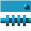 | 25 | `StoneB` | ground/decoration | no | |
|  | 183 | `Wall` | wall | no | |
| 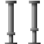 | 200 | `Platform` | decoration | no | "floating platform" |
| (not cropped) | 158–165 | `Sp0`..`Sp7` | unclassified | no | named but no behavior attached yet |
| (not cropped) | 309 | `Marker` | unclassified | no | |
| (not cropped) | 411–413 | `Tile411`..`Tile413` | unclassified | no | |
| 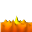 | 68–72 | `Lava` (base 68) | hazard | yes, 8 frames | kills Blupi on contact |
|  | 347, 373, 374 | `Spike` (base 373) | hazard | yes, 16 frames | kills Blupi on contact |
| 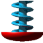 | 317–323 | `Crusher` (base 317) | hazard | yes, 10 frames | kills Blupi on contact; active-kill phase pattern |
|  | 378–383 | `Saw` (base 378, `SawStopped`=379) | hazard | yes, 6 frames | kills Blupi on contact; can be stopped by a `Switch` |
|   | 91–98 | `Water1` (base 92, 6 frames) / `Water2` (base 96, 6 frames) | decorative/swimmable | yes | Blupi swims when grounded on these |
|  | 211 | `Spring` | interactive | no | auto-launches Blupi upward (`SoundChannel41`) |
|  | 324–329 | `Temp` (base 324) | hazard/passable-timing | yes, 20 frames, 2 blank | oscillates and vanishes 2/20 frames; Blupi falls through when invisible |
|     | 126–137 | `FanLeft/Right/Up/Down` (bases 126/129/132/135, 3 frames each) | hazard | yes | kills unless shielded |
| 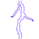 | 305 | `Blitz` | hazard | tick-gated (not frame-animated) | kills 25% of ticks (`animPhase % 4 == 0`) |
|     | 330–333 | `Teleport1`..`4` | interactive | no | solid pillars; pairing discovered by scanning the map for a matching icon, not stored explicitly |
|   | 384/385 | `Switch`/`SwitchOff` | interactive | no | toggled by Blupi's Action button; scans ±20 tiles in X for linked `Saw` tiles |
| 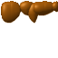 | 364 | `Bridge` | interactive | no | passable trigger in mobile-eggbert; solid in galaxy-eggbert |
|  | 203–208 | `Marine` (base 203, 11 frames) | decorative/animated water surface | yes | |
|    | 334/335/336 | `Door1`/`Door2`/`Door3` | interactive | no (see §7) | key-gated |

**Icons present in `object-m.png`'s addressable range (0–440, per `isMobileTransparent`'s
441-entry table) that have no name in `BlockTypes.hpp` yet:** everything not listed above — plain
ground/wall/decoration variants with no special gameplay behavior get no named constant, which
matches the design comment ("value equals the icon index... named constants equal their icon IDs")
— untagged icons are still perfectly valid block types, just anonymous ones.

**Verification note:** the door icon range (334–336) and key-bit mapping were independently
re-derived from mobile-eggbert's own door-detection code (`Decor::IsDoor`, `Decor.cpp` ~line 7360:
"icon in the 334..336 range"; door-opening code ~line 5615: `ToDoorKeyFlags(1 << (icon - 334))`) —
this exactly matches `BlockTypes.hpp`'s `isDoor()`/`doorKeyType()` (49/50/51). **No discrepancy
found** — galaxy-eggbert's existing door mapping is correct.

### 3.1 Animated tile frame tables — already ported

`Tables.cpp`'s animation arrays for the groups above have already been transcribed (with prior
approval) into `src/GalaxyEggbertSimple3D/Game/GETerrainRenderer.cpp` as `kAnimLava[8]`,
`kAnimSpike[16]`, `kAnimCrusher[10]`, `kAnimSaw[6]`, `kAnimWater1[6]`, `kAnimWater2[6]`,
`kAnimTemp[20]`, `kAnimMarine[11]`, plus the 3-frame fan sequences — and ported again to the CNA
target's `GETerrainRenderer.cpp` this same development cycle. This document does not re-transcribe
those values; see the cited files for the exact frame sequences.

## 4. Objects/elements (`ObjectType`, 204 IDs)

`ObjectType` (`include/GalaxyEggbert/def/ObjectType.hpp`, mirrors mobile-eggbert's own enum
1:1 in numeric value) is already fully declared in galaxy-eggbert with categorized comments.
Summary by category (not re-listing all 204 IDs — see the header for the full, already-commented
list):

- **Platform lifts**: 1, 47, 48
- **Horizontal patrol enemies**: 2, 3, 96, 97
- **Bulldozer**: 4
- **Collectibles**: 5 (treasure), 6 (extra-life egg), 7 (level-exit goal), 21 (secret-level exit), 39 (pickup sparkle)
- **Key collectibles**: 49, 50, 51 (correspond to `DoorKeyFlags::Key1/2/3`)
- **Vehicle/power-up pickups**: 13 (helicopter), 19 (jeep), 24 (skateboard), 25 (shield), 26 (suction-cup), 28 (tank), 29 (bullet pack), 30 (drink), 31 (charge/cloud), 40 (mirror/invert), 46 (balloon), 55 (dynamite)
- **Explosions/visual effects** (transient, auto-expire): 8–12, 36–38, 41, 42, 53, 90–93, 98–100
- **Water/goo effects**: 14, 15, 34, 35
- **Projectiles**: 23 (fired by `blupih`/`blupit` enemies)
- **Patrol walker enemies**: 16 (spider), 17 (fish), 18 (variant), 20 (bird), 32 (`blupih`, fires projectiles on turn), 33 (`blupit`, fires two), 44 (wasp/bee), 54 (large creature, destroys helicopter on contact)
- **Moving level objects**: 22 (door-opening animation, see §7), 27 (magic sparkle), 52 (bridge construction, 157 frames), 56 (dynamite fuse), 57/58 (shield effects)
- **Blupi skin variants**: 200–203
- **Unidentified/reserved**: 43, 45, 59–89, 94, 95, 101–199 (declared only to keep the enum
  contiguous for level-file round-trips; not confirmed to have distinct real-game meaning)

Icon/frame mapping for objects is table-driven per type (`GEDecorSystem::GetObjIcon` in the
already-shipped Simple3D port is the galaxy-eggbert-side reimplementation, e.g. `ObjectType2`/`3`
cycle 9-frame patrol-walk tables, `ObjectType5` treasure cycles a 22-frame sparkle, etc. — see that
file for the exact per-type table references rather than re-deriving them here).

### 4.1 Known icons (phase-0 frame, from `GEDecorSystem::GetObjIcon`)

Images are 60×60 px crops from `element.png` (see §10). Only the 18 `ObjectType`s
`GEDecorSystem::GetObjIcon` currently has a case for are shown — every other type in the categories
above has no confirmed icon in this pass (icon not yet identified), so is left as text-only rather
than guessed.

| Image | ObjectType | Category (from above) |
|---|---|---|
|  | 1 | Platform lift |
|  | 2 | Horizontal patrol enemy |
|  | 3 | Horizontal patrol enemy |
|  | 4 | Bulldozer |
| 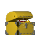 | 5 | Collectible (treasure) |
|  | 6 | Collectible (extra-life egg) |
|  | 7 | Collectible (level-exit goal) |
|  | 12 | Explosion/visual effect |
|  | 13 | Vehicle/power-up pickup (helicopter) |
|  | 16 | Patrol walker enemy (spider) |
|  | 17 | Patrol walker enemy (fish) |
|  | 20 | Patrol walker enemy (bird) |
|  | 25 | Vehicle/power-up pickup (shield) |
|  | 30 | Vehicle/power-up pickup (drink) |
|  | 33 | Patrol walker enemy (`blupit`) |
|  | 49 | Key collectible (`Key1`) |
| 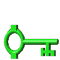 | 50 | Key collectible (`Key2`) |
|  | 51 | Key collectible (`Key3`) |

### 4.2 Blupi (not an `ObjectType` — the player character, `blupi.png`/`blupi1.png`)

A few representative 60×60 px frames (of 340 total across the sheet's 10×34 grid) — not a full
state/animation catalog, just enough to visually anchor the character:


## 5. Enemy/object behavior model

From `Decor.cpp`'s own architectural documentation (top-of-file comment, paraphrased): most
enemies/effects are **table-driven** — a `MoveObject` moves linearly between `posStart` and
`posEnd` at `stepAdvance`/`stepRecede` speed with `timeStopStart`/`timeStopEnd` dwell timers
(`MoveObjectStepLine`), while its visual animation/lifetime is a phase counter indexed into a
`Tables.cpp` animation array (`MoveObjectStepIcon`). A **minority** of object types are
**hand-coded** with bespoke per-type logic in `MoveObjectStepIcon` and its helpers — named examples
in the source comment: dynamite, "charging" enemies, followers (`ObjectType96`/`97`, which track
Blupi's position directly rather than patrolling a fixed line), cloud-nets, and crates.

Patrol-style enemies with `posStart == posEnd` in the raw file data (a common authoring pattern —
confirmed by galaxy-eggbert's own Simple3D loader, which detects this case and synthesizes a small
patrol range: `spec.posStart.x_ -= 2.0f; spec.posEnd.x_ += 2.0f`) patrol back and forth over a
short fixed range around their placed position rather than staying stationary.

Collision for both Blupi and objects is tile-based (not swept): an axis-aligned rectangle is
tested against the tile cells it overlaps via `IsBlocIcon()`/`IsPassIcon()`; a single blocking cell
makes the whole rectangle "occupied". This is the source-of-truth collision model mobile-eggbert
uses — distinct from, and not necessarily reusable for, galaxy-eggbert's own 3D grid-collision code
(e.g. the new `GEBlupiController` in the CNA target implements its own simplified 3D grid collision
with step-up traversal, not a transcription of this 2D system).

## 6. Backgrounds / sky regions

`../mobile-eggbert/Content/backgrounds/` contains 38 background images (`decor000.png` through
`decor031.png`, non-contiguous numbering — several ids like 005, 014, 017, 023 are missing from the
set) plus `blupiyoupie.png` and `gear.png` (title/settings-screen backgrounds, not level
backgrounds). The level header's `region=` field is presumably the selector for one of these
`decorNNN.png` background images per level, but **the exact region→filename mapping code was not
located in this pass** (region-to-background selection likely lives in higher-level UI/game-state
code not yet inspected, e.g. wherever `PixmapChannel::Background` gets (re)loaded) — this is an
open item, not a confirmed fact.

**What galaxy-eggbert currently does instead:** `GEWorldRuntime` parses `region=` into `skyRegion_`
but the Simple3D target does not use it — it instead picks one of 5 hardcoded flat sky colors
indexed by **world number** (1–5, "Grassland/Forest/Ice Caves/Lava Fields/Space Station"), explicitly
marked `TODO(S3D-sky)` as a rough proxy since Simple3D lacks a fog/zone API. No real background
*image* (parallax `decorNNN.png`) is loaded by either galaxy-eggbert target today.

Sample thumbnails (resized to 240px wide, see §10):

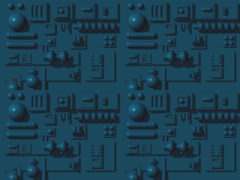

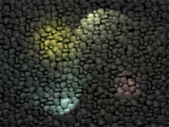

## 7. Doors — detailed behavior (2D)

Confirmed directly from `Decor.cpp` (not just inferred from `BlockTypes.hpp`):

- Door tiles are icons 334, 335, 336 in the main `Decor` grid (`Decor::IsDoor`, `Decor.cpp` ~7360:
  tests `icon >= 334 && icon <= 336`).
- The required key is derived as a bitmask: `doorKeyMask = 1 << (icon - 334)` — icon 334 needs bit
  0, 335 needs bit 1, 336 needs bit 2, matching `DoorKeyFlags::Key1/Key2/Key3` and
  `ObjectType49/50/51` (the three key pickups) exactly.
- Opening (`Decor::OpenDoor`, `Decor.cpp` ~11667): the tile's `icon` is set to `-1` (removed from
  the static grid, becomes passable) and a **temporary `MoveObject` of type 22** ("door opening
  animation") is spawned at that cell, using the door's own icon, sliding from the door's position
  upward by one tile (`posEnd.Y = posStart.Y - 1`) over `stepAdvance = Config::ScaleTime(50)` ticks,
  playing `SoundChannel33`. So visually a door **slides up and out of the way**, it does not fade,
  shatter, or swing.
- Doors are solid/blocking while present (implied by being a normal `Decor` grid icon, subject to
  the same `IsBlocIcon()` tile collision as walls) — i.e. in 2D a door is simply an opaque, solid
  textured tile like any other wall tile until removed.

**Open question for the 3D mapping (per the user's stated intent, not decided here):** the user
wants doors in the 3D target rendered as **billboards with transparency** rather than opaque
textured cubes — presumably so a door can visually read as a thin barrier/frame rather than a solid
block, and/or so the slide-up-and-vanish animation translates naturally to a billboard sliding
along Y. This document does not resolve how (a new `BlockMetadata`-tagged block? a distinct object
type layered over an `Air` cell? something else) — that is exactly the kind of decision this
catalog exists to inform, not make.

## 8. Sounds

`SoundChannel` (93 channels) is already ported 1:1 in `include/GalaxyEggbert/def/SoundChannel.hpp`,
confirmed numerically identical to mobile-eggbert's version per existing project notes; 93 real
`.wav` files exist in `../mobile-eggbert/Content/sounds/`. Not re-cataloged here — see that header
for the full list.

## 9. Open questions for the 3D mapping design

These are flagged, not answered, here:

- Should `BigDecor` become a second parallel render layer in the 3D `World` (e.g. a background
  chunk offset behind the main terrain), or be folded into the main grid, or be dropped? Its actual
  collision behavior in 2D (does Blupi ever collide with `BigDecor` cells, or is it purely visual?)
  was not confirmed in this pass and should be checked before deciding.
- Should hazard/animated tiles (lava, saws, etc.) carry their animation phase as `BlockMetadata`
  instead of being handled by the current CPU-side "rebuild the animated subset's mesh" approach
  (`GETerrainRenderer::Update()`)? The 4-bit metadata field is a plausible fit for a handful of
  animation-phase states, but 12-bit type IDs already fully separate animated groups by base icon.
- Should doors be a distinct `BlockMetadata`-tagged variant of a normal block, or something else
  entirely (a billboard object type layered over an `Air` cell, matching how mobile-eggbert's own
  door-open animation is itself a `MoveObject`, not a tile mutation with an attached animation)?
- Should `MoveObject` records (pickups, enemies, effects) become `World`-embedded per-block
  metadata, or stay a separate object list alongside the `World` (as galaxy-eggbert's own
  `MobileObjSpec`/`GEDecorSystem` already model them for the 2D-sourced Simple3D target)? The
  latter already works and doesn't obviously need the block-metadata system at all.
- Teleporter pairing is implicit (scan-the-map) in mobile-eggbert — worth deciding whether to keep
  that convention or make pairing explicit via `BlockMetadata` now that the format supports it.
- The `region=` → background-image mapping is still unresolved (§6) — needed before any real
  background/skybox work, 2D or 3D.
- 12 real `ObjectType` values used in actual levels are not yet spawned by any galaxy-eggbert
  target (§2.4) — worth deciding whether/when to close that gap, independent of the 3D mapping
  question.

## 10. How the images in this document were generated

All crops in this document were made with ImageMagick (`convert -crop`) directly against
mobile-eggbert's real sprite sheets in `../mobile-eggbert/Content/icons/` and
`../mobile-eggbert/Content/backgrounds/` (read-only source, never modified) — one representative
frame per named/cataloged item, not a full asset dump. Grid math per sheet, taken from
mobile-eggbert's own rendering code (`Pixmap.cpp`'s per-`PixmapChannel` `switch`), not guessed:

| Sheet | Tile size | Gap | Columns | Used for |
|---|---|---|---|---|
| `object-m.png` | 64×64 px | 1 px | 20 | §3 tile/block icons |
| `element.png` | 60×60 px | 0 | 10 | §4.1 object icons |
| `blupi.png` | 60×60 px | 0 | 10 | §4.2 Blupi frames |
| `decorNNN.png` (backgrounds) | full image, resized to 240px wide | n/a | n/a | §6 background samples |

Icon `n`'s pixel rect on a gapped/ungapped grid: `col = n % cols`, `row = n / cols`,
`x = col * (tileSize + gap)`, `y = row * (tileSize + gap)`, crop `tileSize × tileSize` at `(x, y)`.
Generated files live in `mobile-eggbert-2d-reference-images/`. Object icons (§4.1) use each
`ObjectType`'s phase-0 frame from the already-approved `GEDecorSystem::GetObjIcon` in
`src/GalaxyEggbertSimple3D/Game/GEDecorSystem.cpp` — only the 18 types that function already
covers were cropped; everything else in §4 has no confirmed icon in this pass and was deliberately
left as text-only rather than guessed.

## 11. Animations

Every animated sequence mobile-eggbert's tile/character/object system can produce, as looping
GIFs assembled (with ImageMagick) from the same per-sheet grid crops used above — this is meant as
a full overview of what the animation system does, to inform what galaxy-eggbert eventually needs
to replicate. Frame data and tick rates are taken from galaxy-eggbert's own already-approved,
verified-against-source ports (`GETerrainRenderer.cpp`'s `kAnim*` tables at 6 fps,
`GEBlupiController.cpp`'s state tables at 8 fps, `GEDecorSystem::GetObjIcon`'s per-type tables at
6 fps ÷ a per-type divisor), not re-derived here. Real-world duration = frame count × frame
duration; all loop (last frame connects back to the first).

### 11.1 Animated tiles (`object-m.png`, 6 fps base tick ≈ 167 ms/frame)

| Animation | Frames | Duration/frame | Loop length | GIF |
|---|---|---|---|---|
| Lava | 8 | 167 ms | 1.33 s |  |
| Spike | 16 | 167 ms | 2.67 s |  |
| Crusher | 10 | 167 ms | 1.67 s | 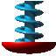 |
| Saw | 6 | 167 ms | 1.0 s |  |
| Water1 | 6 | 167 ms | 1.0 s |  |
| Water2 | 6 | 167 ms | 1.0 s |  |
| Temp | 20 (incl. 2 fully-transparent "vanish" frames) | 167 ms | 3.33 s |  |
| Marine | 11 | 167 ms | 1.83 s |  |
| FanLeft | 3 | 167 ms | 0.5 s |  |
| FanRight | 3 | 167 ms | 0.5 s |  |
| FanUp | 3 | 167 ms | 0.5 s |  |
| FanDown | 3 | 167 ms | 0.5 s |  |

The two `-1` ("invisible") frames in `Temp`'s table are rendered as fully-transparent frames here
(verified: alpha channel mean 0 on both), not skipped — matching the real vanish-then-reappear
behavior (Blupi falls through while invisible, per §3).

### 11.2 Blupi character states (`blupi.png`, 8 fps base tick = 125 ms/frame)

`Stop`={0}, `Down`={33}, `Up`={44} are single static frames (no animation) — see §4.2 for those.

| State | Frames | Duration/frame | Loop length | GIF |
|---|---|---|---|---|
| March (walk) | 6 | 125 ms | 0.75 s | 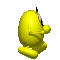 |
| Jump | 3 | 125 ms | 0.375 s |  |
| Air (falling) | 5 | 125 ms | 0.625 s |  |
| SwimIdle | 10 | 125 ms | 1.25 s |  |
| SwimMove | 14 | 125 ms | 1.75 s |  |

### 11.3 Object/pickup/enemy animations (`element.png`, 6 fps base tick, per-type divisor)

Only the `ObjectType`s that actually cycle through multiple icons are shown (from the same 18-type
`GetObjIcon` coverage as §4.1); `ObjectType1`/`12`/`13`/`30` return one constant icon — no
animation, already covered as static crops in §4.1.

| ObjectType | Frames | Duration/frame | Loop length | GIF |
|---|---|---|---|---|
| 2 (patrol enemy A) | 9 | 1.0 s | 9.0 s |  |
| 3 (patrol enemy B) | 9 | 1.0 s | 9.0 s |  |
| 4 (bulldozer) | 8 | 1.5 s | 12.0 s |  |
| 16 (spider) | 9 | 0.5 s | 4.5 s |  |
| 17 (fish) | 8 | 1.0 s | 8.0 s |  |
| 20 (bird) | 8 | 1.0 s | 8.0 s |  |
| 33 (`blupit`) | 8 | 1.0 s | 8.0 s | 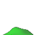 |
| 5 (treasure sparkle) | 22 (11-icon ping-pong) | 1.5 s | 33.0 s | 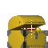 |
| 6 (extra-life egg) | 8 | 2.0 s | 16.0 s | 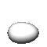 |
| 7 (level-exit goal) | 8 | 1.5 s | 12.0 s |  |
| 25 (shield) | 8 | 1.0 s | 8.0 s |  |
| 49 (key, `Key1`) | 12 | 1.5 s | 18.0 s |  |
| 50 (key, `Key2`) | 12 | 1.5 s | 18.0 s | 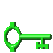 |
| 51 (key, `Key3`) | 12 | 1.5 s | 18.0 s | 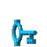 |

**Not covered (deferred, not attempted):**
- **Explosions** (`explo.png`) — per-explosion-type frame counts/sizes come from
  `Tables::table_explo_size[icon]` in mobile-eggbert, not yet cross-referenced in this pass.
- **Door opening** (§7) — a *positional slide* (the door sprite moves up and off-screen over
  `Config::ScaleTime(50)` ticks), not an icon-frame cycle, so a conventional frame-sequence GIF
  doesn't represent it the same way as the animations above.
- **The 12 newly-supported `ObjectType`s** (§2.4 — `19,21,24,26,32,40,44,46,47,54,55,96`) added to
  `GEDecorSystem::GetObjIcon` by other work this session are not yet covered here; §4.1/§11.3 still
  only cover the original 18-type set this document's screenshot pass was scoped to.
