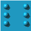
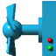
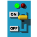
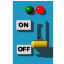

# Tile/Block Catalog (`Decor`/`BigDecor` icon vocabulary)

**Status: PARTIAL — 29 of ~441 addressable icons documented.** Tracked as `DOC-002` in `plan.md`.
This file currently only names icons that already have a named constant in
`include/GalaxyEggbert/BlockTypes.hpp`. The remaining ~410 icons (plain ground/wall/decoration
variants with no gameplay behavior attached, per mobile-eggbert's own `isMobileTransparent` table)
still need: a screenshot crop, a category guess (ground/wall/decoration/unused), and a note on
whether mobile-eggbert's level files actually use them anywhere. See `09-open-questions.md` and
`plan.md`'s `DOC-002` entry for the exact completion plan.

Icons are indices into `object-m.png` (1301×1431 px, 64×64 px tiles, 20 columns — confirmed by
direct file inspection, matches `BlockTypes::kSheetW/kSheetH/kTileSize/kSheetCols` and
`WindowsPhoneSpeedyBlupi::Def::DIMOBJX/DIMOBJY = 64`).

Images below are 64×64 px crops taken directly from `object-m.png` (see "How these images were
generated" at the bottom) — one representative icon per named group (the base/first frame for
animated groups, not every frame).

| Image | Icon(s) | Name in `BlockTypes.hpp` | Category | Animated? | Notes |
|---|---|---|---|---|---|
|  | 10 | `Ground` | ground | no | |
|  | 18 | `StoneA` | ground/decoration | no | |
|  | 25 | `StoneB` | ground/decoration | no | |
|  | 183 | `Wall` | wall | no | |
|  | 200 | `Platform` | decoration | no | "floating platform" |
| (not cropped) | 158–165 | `Sp0`..`Sp7` | unclassified | no | named but no behavior attached yet |
| (not cropped) | 309 | `Marker` | unclassified | no | |
| (not cropped) | 411–413 | `Tile411`..`Tile413` | unclassified | no | |
|  | 68–72 | `Lava` (base 68) | hazard | yes, 8 frames | kills Blupi on contact |
|  | 347, 373, 374 | `Spike` (base 373) | hazard | yes, 16 frames | kills Blupi on contact |
|  | 317–323 | `Crusher` (base 317) | hazard | yes, 10 frames | kills Blupi on contact; active-kill phase pattern |
|  | 378–383 | `Saw` (base 378, `SawStopped`=379) | hazard | yes, 6 frames | kills Blupi on contact; can be stopped by a `Switch` |
|   | 91–98 | `Water1` (base 92, 6 frames) / `Water2` (base 96, 6 frames) | decorative/swimmable | yes | Blupi swims when grounded on these |
|  | 211 | `Spring` | interactive | no | auto-launches Blupi upward (`SoundChannel41`) |
|  | 324–329 | `Temp` (base 324) | hazard/passable-timing | yes, 20 frames, 2 blank | oscillates and vanishes 2/20 frames; Blupi falls through when invisible |
|     | 126–137 | `FanLeft/Right/Up/Down` (bases 126/129/132/135, 3 frames each) | hazard | yes | kills unless shielded |
|  | 305 | `Blitz` | hazard | tick-gated (not frame-animated) | kills 25% of ticks (`animPhase % 4 == 0`) |
|     | 330–333 | `Teleport1`..`4` | interactive | no | solid pillars; pairing discovered by scanning the map for a matching icon, not stored explicitly |
|   | 384/385 | `Switch`/`SwitchOff` | interactive | no | toggled by Blupi's Action button; scans ±20 tiles in X for linked `Saw` tiles |
|  | 364 | `Bridge` | interactive | no | passable trigger in mobile-eggbert; solid in galaxy-eggbert |
|  | 203–208 | `Marine` (base 203, 11 frames) | decorative/animated water surface | yes | |
|    | 334/335/336 | `Door1`/`Door2`/`Door3` | interactive | no (see `06-doors.md`) | key-gated |

**Icons present in `object-m.png`'s addressable range (0–440, per `isMobileTransparent`'s
441-entry table) that have no name in `BlockTypes.hpp` yet:** everything not listed above — plain
ground/wall/decoration variants with no special gameplay behavior get no named constant, which
matches the design comment ("value equals the icon index... named constants equal their icon IDs")
— untagged icons are still perfectly valid block types, just anonymous ones. **This is exactly the
gap `DOC-002` needs to close**: crop and categorize all ~410 of them, not just note their
existence.

**Verification note:** the door icon range (334–336) and key-bit mapping were independently
re-derived from mobile-eggbert's own door-detection code (`Decor::IsDoor`, `Decor.cpp` ~line 7360:
"icon in the 334..336 range"; door-opening code ~line 5615: `ToDoorKeyFlags(1 << (icon - 334))`) —
this exactly matches `BlockTypes.hpp`'s `isDoor()`/`doorKeyType()` (49/50/51). **No discrepancy
found** — galaxy-eggbert's existing door mapping is correct.

## Animated tile frame tables — already ported

`Tables.cpp`'s animation arrays for the groups above have already been transcribed (with prior
approval) into `src/GalaxyEggbertSimple3D/Game/GETerrainRenderer.cpp` as `kAnimLava[8]`,
`kAnimSpike[16]`, `kAnimCrusher[10]`, `kAnimSaw[6]`, `kAnimWater1[6]`, `kAnimWater2[6]`,
`kAnimTemp[20]`, `kAnimMarine[11]`, plus the 3-frame fan sequences — and ported again to the CNA
target's `GETerrainRenderer.cpp`. This file does not re-transcribe those values; see the cited
files for the exact frame sequences, and `08-animations.md` for animated GIFs of each.

## How these images were generated

ImageMagick (`convert -crop`) directly against `../mobile-eggbert/Content/icons/object-m.png`
(read-only source, never modified). Grid math taken from mobile-eggbert's own rendering code
(`Pixmap.cpp`'s `PixmapChannel::Object` case), not guessed: 64×64 px tiles, **1 px gap** between
tiles, 20 columns. Icon `n`'s pixel rect: `col = n % 20`, `row = n / 20`, `x = col * 65`,
`y = row * 65`, crop 64×64 at `(x, y)`.
