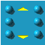
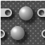
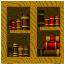
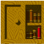
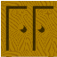
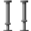
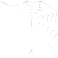

# Tile/Block Catalog (`Decor`/`BigDecor` icon vocabulary)

**Status: COMPLETE.** All 441 addressable icon IDs (0–440) are accounted for — 313 with a full
64×64 image crop (every icon that is either already named/behavioral in `BlockTypes.hpp`, or
confirmed used in at least one of the 78 real level files), the remaining 128 unused/unnamed icons
listed compactly by range (passability + a mechanical visual signal, not a fabricated name — see
"Unused/unnamed icons" below). Generated and verified 2026-07-03 (`DOC-002`).

Icons are indices into `object-m.png` (1301×1431 px, 64×64 px tiles, 20 columns — confirmed by
direct file inspection, matches `BlockTypes::kSheetW/kSheetH/kTileSize/kSheetCols` and
`WindowsPhoneSpeedyBlupi::Def::DIMOBJX/DIMOBJY = 64`).

**Finding: icon 440 has no real pixel data.** The sheet is only tall enough for 22 full 65px-stride
rows (22×65=1430px of a 1431px-tall image) — i.e. icons 0–439 (440 real icons), not 0–440. Icon
440 is the theoretical next slot but only has 1px of image data (a sliver, not a real tile).
`BlockTypes::kPassable[441]` includes an entry for it anyway (bounds-safety in the passability
table, not because it's a real tile) — value `false`.

**Finding: animated sub-frame icons are never placed directly in level files.** Checking real-file
usage per icon confirms that for every animated group (`Lava` 68–72, `Crusher` 317–323, `Saw`
378–383, `Water1`/`Water2` 91–98, `Temp` 324–329, `Marine` 203–208), only the *base* icon (the
first frame, matching `BlockTypes::tileAnimBase()`'s convention) is ever found in a `Decor:`/
`BigDecor:` grid — e.g. `Crusher`'s frames 318–323 all show "not found in any scanned file" while
318's base 317 is used in 15 files. This is a real, verified pattern: sub-frame IDs only exist as
runtime animation states the rendering code cycles through, never as authored level data — which is
exactly what `BlockTypes::tileAnimBase()`'s "map any icon in a group to its base" design already
assumes, now independently confirmed.

## Named/behavioral tiles and every icon used in a real level (313 of 441)

Images are 64×64 px crops from `object-m.png` (see "How these images were generated" below).
"Used in real levels" is a per-icon count out of the 78 real world files, counting only genuine
`Decor:`/`BigDecor:` grid cells (not `MoveObject:` fields or the header, which also contain
numbers). Named icons keep their `BlockTypes.hpp` name and behavioral notes; unnamed-but-used icons
are marked `(unnamed)` — they're included here because they *are* placed in real levels, even
without a galaxy-eggbert constant yet.

| Image | Icon | Name | Category | Animated? | Passable | Used in real levels |
|---|---|---|---|---|---|---|
|  | 1 | (unnamed) | unnamed variant | no | no | 10/78 files |
|  | 2 | (unnamed) | unnamed variant | no | no | 8/78 files |
|  | 3 | (unnamed) | unnamed variant | no | no | 20/78 files |
|  | 4 | (unnamed) | unnamed variant | no | no | 11/78 files |
|  | 5 | (unnamed) | unnamed variant | no | no | 14/78 files |
|  | 6 | (unnamed) | unnamed variant | no | no | 8/78 files |
|  | 7 | (unnamed) | unnamed variant | no | no | 8/78 files |
|  | 8 | (unnamed) | unnamed variant | no | no | 9/78 files |
|  | 9 | (unnamed) | unnamed variant | no | no | 12/78 files |
|  | 10 | `Ground` | ground | no | no | 30/78 files |
|  | 11 | (unnamed) | unnamed variant | no | no | 14/78 files |
|  | 12 | (unnamed) | unnamed variant | no | no | 8/78 files |
|  | 13 | (unnamed) | unnamed variant | no | no | 10/78 files |
|  | 14 | (unnamed) | unnamed variant | no | no | 7/78 files |
|  | 15 | (unnamed) | unnamed variant | no | no | 16/78 files |
|  | 16 | (unnamed) | unnamed variant | no | no | 21/78 files |
|  | 17 | (unnamed) | unnamed variant | no | no | 16/78 files |
|  | 18 | `StoneA` | ground/decoration | no | no | 21/78 files |
|  | 19 | (unnamed) | unnamed variant | no | no | 4/78 files |
|  | 20 | (unnamed) | unnamed variant | no | no | 10/78 files |
|  | 21 | (unnamed) | unnamed variant | no | no | 10/78 files |
|  | 22 | (unnamed) | unnamed variant | no | yes | 17/78 files |
|  | 23 | (unnamed) | unnamed variant | no | no | 34/78 files |
|  | 24 | (unnamed) | unnamed variant | no | no | 35/78 files |
|  | 25 | `StoneB` | ground/decoration | no | no | 42/78 files |
|  | 26 | (unnamed) | unnamed variant | no | no | 12/78 files |
|  | 27 | (unnamed) | unnamed variant | no | no | 15/78 files |
|  | 28 | (unnamed) | unnamed variant | no | no | 10/78 files |
|  | 29 | (unnamed) | unnamed variant | no | no | 13/78 files |
|  | 30 | (unnamed) | unnamed variant | no | no | 10/78 files |
|  | 31 | (unnamed) | unnamed variant | no | no | 4/78 files |
|  | 35 | (unnamed) | unnamed variant | no | no | 14/78 files |
|  | 36 | (unnamed) | unnamed variant | no | no | 18/78 files |
|  | 37 | (unnamed) | unnamed variant | no | no | 18/78 files |
|  | 38 | (unnamed) | unnamed variant | no | no | 10/78 files |
|  | 39 | (unnamed) | unnamed variant | no | no | 12/78 files |
|  | 40 | (unnamed) | unnamed variant | no | no | 9/78 files |
|  | 41 | (unnamed) | unnamed variant | no | no | 5/78 files |
|  | 42 | (unnamed) | unnamed variant | no | no | 3/78 files |
|  | 43 | (unnamed) | unnamed variant | no | no | 1/78 files |
|  | 44 | (unnamed) | unnamed variant | no | no | 1/78 files |
|  | 45 | (unnamed) | unnamed variant | no | no | 6/78 files |
|  | 46 | (unnamed) | unnamed variant | no | no | 2/78 files |
|  | 47 | (unnamed) | unnamed variant | no | no | 3/78 files |
|  | 48 | (unnamed) | unnamed variant | no | no | 11/78 files |
|  | 49 | (unnamed) | unnamed variant | no | yes | 10/78 files |
|  | 50 | (unnamed) | unnamed variant | no | yes | 14/78 files |
|  | 51 | (unnamed) | unnamed variant | no | yes | 14/78 files |
|  | 52 | (unnamed) | unnamed variant | no | yes | 16/78 files |
|  | 53 | (unnamed) | unnamed variant | no | yes | 23/78 files |
|  | 54 | (unnamed) | unnamed variant | no | yes | 25/78 files |
|  | 55 | (unnamed) | unnamed variant | no | yes | 26/78 files |
|  | 56 | (unnamed) | unnamed variant | no | yes | 29/78 files |
|  | 57 | (unnamed) | unnamed variant | no | yes | 18/78 files |
|  | 58 | (unnamed) | unnamed variant | no | yes | 17/78 files |
|  | 59 | (unnamed) | unnamed variant | no | yes | 24/78 files |
|  | 60 | (unnamed) | unnamed variant | no | yes | 24/78 files |
|  | 61 | (unnamed) | unnamed variant | no | yes | 6/78 files |
|  | 62 | (unnamed) | unnamed variant | no | yes | 6/78 files |
|  | 63 | (unnamed) | unnamed variant | no | yes | 10/78 files |
|  | 64 | (unnamed) | unnamed variant | no | yes | 9/78 files |
|  | 65 | (unnamed) | unnamed variant | no | yes | 6/78 files |
|  | 66 | (unnamed) | unnamed variant | no | yes | 15/78 files |
|  | 67 | (unnamed) | unnamed variant | no | yes | 14/78 files |
|  | 68 | `Lava (base)` | hazard | yes, 8 frames (68-72) | no | 41/78 files — kills Blupi on contact |
|  | 69 | (unnamed) | unnamed variant | no | yes | 9/78 files |
|  | 73 | (unnamed) | unnamed variant | no | yes | 12/78 files |
|  | 74 | (unnamed) | unnamed variant | no | no | 9/78 files |
|  | 75 | (unnamed) | unnamed variant | no | no | 10/78 files |
|  | 76 | (unnamed) | unnamed variant | no | yes | 22/78 files |
|  | 77 | (unnamed) | unnamed variant | no | yes | 11/78 files |
|  | 78 | (unnamed) | unnamed variant | no | no | 14/78 files |
|  | 79 | (unnamed) | unnamed variant | no | no | 14/78 files |
|  | 80 | (unnamed) | unnamed variant | no | no | 14/78 files |
|  | 81 | (unnamed) | unnamed variant | no | no | 14/78 files |
|  | 82 | (unnamed) | unnamed variant | no | no | 14/78 files |
|  | 83 | (unnamed) | unnamed variant | no | no | 13/78 files |
|  | 84 | (unnamed) | unnamed variant | no | no | 14/78 files |
|  | 85 | (unnamed) | unnamed variant | no | yes | 2/78 files |
|  | 86 | (unnamed) | unnamed variant | no | yes | 5/78 files |
|  | 87 | (unnamed) | unnamed variant | no | no | 18/78 files |
|  | 88 | (unnamed) | unnamed variant | no | no | 14/78 files |
|  | 89 | (unnamed) | unnamed variant | no | no | 14/78 files |
|  | 90 | (unnamed) | unnamed variant | no | no | 9/78 files |
|  | 91 | (unnamed) | unnamed variant | no | no | 25/78 files |
|  | 92 | `Water1 (base)` | decorative/swimmable | yes, 6 frames (91-95) | no | 38/78 files — Blupi swims when grounded |
|  | 96 | `Water2 (base)` | decorative/swimmable | yes, 6 frames (96-98) | no | not found in scanned files — Blupi swims when grounded |
|  | 107 | (unnamed) | unnamed variant | no | no | 6/78 files |
|  | 108 | (unnamed) | unnamed variant | no | no | 3/78 files |
|  | 109 | (unnamed) | unnamed variant | no | no | 2/78 files |
|  | 110 | (unnamed) | unnamed variant | no | yes | 8/78 files |
|  | 114 | (unnamed) | unnamed variant | no | yes | 7/78 files |
|  | 118 | (unnamed) | unnamed variant | no | yes | 4/78 files |
|  | 122 | (unnamed) | unnamed variant | no | yes | 1/78 files |
|  | 126 | `FanLeft (base)` | hazard | yes, 3 frames (126-128) | no | 8/78 files — kills unless shielded |
|  | 129 | `FanRight (base)` | hazard | yes, 3 frames (129-131) | no | 7/78 files — kills unless shielded |
|  | 132 | `FanUp (base)` | hazard | yes, 3 frames (132-134) | no | 4/78 files — kills unless shielded |
|  | 135 | `FanDown (base)` | hazard | yes, 3 frames (135-137) | no | 1/78 files — kills unless shielded |
|  | 138 | (unnamed) | unnamed variant | no | yes | 19/78 files |
|  | 139 | (unnamed) | unnamed variant | no | no | 9/78 files |
|  | 140 | (unnamed) | unnamed variant | no | no | 10/78 files |
|  | 141 | (unnamed) | unnamed variant | no | no | 9/78 files |
|  | 142 | (unnamed) | unnamed variant | no | no | 9/78 files |
|  | 143 | (unnamed) | unnamed variant | no | no | 8/78 files |
|  | 144 | (unnamed) | unnamed variant | no | no | 14/78 files |
|  | 145 | (unnamed) | unnamed variant | no | no | 14/78 files |
|  | 146 | (unnamed) | unnamed variant | no | no | 9/78 files |
|  | 147 | (unnamed) | unnamed variant | no | no | 8/78 files |
|  | 148 | (unnamed) | unnamed variant | no | no | 6/78 files |
|  | 149 | (unnamed) | unnamed variant | no | no | 13/78 files |
|  | 150 | (unnamed) | unnamed variant | no | no | 13/78 files |
|  | 151 | (unnamed) | unnamed variant | no | no | 14/78 files |
|  | 152 | (unnamed) | unnamed variant | no | no | 13/78 files |
|  | 153 | (unnamed) | unnamed variant | no | no | 1/78 files |
|  | 154 | (unnamed) | unnamed variant | no | no | 10/78 files |
|  | 155 | (unnamed) | unnamed variant | no | no | 11/78 files |
|  | 156 | (unnamed) | unnamed variant | no | no | 14/78 files |
|  | 158 | `Sp0` | unclassified | no | yes | 1/78 files — named but no behavior attached yet |
|  | 159 | `Sp1` | unclassified | no | yes | 1/78 files — named but no behavior attached yet |
|  | 160 | `Sp2` | unclassified | no | yes | 1/78 files — named but no behavior attached yet |
|  | 161 | `Sp3` | unclassified | no | yes | 1/78 files — named but no behavior attached yet |
|  | 162 | `Sp4` | unclassified | no | yes | 1/78 files — named but no behavior attached yet |
|  | 163 | `Sp5` | unclassified | no | yes | 1/78 files — named but no behavior attached yet |
|  | 164 | `Sp6` | unclassified | no | yes | 1/78 files — named but no behavior attached yet |
|  | 165 | `Sp7` | unclassified | no | yes | 1/78 files — named but no behavior attached yet |
|  | 174 | (unnamed) | unnamed variant | no | yes | 12/78 files |
|  | 175 | (unnamed) | unnamed variant | no | yes | 12/78 files |
|  | 176 | (unnamed) | unnamed variant | no | yes | 12/78 files |
|  | 177 | (unnamed) | unnamed variant | no | yes | 12/78 files |
|  | 178 | (unnamed) | unnamed variant | no | yes | 9/78 files |
|  | 179 | (unnamed) | unnamed variant | no | yes | 4/78 files |
|  | 180 | (unnamed) | unnamed variant | no | yes | 2/78 files |
|  | 181 | (unnamed) | unnamed variant | no | yes | 1/78 files |
|  | 182 | (unnamed) | unnamed variant | no | no | 12/78 files |
|  | 183 | `Wall` | wall | no | no | 1/78 files |
|  | 185 | (unnamed) | unnamed variant | no | yes | 8/78 files |
|  | 186 | (unnamed) | unnamed variant | no | no | 11/78 files |
|  | 187 | (unnamed) | unnamed variant | no | no | 9/78 files |
|  | 188 | (unnamed) | unnamed variant | no | no | 9/78 files |
|  | 189 | (unnamed) | unnamed variant | no | no | 10/78 files |
|  | 190 | (unnamed) | unnamed variant | no | no | 9/78 files |
|  | 191 | (unnamed) | unnamed variant | no | no | 6/78 files |
|  | 192 | (unnamed) | unnamed variant | no | no | 11/78 files |
|  | 193 | (unnamed) | unnamed variant | no | no | 7/78 files |
|  | 194 | (unnamed) | unnamed variant | no | no | 9/78 files |
|  | 195 | (unnamed) | unnamed variant | no | no | 8/78 files |
|  | 196 | (unnamed) | unnamed variant | no | no | 9/78 files |
|  | 197 | (unnamed) | unnamed variant | no | no | 9/78 files |
|  | 198 | (unnamed) | unnamed variant | no | yes | 10/78 files |
|  | 199 | (unnamed) | unnamed variant | no | yes | 9/78 files |
|  | 200 | `Platform` | decoration | no | yes | 27/78 files — "floating platform" |
|  | 201 | (unnamed) | unnamed variant | no | yes | 36/78 files |
|  | 202 | (unnamed) | unnamed variant | no | yes | 11/78 files |
|  | 203 | `Marine (base)` | decorative/animated water | yes, 11 frames (203-208) | yes | 18/78 files |
|  | 211 | `Spring` | interactive | no | no | not found in scanned files — auto-launches Blupi upward |
|  | 214 | (unnamed) | unnamed variant | no | no | 7/78 files |
|  | 215 | (unnamed) | unnamed variant | no | no | 13/78 files |
|  | 216 | (unnamed) | unnamed variant | no | no | 10/78 files |
|  | 217 | (unnamed) | unnamed variant | no | no | 14/78 files |
|  | 218 | (unnamed) | unnamed variant | no | no | 10/78 files |
|  | 219 | (unnamed) | unnamed variant | no | no | 6/78 files |
|  | 220 | (unnamed) | unnamed variant | no | no | 5/78 files |
|  | 221 | (unnamed) | unnamed variant | no | no | 4/78 files |
|  | 222 | (unnamed) | unnamed variant | no | no | 4/78 files |
|  | 230 | (unnamed) | unnamed variant | no | no | 6/78 files |
|  | 231 | (unnamed) | unnamed variant | no | no | 7/78 files |
|  | 233 | (unnamed) | unnamed variant | no | no | 4/78 files |
|  | 234 | (unnamed) | unnamed variant | no | no | 4/78 files |
|  | 235 | (unnamed) | unnamed variant | no | yes | 15/78 files |
|  | 236 | (unnamed) | unnamed variant | no | yes | 14/78 files |
|  | 245 | (unnamed) | unnamed variant | no | yes | 3/78 files |
|  | 246 | (unnamed) | unnamed variant | no | no | 8/78 files |
|  | 247 | (unnamed) | unnamed variant | no | no | 8/78 files |
|  | 248 | (unnamed) | unnamed variant | no | no | 8/78 files |
|  | 249 | (unnamed) | unnamed variant | no | no | 8/78 files |
|  | 250 | (unnamed) | unnamed variant | no | no | 2/78 files |
|  | 251 | (unnamed) | unnamed variant | no | no | 9/78 files |
|  | 252 | (unnamed) | unnamed variant | no | no | 9/78 files |
|  | 253 | (unnamed) | unnamed variant | no | no | 8/78 files |
|  | 254 | (unnamed) | unnamed variant | no | no | 3/78 files |
|  | 255 | (unnamed) | unnamed variant | no | no | 3/78 files |
|  | 256 | (unnamed) | unnamed variant | no | no | 2/78 files |
|  | 257 | (unnamed) | unnamed variant | no | no | 2/78 files |
|  | 258 | (unnamed) | unnamed variant | no | no | 2/78 files |
|  | 259 | (unnamed) | unnamed variant | no | no | 2/78 files |
|  | 260 | (unnamed) | unnamed variant | no | no | 1/78 files |
|  | 261 | (unnamed) | unnamed variant | no | no | 12/78 files |
|  | 262 | (unnamed) | unnamed variant | no | no | 12/78 files |
|  | 263 | (unnamed) | unnamed variant | no | no | 12/78 files |
|  | 264 | (unnamed) | unnamed variant | no | yes | 8/78 files |
|  | 265 | (unnamed) | unnamed variant | no | yes | 8/78 files |
|  | 266 | (unnamed) | unnamed variant | no | yes | 7/78 files |
|  | 267 | (unnamed) | unnamed variant | no | yes | 8/78 files |
|  | 268 | (unnamed) | unnamed variant | no | yes | 7/78 files |
|  | 269 | (unnamed) | unnamed variant | no | yes | 6/78 files |
|  | 270 | (unnamed) | unnamed variant | no | yes | 8/78 files |
|  | 271 | (unnamed) | unnamed variant | no | yes | 8/78 files |
|  | 272 | (unnamed) | unnamed variant | no | yes | 8/78 files |
|  | 273 | (unnamed) | unnamed variant | no | yes | 8/78 files |
|  | 274 | (unnamed) | unnamed variant | no | yes | 7/78 files |
|  | 275 | (unnamed) | unnamed variant | no | yes | 7/78 files |
|  | 276 | (unnamed) | unnamed variant | no | yes | 6/78 files |
|  | 277 | (unnamed) | unnamed variant | no | yes | 4/78 files |
|  | 278 | (unnamed) | unnamed variant | no | yes | 4/78 files |
|  | 279 | (unnamed) | unnamed variant | no | yes | 7/78 files |
|  | 280 | (unnamed) | unnamed variant | no | yes | 8/78 files |
|  | 281 | (unnamed) | unnamed variant | no | yes | 8/78 files |
|  | 282 | (unnamed) | unnamed variant | no | yes | 8/78 files |
|  | 283 | (unnamed) | unnamed variant | no | no | 9/78 files |
|  | 284 | (unnamed) | unnamed variant | no | no | 12/78 files |
|  | 285 | (unnamed) | unnamed variant | no | yes | 11/78 files |
|  | 286 | (unnamed) | unnamed variant | no | yes | 12/78 files |
|  | 287 | (unnamed) | unnamed variant | no | yes | 12/78 files |
|  | 288 | (unnamed) | unnamed variant | no | yes | 12/78 files |
|  | 289 | (unnamed) | unnamed variant | no | yes | 11/78 files |
|  | 290 | (unnamed) | unnamed variant | no | yes | 11/78 files |
|  | 291 | (unnamed) | unnamed variant | no | yes | 11/78 files |
|  | 292 | (unnamed) | unnamed variant | no | yes | 11/78 files |
|  | 293 | (unnamed) | unnamed variant | no | yes | 12/78 files |
|  | 294 | (unnamed) | unnamed variant | no | yes | 11/78 files |
|  | 295 | (unnamed) | unnamed variant | no | yes | 11/78 files |
|  | 296 | (unnamed) | unnamed variant | no | yes | 11/78 files |
|  | 297 | (unnamed) | unnamed variant | no | yes | 11/78 files |
|  | 298 | (unnamed) | unnamed variant | no | yes | 10/78 files |
|  | 299 | (unnamed) | unnamed variant | no | yes | 9/78 files |
|  | 300 | (unnamed) | unnamed variant | no | yes | 11/78 files |
|  | 301 | (unnamed) | unnamed variant | no | no | 12/78 files |
|  | 302 | (unnamed) | unnamed variant | no | yes | 11/78 files |
|  | 303 | (unnamed) | unnamed variant | no | yes | 12/78 files |
|  | 304 | (unnamed) | unnamed variant | no | no | 15/78 files |
|  | 305 | `Blitz` | hazard | tick-gated | no | 15/78 files — kills 25% of ticks |
|  | 309 | `Marker` | unclassified | no | yes | 1/78 files |
|  | 317 | `Crusher (base)` | hazard | yes, 10 frames (317-323) | no | 3/78 files — kills Blupi on contact |
|  | 324 | `Temp (base)` | hazard/passable-timing | yes, 20 frames, 2 blank (324-329) | no | 5/78 files — vanishes 2/20 frames |
|  | 330 | `Teleport1` | interactive | no | no | 11/78 files — solid pillar |
|  | 331 | `Teleport2` | interactive | no | no | 6/78 files — solid pillar |
|  | 332 | `Teleport3` | interactive | no | no | 4/78 files — solid pillar |
|  | 333 | `Teleport4` | interactive | no | no | 3/78 files — solid pillar |
|  | 334 | `Door1` | interactive | no | no | 12/78 files — key-gated, see 06-doors.md |
|  | 335 | `Door2` | interactive | no | no | 10/78 files — key-gated, see 06-doors.md |
|  | 336 | `Door3` | interactive | no | no | 11/78 files — key-gated, see 06-doors.md |
|  | 337 | (unnamed) | unnamed variant | no | yes | 8/78 files |
|  | 339 | (unnamed) | unnamed variant | no | yes | 4/78 files |
|  | 341 | (unnamed) | unnamed variant | no | no | 11/78 files |
|  | 342 | (unnamed) | unnamed variant | no | no | 12/78 files |
|  | 343 | (unnamed) | unnamed variant | no | no | 12/78 files |
|  | 344 | (unnamed) | unnamed variant | no | no | 12/78 files |
|  | 345 | (unnamed) | unnamed variant | no | no | 12/78 files |
|  | 346 | (unnamed) | unnamed variant | no | no | 11/78 files |
|  | 347 | (unnamed) | unnamed variant | no | no | 13/78 files |
|  | 348 | (unnamed) | unnamed variant | no | no | 12/78 files |
|  | 349 | (unnamed) | unnamed variant | no | no | 13/78 files |
|  | 350 | (unnamed) | unnamed variant | no | no | 12/78 files |
|  | 351 | (unnamed) | unnamed variant | no | no | 12/78 files |
|  | 352 | (unnamed) | unnamed variant | no | no | 10/78 files |
|  | 353 | (unnamed) | unnamed variant | no | no | 12/78 files |
|  | 354 | (unnamed) | unnamed variant | no | no | 12/78 files |
|  | 355 | (unnamed) | unnamed variant | no | no | 13/78 files |
|  | 356 | (unnamed) | unnamed variant | no | no | 13/78 files |
|  | 357 | (unnamed) | unnamed variant | no | no | 10/78 files |
|  | 358 | (unnamed) | unnamed variant | no | no | 11/78 files |
|  | 359 | (unnamed) | unnamed variant | no | no | 13/78 files |
|  | 360 | (unnamed) | unnamed variant | no | no | 7/78 files |
|  | 361 | (unnamed) | unnamed variant | no | no | 5/78 files |
|  | 362 | (unnamed) | unnamed variant | no | no | 13/78 files |
|  | 363 | (unnamed) | unnamed variant | no | no | 12/78 files |
|  | 364 | `Bridge` | interactive | no | no | 9/78 files — passable in 2D; solid in galaxy-eggbert |
|  | 373 | `Spike (base)` | hazard | yes, 16 frames (347,373,374) | no | 5/78 files — kills Blupi on contact |
|  | 375 | (unnamed) | unnamed variant | no | yes | 3/78 files |
|  | 376 | (unnamed) | unnamed variant | no | yes | 5/78 files |
|  | 377 | (unnamed) | unnamed variant | no | yes | 1/78 files |
|  | 378 | `Saw (base)` | hazard | yes, 6 frames (378-383) | no | 15/78 files — kills Blupi on contact; stoppable by Switch |
|  | 384 | `Switch` | interactive | no | no | 8/78 files — toggles linked Saw tiles |
|  | 385 | `SwitchOff` | interactive | no | no | not found in scanned files — toggles linked Saw tiles |
|  | 386 | (unnamed) | unnamed variant | no | no | 6/78 files |
|  | 387 | (unnamed) | unnamed variant | no | no | 6/78 files |
|  | 388 | (unnamed) | unnamed variant | no | no | 4/78 files |
|  | 389 | (unnamed) | unnamed variant | no | no | 5/78 files |
|  | 390 | (unnamed) | unnamed variant | no | no | 5/78 files |
|  | 391 | (unnamed) | unnamed variant | no | no | 7/78 files |
|  | 392 | (unnamed) | unnamed variant | no | no | 7/78 files |
|  | 393 | (unnamed) | unnamed variant | no | no | 7/78 files |
|  | 394 | (unnamed) | unnamed variant | no | no | 7/78 files |
|  | 395 | (unnamed) | unnamed variant | no | no | 7/78 files |
|  | 396 | (unnamed) | unnamed variant | no | no | 7/78 files |
|  | 397 | (unnamed) | unnamed variant | no | no | 7/78 files |
|  | 398 | (unnamed) | unnamed variant | no | yes | 7/78 files |
|  | 399 | (unnamed) | unnamed variant | no | yes | 5/78 files |
|  | 400 | (unnamed) | unnamed variant | no | yes | 5/78 files |
|  | 401 | (unnamed) | unnamed variant | no | yes | 16/78 files |
|  | 402 | (unnamed) | unnamed variant | no | yes | 15/78 files |
|  | 403 | (unnamed) | unnamed variant | no | yes | 15/78 files |
|  | 404 | (unnamed) | unnamed variant | no | yes | 3/78 files |
|  | 410 | (unnamed) | unnamed variant | no | yes | 5/78 files |
|  | 411 | `Tile411` | unclassified | no | yes | 1/78 files |
|  | 412 | `Tile412` | unclassified | no | yes | 1/78 files |
|  | 413 | `Tile413` | unclassified | no | yes | 1/78 files |
|  | 421 | (unnamed) | unnamed variant | no | no | 10/78 files |
|  | 422 | (unnamed) | unnamed variant | no | no | 15/78 files |
|  | 423 | (unnamed) | unnamed variant | no | no | 4/78 files |
|  | 424 | (unnamed) | unnamed variant | no | no | 9/78 files |
|  | 425 | (unnamed) | unnamed variant | no | no | 4/78 files |
|  | 426 | (unnamed) | unnamed variant | no | no | 7/78 files |
|  | 427 | (unnamed) | unnamed variant | no | no | 7/78 files |
|  | 428 | (unnamed) | unnamed variant | no | no | 2/78 files |
|  | 429 | (unnamed) | unnamed variant | no | no | 2/78 files |
|  | 430 | (unnamed) | unnamed variant | no | no | 2/78 files |
|  | 431 | (unnamed) | unnamed variant | no | no | 1/78 files |
|  | 432 | (unnamed) | unnamed variant | no | no | 2/78 files |
|  | 433 | (unnamed) | unnamed variant | no | no | 1/78 files |
|  | 434 | (unnamed) | unnamed variant | no | no | 1/78 files |
|  | 435 | (unnamed) | unnamed variant | no | no | 1/78 files |
|  | 437 | (unnamed) | unnamed variant | no | no | 1/78 files |

**Verification note (door mapping):** the door icon range (334–336) and key-bit mapping were
independently re-derived from mobile-eggbert's own door-detection code (`Decor::IsDoor`,
`Decor.cpp` ~line 7360: "icon in the 334..336 range"; door-opening code ~line 5615:
`ToDoorKeyFlags(1 << (icon - 334))`) — this exactly matches `BlockTypes.hpp`'s `isDoor()`/
`doorKeyType()` (49/50/51). **No discrepancy found** — galaxy-eggbert's existing door mapping is
correct.

**Finding: three named icons are never placed in any of the 78 shipped levels** — `Water2` (base
96), `Spring` (211), `SwitchOff` (385) all show 0/78 usage (double-checked with a raw `grep`, not
just the section-aware scan, to rule out a parsing bug — confirmed absent both ways). This doesn't
mean they're non-functional (their behavior is independently confirmed from `Decor.cpp`, see
`06-doors.md` for `Switch`/`SwitchOff`, `02-tiles.md`'s Spring row above) — the shipped level set
simply never happens to place them directly (`SwitchOff` in particular may only ever be reached at
runtime, by toggling a placed `Switch`, never authored as the initial state).

## Unused/unnamed icons (128 of 441) — compact listing

These icons have no name in `BlockTypes.hpp` **and** were not found in any of the 78 real level
files' `Decor:`/`BigDecor:` grids. No image is embedded per-icon here to keep this file's size
reasonable — regenerate a crop on demand with the formula in "How these images were generated"
below if one is needed later. The "visual signal" column is a mechanical measurement (mean
alpha-channel value of the crop), not a guess at what the tile depicts — low alpha means the
sprite-sheet slot is mostly/fully transparent (likely an unused slot or a sparse decorative
overlay), high alpha means it has real opaque pixel content but this pass didn't determine what it
depicts.

**Correction (2026-07-03, post-generation verification):** the ranges below were regenerated from
scratch (independently re-cropped and re-measured) after a completeness check found the original
version of this table used coarse, loosely-worded ranges (e.g. "166–205") that numerically
overlapped icons already documented in the section above (e.g. `Wall`=183 sits inside that range).
Total coverage was never actually wrong (all 441 icons were accounted for somewhere), but the range
boundaries were imprecise. These 45 ranges are exact: every icon number in every range below is
confirmed to have no name and no real-level usage, with zero overlap against the 313 icons in the
section above.

| Icon range | Passable | Visual signal (mean alpha) |
|---|---|---|
| 0 | no | sparse/decorative (mostly transparent) |
| 32-34 | no | solid/textured tile, uncategorized |
| 70-72 | yes | sparse/decorative (mostly transparent) |
| 93-95 | no | sparse/decorative (mostly transparent) |
| 97-98 | no | sparse/decorative (mostly transparent) |
| 99 | no | empty sheet slot (near-fully transparent) |
| 100-102 | no | sparse/decorative (mostly transparent) |
| 103-106 | no | empty sheet slot (near-fully transparent) |
| 111-113 | yes | sparse/decorative (mostly transparent) |
| 115-117 | yes | sparse/decorative (mostly transparent) |
| 119-121 | yes | sparse/decorative (mostly transparent) |
| 123-125 | yes | sparse/decorative (mostly transparent) |
| 127-128 | yes | solid/textured tile, uncategorized |
| 130-131 | yes | solid/textured tile, uncategorized |
| 133-134 | yes | solid/textured tile, uncategorized |
| 136-137 | yes | solid/textured tile, uncategorized |
| 157 | no | solid/textured tile, uncategorized |
| 166-173 | yes | solid/textured tile, uncategorized |
| 184 | yes | solid/textured tile, uncategorized |
| 204-208 | yes | sparse/decorative (mostly transparent) |
| 209-210 | no | solid/textured tile, uncategorized |
| 212-213 | no | solid/textured tile, uncategorized |
| 223-229 | no | solid/textured tile, uncategorized |
| 232 | no | solid/textured tile, uncategorized |
| 237 | yes | solid/textured tile, uncategorized |
| 238-243 | yes | sparse/decorative (mostly transparent) |
| 244 | yes | empty sheet slot (near-fully transparent) |
| 306-308 | yes | sparse/decorative (mostly transparent) |
| 310 | yes | solid/textured tile, uncategorized |
| 311-316 | no | sparse/decorative (mostly transparent) |
| 318-323 | yes | sparse/decorative (mostly transparent) |
| 325-326 | yes | solid/textured tile, uncategorized |
| 327-329 | yes | sparse/decorative (mostly transparent) |
| 338 | no | solid/textured tile, uncategorized |
| 340 | no | solid/textured tile, uncategorized |
| 365-366 | no | sparse/decorative (mostly transparent) |
| 367-372 | yes | sparse/decorative (mostly transparent) |
| 374 | no | solid/textured tile, uncategorized |
| 379 | no | sparse/decorative (mostly transparent) |
| 380-383 | yes | sparse/decorative (mostly transparent) |
| 405-409 | yes | sparse/decorative (mostly transparent) |
| 414-420 | yes | solid/textured tile, uncategorized |
| 436 | no | sparse/decorative (mostly transparent) |
| 438-439 | no | sparse/decorative (mostly transparent) |
| 440 | no | empty sheet slot (near-fully transparent) |

Verified programmatically: the 128 icons spanned by these 45 ranges have zero overlap with the 313
icons in the section above, and their union is exactly `{0..440}` (441 icons, no gaps, no
double-counts).

## Animated tile frame tables — already ported

`Tables.cpp`'s animation arrays for the groups above have already been transcribed (with prior
approval) into `src/GalaxyEggbertSimple3D/Game/GETerrainRenderer.cpp` as `kAnimLava[8]`,
`kAnimSpike[16]`, `kAnimCrusher[10]`, `kAnimSaw[6]`, `kAnimWater1[6]`, `kAnimWater2[6]`,
`kAnimTemp[20]`, `kAnimMarine[11]`, plus the 3-frame fan sequences — and ported again to the CNA
target's `GETerrainRenderer.cpp`. This file does not re-transcribe those values; see the cited
files for the exact frame sequences, and `08-animations.md` for animated GIFs of each.

## How these images were generated

ImageMagick (`convert -crop`) directly against `../mobile-eggbert/Content/icons/object-m.png`
(read-only source, never modified), plus a small Python script (Pillow) for the mean-alpha visual
signal and for extracting `Decor:`/`BigDecor:` grid usage counts from all 78 real world files.
Grid math taken from mobile-eggbert's own rendering code (`Pixmap.cpp`'s `PixmapChannel::Object`
case), not guessed: 64×64 px tiles, **1 px gap** between tiles, 20 columns. Icon `n`'s pixel rect:
`col = n % 20`, `row = n / 20`, `x = col * 65`, `y = row * 65`, crop 64×64 at `(x, y)`.
Passability per icon is read directly out of `BlockTypes::isMobileTransparent`'s existing 441-entry
`kPassable[]` array (parsed programmatically, not retyped by hand).
