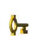
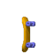
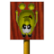

# Objects/Elements Catalog (`ObjectType`, 204 IDs)

**Status: COMPLETE for classification** — every ID 0–203 is now placed in exactly one of four
categories (real behavior + used in shipped levels / real behavior but never placed in a shipped
level / ambiguous boundary-only reference / vestigial with zero references), verified
programmatically against real mobile-eggbert source and all 78 world files. Icon crops exist for
30 of the 70 "real behavior" IDs (the original 18 plus the 12 recently added — see below);
cropping icons for the remaining 40 "real but unused in shipped levels" IDs is not done (lower
value: they never appear in a real level, so there's nothing to visually cross-check against).
Tracked as `DOC-003` in `plan.md`.

`ObjectType` (`include/GalaxyEggbert/def/ObjectType.hpp`, mirrors mobile-eggbert's own enum
1:1 in numeric value, confirmed 0–203 with no gaps/duplicates) is already fully declared in
galaxy-eggbert with categorized comments. Summary by category (not re-listing all 204 IDs — see
the header for the full, already-commented list):

- **Platform lifts**: 1, 47, 48
- **Horizontal patrol enemies**: 2, 3, 96, 97
- **Bulldozer**: 4
- **Collectibles**: 5 (treasure), 6 (extra-life egg), 7 (level-exit goal), 21 (secret-level exit), 39 (pickup sparkle)
- **Key collectibles**: 49, 50, 51 (correspond to `DoorKeyFlags::Key1/2/3`)
- **Vehicle/power-up pickups**: 13 (helicopter), 19 (jeep), 24 (skateboard), 25 (shield), 26 (suction-cup), 28 (tank), 29 (bullet pack), 30 (drink), 31 (charge/cloud), 40 (mirror/invert), 46 (balloon), 55 (dynamite)
- **Explosions/visual effects** (transient, auto-expire): 8–12, 36–38, 41, 42, 53, 90–93, 98–100
- **Water/goo effects**: 14, 15, 34, 35
- **Projectiles**: 23 (fired by `blupih`/`blupit` enemies)
- **Patrol walker enemies**: 16 (spider), 17 (fish), 18 (variant), 20 (bird), 32 (`blupih`, fires projectiles on turn), 33 (`blupit`, fires two), 44 (wasp/bee), 54 (large creature, destroys helicopter on contact)
- **Moving level objects**: 22 (door-opening animation, see `06-doors.md`), 27 (magic sparkle), 52 (bridge construction, 157 frames), 56 (dynamite fuse), 57/58 (shield effects)
- **Blupi skin variants**: 200–203
- **Unidentified/reserved**: 43, 45, 59–89, 94, 101–199 (declared only to keep the enum contiguous
  for level-file round-trips — **now confirmed by direct source search, not assumed**: zero
  references to any of these IDs exist anywhere in `Decor.cpp` or `Tables.cpp`. `95` is a partial
  exception — see Category C below.)

## Classification methodology (verified programmatically)

For every ID 0–203: (1) searched `../mobile-eggbert/src/WindowsPhoneSpeedyBlupi/Decor.cpp`'s
`MoveObjectStepIcon()` function (the per-type icon/animation dispatch, lines ~8192–9057) for a
direct `ObjectType::ObjectTypeN` comparison; (2) for IDs not found there, searched the rest of
`Decor.cpp` and `Tables.cpp` for any reference at all; (3) cross-referenced against a real scan of
every `MoveObject: type=N` value across all 78 world files (`grep`, not a manual sample). Verified
by script: the four categories below partition all 204 IDs exactly — no ID in two categories, no ID
missing (`29 + 41 + 1 + 133 = 204`).

## Category A — real behavior AND placed in a shipped level (29 IDs)

`1,2,3,4,5,6,7,12,13,16,17,19,20,21,24,26,30,32,33,40,44,46,47,49,50,51,54,55,96`

**Fixed 2026-07-03**: 12 of these (`19,21,24,26,32,40,44,46,47,54,55,96`) previously never spawned
at all in `GalaxyEggbertSimple3D` (silently dropped by a hardcoded allowlist). All 12 now spawn,
verified against real level files (`tools/VerifyMoveObjectTypes.cpp`, 12/12 pass):

| Type | Name | Status |
|---|---|---|
| 47 | platform lift | Full — reuses `ObjectType1`'s lift movement, animated `table_chenille` track texture |
| 32 | blupih (patrol, fires projectiles) | Full — patrol movement, real `table_blupih_left` icon table |
| 44 | wasp/bee | Full — patrol movement, real `table_guepe_left` icon table |
| 54 | large creature | Full — patrol movement, real `table_creature_left` icon table |
| 96 | follower | Full — dormant→awake→chase behavior approximating mobile-eggbert's `Decor::MoveObjectFollow` |
| 19 | jeep | Partial — spawns with correct icon/animation, no pickup effect (vehicle mode not implemented) |
| 21 | secret-level exit | Partial — spawns with correct icon/animation, no pickup effect |
| 24 | skateboard | Partial — spawns with correct icon/animation, no pickup effect |
| 26 | suction-cup | Partial — spawns with correct icon/animation, no pickup effect |
| 40 | mirror/invert | Partial — spawns with correct icon/animation, no pickup effect |
| 46 | balloon | Partial — spawns with correct icon/animation, no pickup effect |
| 55 | dynamite | Partial — spawns with idle icon only, no fuse/explosion trigger (`ObjectType56`) wired up |

(The "partial" ones match an existing precedent: `ObjectType13`, helicopter, has had "spawns, no
collection effect" status all along — this isn't a new kind of gap.)

### ⚠️ Real bug found this pass: wrong sprite-sheet channel for at least 5 types

`GEDecorSystem.cpp`'s file header says "Sprites from `element.png`" and draws **every** `ObjectType`
via that one sheet unconditionally. Checking real level files' `MoveObject: ... channel=N` field
(the field that tells mobile-eggbert which actual sprite sheet to sample — see
`01-world-file-format.md`) shows this is **not universally true**:

| Type | Real `channel=` value in shipped levels | Real sheet | galaxy-eggbert currently assumes |
|---|---|---|---|
| 1 | `channel=1` | `PixmapChannel::Object` (`object-m.png`) | `element.png` (wrong) |
| 12 | `channel=1` | `PixmapChannel::Object` (`object-m.png`) | `element.png` (wrong) |
| 32 (blupih) | `channel=12` or `13` | `PixmapChannel::Blupi1_12`/`Blupi1_13` (`blupi1.png`) | `element.png` (wrong) |
| 33 (blupit) | `channel=11`, `12`, or `13` | `PixmapChannel::Blupi1_11/12/13` (`blupi1.png`) | `element.png` (wrong) — **this is one of the *original* 18 "confirmed" types**, not a new one |
| 47 (platform lift, track texture) | `channel=1` | `PixmapChannel::Object` (`object-m.png`) | `element.png` (wrong — and `table_chenille`'s icon values 311–316 are **out of bounds** for `element.png`, which only holds icons 0–289; cropping icon 311 from `element.png` throws an ImageMagick range error, confirmed) |

This means galaxy-eggbert's Simple3D port is very likely drawing the *wrong texture* (or, for type
47/48, a texture-sheet-bounds violation) for these 5 `ObjectType`s today. This is a real rendering
bug, not just a documentation gap — **not fixed in this pass** (out of scope for a cataloging task;
needs its own careful fix, likely reading `.channel` per-`MoveObjectSpec` from the level file
instead of hardcoding `element.png`). Recorded as a new item in `plan.md`.

`object-type047-icon311-objectchannel.png` (correct sheet) replaces the earlier, wrong-sheet crop
for type 47 in the icon table below.

## Category B — real behavior confirmed, but never placed in any of the 78 shipped levels (41 IDs)

These have genuine logic in `Decor.cpp` (confirmed by direct search, not assumed), but no level
author ever placed one — they may still be reachable through non-`MoveObject` paths (e.g. spawned
dynamically by other game logic, like explosion/effect types typically are) rather than being
level-authored placements.

| ID | Name (from `ObjectType.hpp`) |
|---|---|
| 0 | null / inactive slot |
| 8 | primary explosion (Explosion channel) |
| 9 | secondary small explosion |
| 10 | tertiary explosion |
| 11 | fan-hit shockwave (triggers BigShake) |
| 14 | water plouf splash |
| 15 | water bubble rising |
| 18 | patrol variant |
| 22 | door opening animation (dynamically spawned when a door opens — see `06-doors.md`) |
| 23 | fired projectile (from blupih/blupit enemies — dynamically spawned, not level-placed) |
| 25 | shield (100 ticks invincibility) — has a confirmed icon table (`kShield`/real `table_shield`) but is apparently never a placed `MoveObject`; likely granted as an effect, not an authored pickup |
| 27 | magic track sparkle (24 frames) |
| 28 | tank |
| 29 | bullet ammo pack (+10 bullets) |
| 31 | charge/cloud power-up (100 ticks) |
| 34 | goo/glue particle (25-frame loop) |
| 35 | small plouf splash |
| 36 | pollution/cloud puff (8 frames) |
| 37 | clear/dissipate effect (70 frames) |
| 38 | electric arc (90 frames) |
| 39 | sparkle trail (spawned on pickup, not level-placed) |
| 41 | invert-start particle burst |
| 42 | invert-stop particle burst |
| 48 | platform lift, leftward carry bonus (same channel-mismatch risk as `47`, not yet checked — deferred) |
| 52 | bridge construction (157 frames) |
| 53 | tentacle hazard (45 frames, Explosion channel) |
| 56 | dynamite fuse (100 frames, triggers blasts 50–69 — dynamically spawned by `55`, not level-placed directly) |
| 57 | shield trail sparkle (20 frames) |
| 58 | shield disappear effect |
| 90 | electric spark (triggers ElectricShake) |
| 91 | small flash |
| 92 | long energy arc (128 frames) |
| 93 | tiny flash (5 frames) |
| 97 | follow enemy variant 2 (tracks Blupi exactly — the "awake" promotion of `96`, dynamically switched-to, not level-placed as `97` directly) |
| 98 | water splash variant 1 (10 frames) |
| 99 | water splash variant 2 (13 frames) |
| 100 | water splash variant 3 (18 frames) |
| 200 | Blupi default skin |
| 201 | Blupi skin variant 1 (damages Blupi on contact) |
| 202 | Blupi skin variant 2 |
| 203 | Blupi skin variant 3 |

## Category C — ambiguous: boundary-only reference (1 ID)

**`95`** appears in `Decor.cpp` only as a numeric bound inside range comparisons (e.g.
`type > ObjectType::ObjectType95`, `type <= ObjectType::ObjectType95`) used to test whether some
*other* object's type falls inside a broad "effect-ish" numeric range — it is never itself the
subject of a direct `type == ObjectType95` check. Unclear whether `95` denotes a real, distinct
object or is purely a range-fence value chosen because `94`/`95` happen to sit between confirmed
ranges (`90–93` and `96–100`). Left unresolved rather than guessed.

## Category D — vestigial: zero references anywhere in `Decor.cpp`/`Tables.cpp` (133 IDs)

`43`, `45`, `48`(see Category B, not here), `59`–`89`, `94`, `101`–`199`. Exact ranges (verified,
no overlap with categories A/B/C, no gaps against 0–203): `43`, `45`, `59-89`, `94`, `101-199`.
These are genuinely inert — the enum only declares them to keep level-file byte offsets/round-trips
stable, not because they do anything in the original game.

## Known icons (phase-0 frame)

Images are 60×60 px crops from `element.png` (60×60 px tiles, no gap, 10 columns — see
`02-tiles.md`'s image-generation note for the general grid-math method), except `47` which is
64×64 from `object-m.png` (see the channel-bug note above). 30 of the 70 Category-A/confirmed IDs
have a crop: the original 18 (from `GEDecorSystem::GetObjIcon`) plus the 12 added in the
2026-07-03 `MoveObject` fix.

| Image | ObjectType | Category (from above) |
|---|---|---|
|  | 1 | Platform lift |
|  | 2 | Horizontal patrol enemy |
|  | 3 | Horizontal patrol enemy |
|  | 4 | Bulldozer |
|  | 5 | Collectible (treasure) |
|  | 6 | Collectible (extra-life egg) |
|  | 7 | Collectible (level-exit goal) |
|  | 12 | Explosion/visual effect (icon shown is via `element.png` — real channel is `Object`, see bug note above) |
|  | 13 | Vehicle/power-up pickup (helicopter) |
|  | 16 | Patrol walker enemy (spider) |
|  | 17 | Patrol walker enemy (fish) |
|  | 19 | Vehicle/power-up pickup (jeep) |
|  | 20 | Patrol walker enemy (bird) |
|  | 21 | Collectible (secret-level exit) |
|  | 24 | Vehicle/power-up pickup (skateboard) |
|  | 25 | Vehicle/power-up pickup (shield) |
|  | 26 | Vehicle/power-up pickup (suction-cup) |
|  | 30 | Vehicle/power-up pickup (drink) |
|  | 32 | Patrol walker enemy (`blupih`) — icon shown is via `element.png`; real channel is `blupi1.png`, see bug note above |
|  | 33 | Patrol walker enemy (`blupit`) — icon shown is via `element.png`; real channel is `blupi1.png`, see bug note above |
|  | 40 | Vehicle/power-up pickup (mirror/invert) |
|  | 44 | Patrol walker enemy (wasp/bee) |
|  | 46 | Vehicle/power-up pickup (balloon) |
|  | 47 | Platform lift (track texture) — correct-channel crop (`object-m.png`) |
|  | 49 | Key collectible (`Key1`) |
|  | 50 | Key collectible (`Key2`) |
|  | 51 | Key collectible (`Key3`) |
|  | 54 | Patrol walker enemy (large creature) |
|  | 55 | Vehicle/power-up pickup (dynamite, idle icon) |
|  | 96 | Horizontal patrol enemy (follower, dormant) |

## Blupi (not an `ObjectType` — the player character, `blupi.png`/`blupi1.png`)

A few representative 60×60 px frames (of 340 total across the sheet's 10×34 grid) — not a full
state/animation catalog (see `08-animations.md` for animated GIFs of Blupi's actual states):

