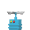
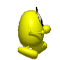

# Objects/Elements Catalog (`ObjectType`, 204 IDs)

**Status: PARTIAL — 18 of 204 `ObjectType`s have a confirmed icon; 29 of 204 are confirmed to
appear in real level files at all (of which 12 were only recently made to spawn — see below); the
remaining ~175 are undocumented beyond the category guesses below.** Tracked as `DOC-003` in
`plan.md`.

`ObjectType` (`include/GalaxyEggbert/def/ObjectType.hpp`, mirrors mobile-eggbert's own enum
1:1 in numeric value) is already fully declared in galaxy-eggbert with categorized comments.
Summary by category (not re-listing all 204 IDs — see the header for the full, already-commented
list):

- **Platform lifts**: 1, 47, 48
- **Horizontal patrol enemies**: 2, 3, 96, 97
- **Bulldozer**: 4
- **Collectibles**: 5 (treasure), 6 (extra-life egg), 7 (level-exit goal), 21 (secret-level exit), 39 (pickup sparkle)
- **Key collectibles**: 49, 50, 51 (correspond to `DoorKeyFlags::Key1/2/3`)
- **Vehicle/power-up pickups**: 13 (helicopter), 19 (jeep), 24 (skateboard), 25 (shield), 26 (suction-cup), 28 (tank), 29 (bullet pack), 30 (drink), 31 (charge/cloud), 40 (mirror/invert), 46 (balloon), 55 (dynamite)
- **Explosions/visual effects** (transient, auto-expire): 8–12, 36–38, 41, 42, 53, 90–93, 98–100
- **Water/goo effects**: 14, 15, 34, 35
- **Projectiles**: 23 (fired by `blupih`/`blupit` enemies)
- **Patrol walker enemies**: 16 (spider), 17 (fish), 18 (variant), 20 (bird), 32 (`blupih`, fires projectiles on turn), 33 (`blupit`, fires two), 44 (wasp/bee), 54 (large creature, destroys helicopter on contact)
- **Moving level objects**: 22 (door-opening animation, see `06-doors.md`), 27 (magic sparkle), 52 (bridge construction, 157 frames), 56 (dynamite fuse), 57/58 (shield effects)
- **Blupi skin variants**: 200–203
- **Unidentified/reserved**: 43, 45, 59–89, 94, 95, 101–199 (declared only to keep the enum
  contiguous for level-file round-trips; not confirmed to have distinct real-game meaning — this
  large unresolved range is most of what `DOC-003` needs to research)

Icon/frame mapping for objects is table-driven per type (`GEDecorSystem::GetObjIcon` in the
already-shipped Simple3D port is the galaxy-eggbert-side reimplementation, e.g. `ObjectType2`/`3`
cycle 9-frame patrol-walk tables, `ObjectType5` treasure cycles a 22-frame sparkle, etc. — see that
file for the exact per-type table references rather than re-deriving them here).

## Spawn/behavior status per type actually seen in real level files

A scan of all 78 real world files found 29 `ObjectType` values in actual use:
`1,2,3,4,5,6,7,12,13,16,17,19,20,21,24,26,30,32,33,40,44,46,47,49,50,51,54,55,96`.

**Fixed 2026-07-03**: 12 of these (`19,21,24,26,32,40,44,46,47,54,55,96`) previously never spawned
at all in `GalaxyEggbertSimple3D` (silently dropped by a hardcoded allowlist). All 12 now spawn,
verified against real level files (`tools/VerifyMoveObjectTypes.cpp`, 12/12 pass):

| Type | Name | Status |
|---|---|---|
| 47 | platform lift | Full — reuses `ObjectType1`'s lift movement, animated `table_chenille` track texture |
| 32 | blupih (patrol, fires projectiles) | Full — patrol movement, real `table_blupih_left` icon table |
| 44 | wasp/bee | Full — patrol movement, real `table_guepe_left` icon table |
| 54 | large creature | Full — patrol movement, real `table_creature_left` icon table |
| 96 | follower | Full — dormant→awake→chase behavior approximating mobile-eggbert's `Decor::MoveObjectFollow` |
| 19 | jeep | Partial — spawns with correct icon/animation, no pickup effect (vehicle mode not implemented) |
| 21 | secret-level exit | Partial — spawns with correct icon/animation, no pickup effect |
| 24 | skateboard | Partial — spawns with correct icon/animation, no pickup effect |
| 26 | suction-cup | Partial — spawns with correct icon/animation, no pickup effect |
| 40 | mirror/invert | Partial — spawns with correct icon/animation, no pickup effect |
| 46 | balloon | Partial — spawns with correct icon/animation, no pickup effect |
| 55 | dynamite | Partial — spawns with idle icon only, no fuse/explosion trigger (`ObjectType56`) wired up |

(The "partial" ones match an existing precedent: `ObjectType13`, helicopter, has had "spawns, no
collection effect" status all along — this isn't a new kind of gap.)

## Known icons (phase-0 frame, from `GEDecorSystem::GetObjIcon`)

Images are 60×60 px crops from `element.png` (see `02-tiles.md`'s image-generation note for the
general method; this sheet's grid is 60×60 px, no gap, 10 columns). Only the 18 `ObjectType`s
`GEDecorSystem::GetObjIcon` had a case for **at the time these crops were generated** are shown —
the 12 types added in the fix above are not yet cropped here (tracked under `DOC-003`). Every other
type in the categories above has no confirmed icon, so is left as text-only rather than guessed.

| Image | ObjectType | Category (from above) |
|---|---|---|
|  | 1 | Platform lift |
|  | 2 | Horizontal patrol enemy |
|  | 3 | Horizontal patrol enemy |
|  | 4 | Bulldozer |
|  | 5 | Collectible (treasure) |
|  | 6 | Collectible (extra-life egg) |
|  | 7 | Collectible (level-exit goal) |
|  | 12 | Explosion/visual effect |
|  | 13 | Vehicle/power-up pickup (helicopter) |
|  | 16 | Patrol walker enemy (spider) |
|  | 17 | Patrol walker enemy (fish) |
|  | 20 | Patrol walker enemy (bird) |
|  | 25 | Vehicle/power-up pickup (shield) |
|  | 30 | Vehicle/power-up pickup (drink) |
|  | 33 | Patrol walker enemy (`blupit`) |
|  | 49 | Key collectible (`Key1`) |
|  | 50 | Key collectible (`Key2`) |
|  | 51 | Key collectible (`Key3`) |

## Blupi (not an `ObjectType` — the player character, `blupi.png`/`blupi1.png`)

A few representative 60×60 px frames (of 340 total across the sheet's 10×34 grid) — not a full
state/animation catalog (see `08-animations.md` for animated GIFs of Blupi's actual states):

