# Backgrounds / Sky Regions

**Status: COMPLETE.** `region=` → filename mapping resolved (`DOC-247`, `DOC-248`); all 28 level
backgrounds thumbnailed (`DOC-249`-`DOC-256`); the 10 non-level UI-screen backgrounds documented
(`DOC-257`). Tracked as `DOC-006` in `plan.md`.

`../mobile-eggbert/Content/backgrounds/` contains 38 images total: 28 level backgrounds
(`decor000.png` through `decor031.png`, non-contiguous — ids 005, 014, 017, 023 are missing from
the set) plus **10** non-level UI-screen backgrounds — `init.png`, `lost.png`, `pause.png`,
`setup.png`, `speedyblupi.png`, `trial.png`, `wait.png`, `win.png`, `blupiyoupie.png`, `gear.png`.
**Correction: earlier drafts of this file only mentioned `blupiyoupie.png`/`gear.png`** — there are
8 more UI-screen files, confirmed below.

## The `region=` → filename mapping (`DOC-247`, resolved)

The mapping is **direct, not a lookup table**: `Decor::LoadImages()` (`Decor.cpp` ~line 244) builds
the filename straight from the level's region number —

```cpp
oss << "decor" << std::setw(3) << std::setfill('0') << m_region;   // e.g. region=7 -> "decor007"
m_pixmap->BackgroundCache(name);
```

— and `m_region` is read directly from the level file's `region=` field
(`Worlds::GetIntField(..., "region")`, `Decor.cpp` ~line 11323). There is no indirection through
world number, level index, or any other selector — `region=N` always means `decorNNN.png`, full
stop. This closes the single most important open question this file previously flagged.

**Cross-check against all 78 real level files (`DOC-248`):** extracted every `region=` value from
`../mobile-eggbert/worlds/*.txt` (28 distinct values used: 0-4, 6-13, 15, 16, 18-22, 24-31) and
confirmed every single one has a real, existing `decorNNN.png` — zero missing backgrounds are ever
actually referenced by a real level. The 4 "missing" ids (005, 014, 017, 023) are exactly the ones
no level ever uses; not a coincidence, and not something to fill in.

**The 10 non-level UI-screen backgrounds are loaded the same way, by literal name, not a region
number** — `Pixmap::BackgroundCache("wait"/"init"/"pause"/"lost"/"win"/"setup"/"trial")` is called
directly from `Game1.cpp`'s screen-state switch (not gameplay code); `speedyblupi.png` (title
screen) and `blupiyoupie.png`/`gear.png` are loaded elsewhere by the same mechanism. None of these
10 ever go through `Decor::LoadImages()`'s `region=` path.

**What galaxy-eggbert currently does instead:** `GEWorldRuntime` parses `region=` into `skyRegion_`
but the Simple3D target does not use it — it instead picks one of 5 hardcoded flat sky colors
indexed by **world number** (1–5, "Grassland/Forest/Ice Caves/Lava Fields/Space Station"), explicitly
marked `TODO(S3D-sky)` as a rough proxy since Simple3D lacks a fog/zone API. No real background
*image* (parallax `decorNNN.png`) is loaded by either galaxy-eggbert target today.

Thumbnails (resized to 240×180, same method as `DOC-233`: plain `convert -resize`, not a
sprite-sheet crop, so unaffected by the `object-m.png` leading-margin bug):


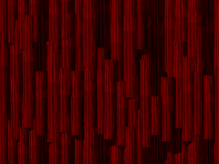
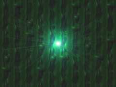
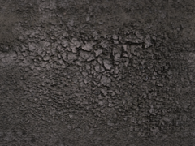
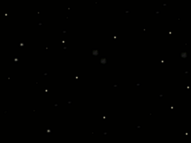
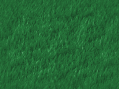
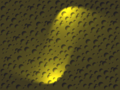
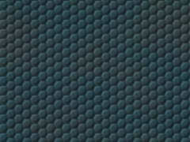

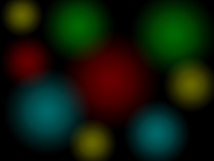
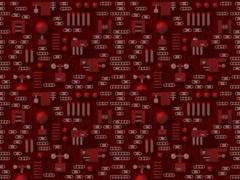
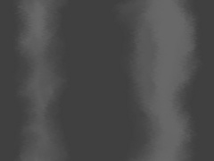

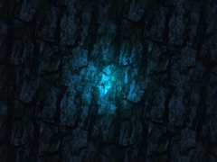
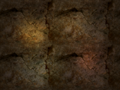
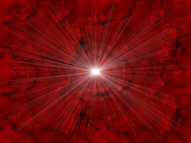
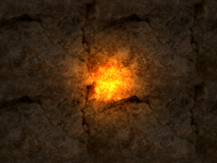
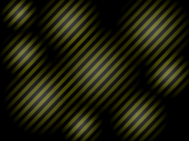
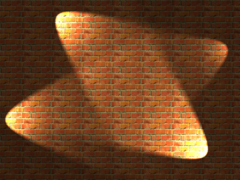
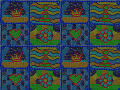
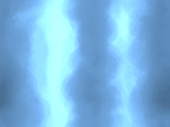
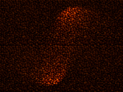
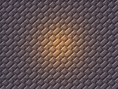
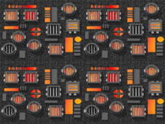
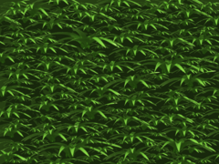
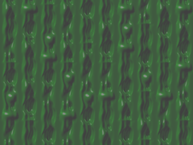

**`DOC-233`/`DOC-249`-`DOC-256` (2026-07-04):** all 28 level backgrounds now thumbnailed —
`decor000`-`decor002` re-verified (`DOC-233`); `decor003` (`DOC-249`), `decor004`/`006`/`007`
(`DOC-250`, skipping missing id `005`), `decor008`-`011` (`DOC-251`), `decor012`/`013`/`015`
(`DOC-252`, skipping missing id `014`), `decor016`/`018`/`019` (`DOC-253`, skipping missing id
`017`), `decor020`-`022` (`DOC-254`, skipping missing id `023`), `decor024`-`027` (`DOC-255`), and
`decor028`-`031` (`DOC-256`) added. All 28 confirmed pixel-exact (`compare -metric AE`=0) against a
fresh `convert decorNNN.png -resize 240x180`. `decor015` is a genuinely grayscale image (not a
bug) — a stone-cave background. This completes the level-background half of `DOC-006`.

## The 10 non-level UI-screen backgrounds (`DOC-257`)

None of these go through `region=`/`Decor::LoadImages()`. Two different loading mechanisms:

**7 files loaded by literal name via the same `Pixmap::BackgroundCache()` used for levels**, keyed
off the game's UI `Def::Phase` state machine in `Game1::SetPhase()` (`Game1.cpp` ~line 1025):

| File | Real trigger |
|---|---|
| `wait.png` | Boot/loading screen — loaded once in `Game1::LoadContent()`, before any phase is set. |
| `init.png` | `Def::Phase::Init` — the main menu/title phase. |
| `pause.png` | `Def::Phase::Pause`, `Resume`, and `Ranking` (all three reuse this one file). |
| `lost.png` | `Def::Phase::Lost` — level-failed screen. |
| `win.png` | `Def::Phase::Win` — level-complete screen. |
| `setup.png` | `Def::Phase::MainSetup` and `PlaySetup` (both reuse this one file). |
| `trial.png` | `Def::Phase::Trial` — trial/demo-mode nag screen. |

**3 files loaded once at startup into their own dedicated texture slots** (`Pixmap::LoadContent()`,
not the swappable `bitmapBackground` slot the 7 files above share) — these are logo/menu-chrome
graphics drawn as UI overlays, not full-screen phase backgrounds:

| File | Real trigger |
|---|---|
| `speedyblupi.png` | The "SpeedyBlupi" title logo — drawn by `Game1::DrawBackgroundFade()` during the fade-in/fade-out transition animation between phases. |
| `blupiyoupie.png` | The "Youpie" (celebration) character graphic — drawn in several places in `Game1::Draw()`/`DrawBackgroundFade()` during win/celebration animation beats (rotating/scaling entrance effects). |
| `gear.png` | A spinning gear icon — drawn by `Game1::DrawButtonsBackground()` behind the on-screen button chrome (two overlapping copies, counter-rotating). |

This closes `DOC-006` (the full background catalog) entirely.
