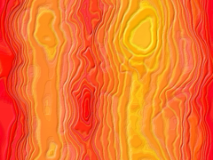

# Backgrounds / Sky Regions

**Status: PARTIAL — 3 of 38 background images shown; the `region=` → filename mapping is
unresolved.** Tracked as `DOC-006` in `plan.md`.

`../mobile-eggbert/Content/backgrounds/` contains 38 background images (`decor000.png` through
`decor031.png`, non-contiguous numbering — several ids like 005, 014, 017, 023 are missing from the
set) plus `blupiyoupie.png` and `gear.png` (title/settings-screen backgrounds, not level
backgrounds). The level header's `region=` field is presumably the selector for one of these
`decorNNN.png` background images per level, but **the exact region→filename mapping code was not
located in this pass** (region-to-background selection likely lives in higher-level UI/game-state
code not yet inspected, e.g. wherever `PixmapChannel::Background` gets (re)loaded) — this is an
open item, not a confirmed fact. Closing this requires locating that mapping code and, ideally,
cross-checking it against every level file's actual `region=` value.

**What galaxy-eggbert currently does instead:** `GEWorldRuntime` parses `region=` into `skyRegion_`
but the Simple3D target does not use it — it instead picks one of 5 hardcoded flat sky colors
indexed by **world number** (1–5, "Grassland/Forest/Ice Caves/Lava Fields/Space Station"), explicitly
marked `TODO(S3D-sky)` as a rough proxy since Simple3D lacks a fog/zone API. No real background
*image* (parallax `decorNNN.png`) is loaded by either galaxy-eggbert target today.

Sample thumbnails (resized to 240px wide; 35 of 38 backgrounds still need a thumbnail):

**`DOC-233` (2026-07-04):** re-verified all 3 thumbnails. These are plain resizes of the full
`decorNNN.png` source (640×480 → 240×180, same aspect ratio), not sprite-sheet crops, so they were
never subject to the `object-m.png` leading-margin bug. Confirmed pixel-exact (`compare -metric
AE`=0) against a fresh `convert decorNNN.png -resize 240x180`, and confirmed the `bg-decorNNN` ↔
`decorNNN` numbering correspondence is direct (no off-by-one). No regeneration needed.
