# Animations

**Status: COMPLETE.** 131 animated sequences documented: 12 tiles (§1), all 87 real `BlupiAction`
states — 84 with a real `table_blupi`-sourced animation, 3 confirmed to have no direct record
(§2), 14 original + 9 newer object animations (§3), 8 explosions (§4), 1 door slide (§5).
(12+87+14+9+8+1 = 131; a prior version of this line said 155, which didn't match this
breakdown — corrected 2026-07-05.)

**2026-07-18 update**: added §8, a galaxy-eggbert (CNA) implementation-status cross-reference (41
of the 84 recorded actions are now actually wired into `BlupiController`'s own `AnimState`
system — this file itself never tracked that, only mobile-eggbert's real behavior). Also corrected
the Mockery section (§2, "Table/level-editing" area): its "enemy mocking Blupi" description was
inherited verbatim from `BlupiAction.hpp`'s own misleading doc comment and is backwards — verified
directly against `Decor::MockeryDetect()` that it's actually Blupi taunting a nearby enemy, not the
reverse.

**History**: an earlier pass in this series (2026-07-03) documented only the 8 `BlupiState` values
`BlupiController.cpp` (galaxy-eggbert's own partial Simple3D port) implements, not mobile-eggbert's
real 87-state `BlupiAction` enum — the user caught that this was the wrong source of truth (both the
generating pass and the coordinator's own verification had trusted the partial port as if it were
complete, instead of checking mobile-eggbert's own enum directly). §2 was regenerated from scratch
against the real source — see §2's own methodology note for details. Tiles (§1) and
objects/explosions/door (§3–§5) were not affected by this specific gap. Tracked as `DOC-004` in
`plan.md`.

Every animated sequence mobile-eggbert's tile/character/object system can produce, as looping
GIFs assembled (with ImageMagick) from per-sheet grid crops — this is meant as a full overview of
what the animation system does, to inform what galaxy-eggbert eventually needs to replicate. Frame
data is taken from galaxy-eggbert's own already-approved, verified-against-source ports
(`TerrainRenderer.cpp`'s `kAnim*` tables, `BlupiController.cpp`'s state tables,
`GEDecorSystem::GetObjIcon`'s per-type tables), not re-derived here. All GIFs loop (last frame
connects back to the first).

**All 129 GIFs regenerated 2026-07-04 (`DOC-100`-`DOC-229`)**: the user found by visual inspection
that every animated GIF in this file was corrupted — each frame accumulated the previous frame's
opaque pixels instead of clearing (`convert`'s default GIF disposal method is `Undefined`, not
`Background`). Confirmed via alpha-channel analysis (mean alpha per coalesced frame climbs and
plateaus instead of tracking the real per-frame silhouette) and fixed in
`mobile-eggbert-reference/tools/make-gif.sh` (`-dispose Background`). A second bug found along the
way: genuinely translucent tiles (e.g. `Water1`) could randomly collapse to fully transparent under
GIF's binary-alpha encoding — fixed in the same script (`-channel A -threshold 1%`, forcing any
visible pixel fully opaque; translucent content now renders as its real saturated color). Two of
the regenerated GIFs (`blupi-action-02-march.gif`, `explosion-anim-explo1.gif`) are the exact files
that originally surfaced the bug report. Regenerating also surfaced two real **engine** bugs (not
GIF-tooling bugs) — see `plan.md` §13 for `S3D-2` (`BlockTypes::tileUV()`'s leading-margin grid bug,
found via `tile-anim-lava.gif`'s visible seam) and `S3D-4` (`ObjectType47`/Chenille's wrong sprite
sheet).

**Correction (2026-07-03, found while completing this pass): the "6 fps" tick rate claimed below
for object/explosion animations is not confirmed and is likely wrong.** Tile animations
(`WorldRuntime::Update()`) and Blupi's state animations (`BlupiController::AdvanceAnim()`) both
use an explicit, throttled timer (6 fps and 8 fps respectively — these ARE confirmed, real, in the
code). Object animations (`GEDecorSystem::Update()`) have **no such throttle** —
`st.animPhase = (st.animPhase + 1) % 10000;` runs unconditionally every call, and
`GEDecorSystem::Update()` is called once per game frame with no rate cap found anywhere in
`GalaxyEggbertSimple3D`. This means object-animation phase advances at the *display frame rate*
(commonly ~60 fps, but not a guaranteed constant), not a fixed 6 fps — the per-type "duration/frame"
and "loop length" values in §3 below (inherited from the original animation pass, not re-verified in
this one) are likely off by roughly a factor of 10 (e.g. a `p/6` divisor at 60 fps is 100 ms/frame,
not the ~1.0 s/frame the existing table claims). **Not corrected in this pass** — re-deriving the
real frame rate needs either instrumenting a real run or finding an explicit rate constant this
search didn't locate; flagging it here rather than leaving the wrong assumption undocumented, per
`feedback_ask_before_scoping_completeness`-style discipline (don't silently carry forward an
unverified number as if confirmed). New animation entries added in this pass (§2–§4) use the same
"N ticks, assumed frame rate" phrasing with the same caveat, not a confirmed duration.

## 1. Animated tiles (`object-m.png`, galaxy-eggbert's own uniform 6 fps ≈ 167 ms/frame tick — real
and throttled in `WorldRuntime::Update()`, but a simplification: mobile-eggbert's real per-tile
divisors vary and mostly don't equal 167 ms/frame, e.g. Saw ticks at 50 ms/frame (20 fps, `Decor.cpp`'s
`table_decor_scie` divisor=1) and Crusher/Water1/Marine at 150 ms/frame (divisor=3) — see the
per-tile table below for mobile-eggbert's actual rates; do not read "6 fps" as a mobile-eggbert-confirmed
constant)

| Animation | Frames | Duration/frame | Loop length | GIF |
|---|---|---|---|---|
| Lava | 8 | 167 ms | 1.33 s | 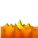 |
| Spike | 16 | 167 ms | 2.67 s | 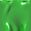 |
| Crusher | 10 | 167 ms | 1.67 s |  |
| Saw | 6 | 167 ms | 1.0 s |  |
| Water1 | 6 | 167 ms | 1.0 s |  |
| Water2 | 6 | 167 ms | 1.0 s |  |
| Temp | 20 (incl. 2 fully-transparent "vanish" frames) | 167 ms | 3.33 s |  |
| Marine | 11 | 167 ms | 1.83 s |  |
| FanLeft | 3 | 167 ms | 0.5 s | 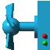 |
| FanRight | 3 | 167 ms | 0.5 s |  |
| FanUp | 3 | 167 ms | 0.5 s |  |
| FanDown | 3 | 167 ms | 0.5 s |  |

The two `-1` ("invisible") frames in `Temp`'s table are rendered as fully-transparent frames here
(verified: alpha channel mean 0 on both), not skipped — matching the real vanish-then-reappear
behavior (Blupi falls through while invisible, per `02-tiles.md`).

## 2. Blupi character states — all 87 real `BlupiAction` values (`blupi.png`/`element.png`, 8 fps
base tick = 125 ms/frame per `BlupiController.cpp`'s confirmed throttled timer)

**Complete as of this pass.** Source of truth is mobile-eggbert's real
`../mobile-eggbert/include/WindowsPhoneSpeedyBlupi/def/BlupiAction.hpp` enum (87 real states,
`None`=0 excluded) — NOT galaxy-eggbert's `BlupiController.cpp`, which only implements 8 of
these for the currently-playable Simple3D game (this was the exact gap the user caught: an earlier
pass in this series treated the partial port as if it were the complete animation set). Frame data
comes from parsing `Tables::table_blupi[2911]`
(`../mobile-eggbert/src/WindowsPhoneSpeedyBlupi/Tables.cpp`) directly and programmatically — a flat
record list `{actionId, frameCount, holdLimit, icon_0..icon_(frameCount-1)}` terminated by
`actionId==0`, consumed by `Decor::BlupiSearchIcon()` (`Decor.cpp` ~line 2390). `holdLimit`
(confirmed from that function's doc comment) clamps the phase counter at a fixed frame for
one-shot animations instead of wrapping — noted per-row below where it applies. Channel selection
(`blupi.png` vs `element.png`) is also read directly from `BlupiSearchIcon()`: only
`Clear1`/`Clear2`/`Clear3`/`Glu`/`Electro` (the last only while its icon is `< 266`) use
`element.png`; everything else uses `blupi.png`. Icon `-1` in a frame list is a real, confirmed
"invisible frame" sentinel (same convention as the `Temp` tile, `02-tiles.md`) — rendered as a
transparent 60×60 frame, not skipped. **3 of the 87 actions (`Set`=12, `Recedeq`=70, `Advanceq`=71)
have no `table_blupi` record at all** — mobile-eggbert's own doc comment says stage-1 "action
remapping" rewrites the base action into a mode-specific variant before the table lookup runs, so
these likely resolve to another action's animation at runtime; this pass did not trace that
remapping logic, so they're listed as "no record found" rather than a guessed mapping.

Independent cross-check: this pass's parse of `table_blupi` reproduces `BlupiController.cpp`'s
existing `March`/`Jump`/`Air`/`SwimIdle`/`SwimMove` frame arrays byte-for-byte — confirms both the
parser and galaxy-eggbert's original 5-action port are correct as far as they go; the gap was
purely that 82 other real actions were never in scope for that port in the first place.

### Core ground movement

| Action | ID | Description | Frames | Sheet | GIF |
|---|---|---|---|---|---|
| `Stop` | 1 | Standing still (ACTION_STOP). | 330 | blupi.png | 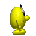 |
| `March` | 2 | Walking (ACTION_MARCH). | 6 | blupi.png | 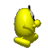 |
| `Turn` | 3 | Turning around (ACTION_TURN). | 6 | blupi.png |  |
| `Jump` | 4 | Jumping (ACTION_JUMP). | 3 | blupi.png | 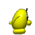 |
| `Air` | 5 | Airborne / falling (ACTION_AIR). | 5 | blupi.png | 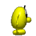 |
| `Down` | 6 | Moving down (ACTION_DOWN). | 3 | blupi.png |  |
| `Up` | 7 | Moving up (ACTION_UP). | 1 | blupi.png |  |
| `Vertigo` | 8 | Hanging on a ledge in fear (ACTION_VERTIGO). | 8 | blupi.png |  |
| `Recede` | 9 | Moving backward (ACTION_RECEDE). | 6 | blupi.png |  |
| `Advance` | 10 | Moving forward (ACTION_ADVANCE). | 6 | blupi.png |  |

### Table/level-editing & progression

| Action | ID | Description | Frames | Sheet | GIF |
|---|---|---|---|---|---|
| `Clear1` | 11 | Clearing/erasing animation variant 1 (ACTION_CLEAR1). | 70 | element.png |  |
| `Set` | 12 | Placing/setting an object (ACTION_SET). | *no `table_blupi` record found* | — | — |
| `Win` | 13 | Level-win celebration (ACTION_WIN). | 6 | blupi.png |  |
| `Push` | 14 | Pushing a crate (ACTION_PUSH). | 6 | blupi.png | 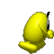 |

### Helicopter mode

| Action | ID | Description | Frames | Sheet | GIF |
|---|---|---|---|---|---|
| `StopHelico` | 15 | Hovering in helicopter mode (ACTION_STOPHELICO). | 1 | blupi.png |  |
| `MarchHelico` | 16 | Flying forward in helicopter mode (ACTION_MARCHHELICO). | 8 | blupi.png |  |
| `TurnHelico` | 17 | Turning in helicopter mode (ACTION_TURNHELICO). | 10 | blupi.png | 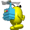 |

### Swimming (Nage) mode

| Action | ID | Description | Frames | Sheet | GIF |
|---|---|---|---|---|---|
| `StopNage` | 18 | Treading water (ACTION_STOPNAGE). | 10 | blupi.png |  |
| `MarchNage` | 19 | Swimming forward (ACTION_MARCHNAGE). | 14 | blupi.png |  |
| `TurnNage` | 20 | Turning while swimming (ACTION_TURNNAGE). | 10 | blupi.png |  |

### Surfboard mode

| Action | ID | Description | Frames | Sheet | GIF |
|---|---|---|---|---|---|
| `StopSurf` | 21 | Surfboard idle (ACTION_STOPSURF). | 12 | blupi.png |  |
| `MarchSurf` | 22 | Surfing forward (ACTION_MARCHSURF). | 12 | blupi.png | 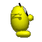 |
| `TurnSurf` | 23 | Turning on surfboard (ACTION_TURNSURF). | 10 | blupi.png |  |
| `Drown` | 24 | Drowning in deep water (ACTION_DROWN). | 90 | blupi.png |  |

### Jeep mode

| Action | ID | Description | Frames | Sheet | GIF |
|---|---|---|---|---|---|
| `StopJeep` | 25 | Jeep idle (ACTION_STOPJEEP). | 8 | blupi.png | 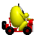 |
| `MarchJeep` | 26 | Driving jeep (ACTION_MARCHJEEP). | 8 | blupi.png |  |
| `TurnJeep` | 27 | Turning jeep (ACTION_TURNJEEP). | 7 | blupi.png |  |

### Pop-star / celebration

| Action | ID | Description | Frames | Sheet | GIF |
|---|---|---|---|---|---|
| `StopPop` | 28 | Pop-star idle (ACTION_STOPPOP). | 6 | blupi.png | 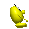 |
| `Pop` | 29 | Pop-star dancing/moving (ACTION_POP). | 6 | blupi.png |  |
| `Bye` | 30 | Farewell/exit animation (ACTION_BYE). | 12 | blupi.png | 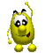 |

### Hanging/suspended mode

| Action | ID | Description | Frames | Sheet | GIF |
|---|---|---|---|---|---|
| `StopSuspend` | 31 | Hanging idle (ACTION_STOPSUSPEND). | 328 | blupi.png | 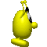 |
| `MarchSuspend` | 32 | Moving while hanging (ACTION_MARCHSUSPEND). | 12 | blupi.png |  |
| `TurnSuspend` | 33 | Turning while hanging (ACTION_TURNSUSPEND). | 10 | blupi.png |  |
| `JumpSuspend` | 34 | Jumping from a hanging position (ACTION_JUMPSUSPEND). | 10 | blupi.png |  |
| `Hide` | 35 | Hiding (ACTION_HIDE). | 9 | blupi.png |  |

### Hurt-jump / skateboard mode

| Action | ID | Description | Frames | Sheet | GIF |
|---|---|---|---|---|---|
| `JumpAie` | 36 | Hurt-jump (ACTION_JUMPAIE). | 32 | blupi.png | 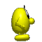 |
| `StopSkate` | 37 | Skateboard idle (ACTION_STOPSKATE). | 140 | blupi.png |  |
| `MarchSkate` | 38 | Skating forward (ACTION_MARCHSKATE). | 96 | blupi.png | 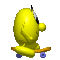 |
| `TurnSkate` | 39 | Turning on skateboard (ACTION_TURNSKATE). | 14 | blupi.png | 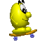 |
| `JumpSkate` | 40 | Jumping on skateboard (ACTION_JUMPSKATE). | 3 | blupi.png | 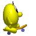 |
| `AirSkate` | 41 | Airborne on skateboard (ACTION_AIRSKATE). | 8 | blupi.png |  |
| `TakeSkate` | 42 | Picking up skateboard (ACTION_TAKESKATE). | 20 | blupi.png | 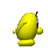 |
| `DeposeSkate` | 43 | Putting down skateboard (ACTION_DEPOSESKATE). | 20 | blupi.png |  |

### Relief ("Ouf") animations, part 1

| Action | ID | Description | Frames | Sheet | GIF |
|---|---|---|---|---|---|
| `Ouf1a` | 44 | Relief animation variant 1a (ACTION_OUF1a). | 29 | blupi.png |  |
| `Ouf1b` | 45 | Relief animation variant 1b (ACTION_OUF1b). | 29 | blupi.png |  |
| `Ouf2` | 46 | Relief animation variant 2 (ACTION_OUF2). | 32 | blupi.png |  |
| `Ouf3` | 47 | Relief animation variant 3 (ACTION_OUF3). | 34 | blupi.png | 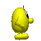 |
| `Ouf4` | 48 | Relief animation variant 4 (ACTION_OUF4). | 40 | blupi.png |  |

### Pickup & tank mode

| Action | ID | Description | Frames | Sheet | GIF |
|---|---|---|---|---|---|
| `Sucette` | 49 | Collecting a lollipop power-up (ACTION_SUCETTE). | 32 | blupi.png |  |
| `StopTank` | 50 | Tank idle (ACTION_STOPTANK). | 64 | blupi.png | 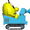 |
| `MarchTank` | 51 | Driving tank (ACTION_MARCHTANK). | 8 | blupi.png | 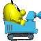 |
| `TurnTank` | 52 | Turning tank (ACTION_TURNTANK). | 12 | blupi.png |  |
| `FireTank` | 53 | Tank firing (ACTION_FIRETANK). | 6 | blupi.png | 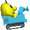 |

### Hazard contact

| Action | ID | Description | Frames | Sheet | GIF |
|---|---|---|---|---|---|
| `Glu` | 54 | Stuck in glue/trap (ACTION_GLU). | 25 | element.png |  |
| `Drink` | 55 | Drinking a power-up (ACTION_DRINK). | 4 | blupi.png |  |
| `Charge` | 56 | Being charged at by an enemy (ACTION_CHARGE). | 64 | blupi.png |  |
| `Electro` | 57 | Electrocuted (ACTION_ELECTRO). | 90 | mixed(icon<266=element.png,else=blupi.png) |  |
| `HelicoGlu` | 58 | Helicopter stuck in glue (ACTION_HELICOGLU). | 14 | blupi.png |  |

### Air/landing micro-states

| Action | ID | Description | Frames | Sheet | GIF |
|---|---|---|---|---|---|
| `TurnAir` | 59 | Turning while airborne (ACTION_TURNAIR). | 6 | blupi.png |  |
| `StopMarch` | 60 | Decelerating from walk to stop (ACTION_STOPMARCH). | 3 | blupi.png |  |
| `StopJump` | 61 | Jump landing (ACTION_STOPJUMP). | 5 | blupi.png | 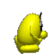 |
| `StopJumph` | 62 | High-jump landing (ACTION_STOPJUMPh). | 2 | blupi.png | 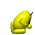 |

### Mockery (Blupi taunts a nearby enemy)

**Direction corrected 2026-07-18** (galaxy-eggbert session, cross-referenced against
`Decor.cpp:9518-9601`'s `MockeryDetect()` and its caller `Decor.cpp:5627-5636`): this table's
"Description" column and section header previously said "enemy mocking Blupi" — inherited verbatim
from `BlupiAction.hpp`'s own doc comment, which is itself misleading/backwards. The actual
behavior, confirmed directly against `Decor::BlupiStep()`'s logic (not just the enum comment): BLUPI
taunts a NEARBY enemy (proximity-only, a bounding-box overlap check, not contact/collision), gated
on being idle and off a real 300-tick (15s) `m_blupiTimeMockery` cooldown. `Mockeryp` always fires
for `ObjectType54` (the large creature) regardless of side; `Mockery`/`Mockeryi` are chosen for
every other qualifying enemy type (a specific list of 11 real `ObjectType`s) by whether the enemy
is ahead of or behind Blupi's own facing direction — except `ObjectType2` (standard patrol enemy),
which never gets the "ahead" `Mockery` variant, only `Mockeryi` when behind (the real source doesn't
state why this one type is asymmetric). Entry sound also confirmed directly: `Mockery`/`Mockeryi`
both play channel 65 (`Decor.cpp:3151/3165`); `Mockeryp` plays a DIFFERENT channel, 47
(`Decor.cpp:3179`) — not assumed from the other two. Implemented in galaxy-eggbert, see §8 below.

| Action | ID | Description | Frames | Sheet | GIF |
|---|---|---|---|---|---|
| `Mockery` | 63 | Blupi taunts a nearby enemy ahead of him (ACTION_MOCKERY). | 92 | blupi.png |  |
| `Mockeryi` | 64 | Blupi taunts a nearby enemy behind him, inverted pose (ACTION_MOCKERYi). | 104 | blupi.png |  |
| `Mockeryp` | 83 | Blupi taunts `ObjectType54` (large creature) specifically, alternate pose (ACTION_MOCKERYp). | 60 | blupi.png |  |

### Relief animation, part 2 & balloon

| Action | ID | Description | Frames | Sheet | GIF |
|---|---|---|---|---|---|
| `Ouf5` | 65 | Relief animation variant 5 (ACTION_OUF5). | 44 | blupi.png |  |
| `Balloon` | 66 | Balloon mode (ACTION_BALLOON). | 16 | blupi.png |  |

### Flattened ("Over") mode

| Action | ID | Description | Frames | Sheet | GIF |
|---|---|---|---|---|---|
| `StopOver` | 67 | Flat/squashed idle (ACTION_STOPOVER). | 1 | blupi.png |  |
| `MarchOver` | 68 | Moving while flat (ACTION_MARCHOVER). | 12 | blupi.png |  |
| `TurnOver` | 69 | Turning while flat (ACTION_TURNOVER). | 7 | blupi.png |  |

### Quick recede/advance

| Action | ID | Description | Frames | Sheet | GIF |
|---|---|---|---|---|---|
| `Recedeq` | 70 | Quick backward movement (ACTION_RECEDEq). | *no `table_blupi` record found* | — | — |
| `Advanceq` | 71 | Quick forward movement (ACTION_ADVANCEq). | *no `table_blupi` record found* | — | — |

### Crushed ("Ecrase") mode

| Action | ID | Description | Frames | Sheet | GIF |
|---|---|---|---|---|---|
| `StopEcrase` | 72 | Crushed idle (ACTION_STOPECRASE). | 1 | blupi.png |  |
| `MarchEcrase` | 73 | Moving while crushed (ACTION_MARCHECRASE). | 24 | blupi.png |  |

### Teleporting

| Action | ID | Description | Frames | Sheet | GIF |
|---|---|---|---|---|---|
| `Teleporte` | 74 | Teleporting (ACTION_TELEPORTE). | 128 (67 transparent) | blupi.png |  |

### Clearing/erasing animation variants

| Action | ID | Description | Frames | Sheet | GIF |
|---|---|---|---|---|---|
| `Clear2` | 75 | Clearing animation variant 2 (ACTION_CLEAR2). | 1 (1 transparent) | element.png |  |
| `Clear3` | 76 | Clearing animation variant 3 (ACTION_CLEAR3). | 70 (40 transparent) | element.png |  |
| `Clear4` | 77 | Clearing animation variant 4 (ACTION_CLEAR4). | 110 | blupi.png |  |
| `Clear5` | 78 | Clearing animation variant 5 (ACTION_CLEAR5). | 1 (1 transparent) | blupi.png |  |
| `Clear6` | 79 | Clearing animation variant 6 (ACTION_CLEAR6). | 1 (1 transparent) | blupi.png |  |
| `Clear7` | 80 | Clearing animation variant 7 (ACTION_CLEAR7). | 1 (1 transparent) | blupi.png |  |
| `Clear8` | 81 | Clearing animation variant 8 (ACTION_CLEAR8). | 1 (1 transparent) | blupi.png |  |

### Switch & refusal

| Action | ID | Description | Frames | Sheet | GIF |
|---|---|---|---|---|---|
| `Switch` | 82 | Activating a switch (ACTION_SWITCH). | 10 | blupi.png |  |
| `Non` | 84 | Blupi refusing / shaking head (ACTION_NON). | 18 | blupi.png |  |

### Skateboard braking

| Action | ID | Description | Frames | Sheet | GIF |
|---|---|---|---|---|---|
| `SlowdownSkate` | 85 | Skateboard braking (ACTION_SLOWDOWNSKATE). | 1 | blupi.png | 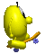 |

### Dynamite handling

| Action | ID | Description | Frames | Sheet | GIF |
|---|---|---|---|---|---|
| `TakeDynamite` | 86 | Picking up dynamite (ACTION_TAKEDYNAMITE). | 18 | blupi.png |  |
| `PutDynamite` | 87 | Placing dynamite (ACTION_PUTDYNAMITE). | 26 | blupi.png |  |

## 3. Object/pickup/enemy animations (`element.png` unless noted — see per-row sheet)

Durations below use the originally-claimed "6 fps ÷ divisor" figure inherited from the first
animation pass — **see the frame-rate correction note at the top of this file, these numbers are
not confirmed** (object animation is not throttled to a fixed rate in the code). Treat "duration"
columns here as illustrative ordering, not confirmed real-world timing.

### 3.1 Original 14 (from the first pass; `element.png`)

| ObjectType | Frames | Duration/frame (unconfirmed) | GIF |
|---|---|---|---|
| 2 (patrol enemy A) | 9 | 1.0 s |  |
| 3 (patrol enemy B) | 9 | 1.0 s |  |
| 4 (bulldozer) | 8 | 1.5 s |  |
| 16 (spider) | 9 | 0.5 s |  |
| 17 (fish) | 8 | 1.0 s |  |
| 20 (bird) | 8 | 1.0 s |  |
| 33 (`blupit`) | 8 | 1.0 s | 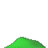 |
| 5 (treasure sparkle) | 22 (11-icon ping-pong) | 1.5 s | 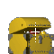 |
| 6 (extra-life egg) | 8 | 2.0 s |  |
| 7 (level-exit goal) | 8 | 1.5 s |  |
| 25 (shield) | 8 | 1.0 s |  |
| 49 (key, `Key1`) | 12 | 1.5 s |  |
| 50 (key, `Key2`) | 12 | 1.5 s | 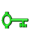 |
| 51 (key, `Key3`) | 12 | 1.5 s |  |

`ObjectType25`'s `kShield[8]` is a known-incomplete port of mobile-eggbert's real 16-frame
`table_shield` (flagged in `plan.md`'s `DOC-002` entry) — the GIF above reflects galaxy-eggbert's
current (partial) table, not mobile-eggbert's full one.

### 3.2 New this pass — the 12 newly-supported `ObjectType`s (`03-objects.md` Category A)

Frame data from `src/GalaxyEggbertSimple3D/Game/GEDecorSystem.cpp`'s `GetObjIcon()`, transcribed
from mobile-eggbert's `table_blupih_left`/`table_guepe_left`/`table_creature_left`/`table_chenille`/
`table_follow1`/`table_follow2`. **Sheet correction applied per `DOC-003`'s finding**: `32` (blupih)
crops from `blupi1.png` (not `element.png`); `47` (platform-lift chenille track) crops from
`object-m.png` (not `element.png` — its icon indices 311–316 are out of `element.png`'s bounds
entirely). `19` (jeep), `46` (balloon), `55` (dynamite) are single static icons, confirmed
channel=10 (`element.png`) — no animation, no GIF needed (already in `03-objects.md`'s icon table).

| ObjectType | Frames | Sheet | GIF |
|---|---|---|---|
| 21 (secret-level exit) | 12 | `element.png` | 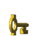 |
| 24 (skateboard) | 34 | `element.png` | 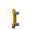 |
| 26 (suction-cup) | 8 | `element.png` |  |
| 32 (blupih, patrol+fires projectiles) | 8 | `blupi1.png` (corrected) |  |
| 40 (mirror/invert) | 20 | `element.png` | 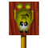 |
| 44 (wasp/bee) | 6 | `element.png` |  |
| 47 (platform lift track) | 6 | `object-m.png` (corrected) | 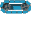 |
| 54 (large creature) | 8 | `element.png` |  |
| 96 (follower, dormant) | 26 | `element.png` |  |
| 96 (follower, awake/homing) | 5 | `element.png` |  |

All 9 remaining channels (`21,24,26,40,44,54,96`, plus the confirmed-`element.png` ones) were
cross-checked against real level files' `MoveObject: ... channel=` field (all `channel=10` =
`Element`, confirming `element.png` is correct for these — only `32` and `47` needed correction).

## 4. Explosions (`explo.png`, 144×144 px grid per `Pixmap.cpp`'s `PixmapChannel::Explosion`, 10 cols)

Frame data transcribed directly from mobile-eggbert's `Tables.cpp` `table_explo1`..`table_explo8`
(doc comments there label each as a distinct "channel" — channel numbering here is the table
index, 1–8, not to be confused with the `MoveObject:` `channel=` sprite-sheet field used elsewhere
in this doc). `-1` frames render as fully transparent (same technique as `Temp`'s vanish frames in
§1). Real per-icon bounding-box sizing (`Tables::table_explo_size`, keyed by a separate 0–99
"explosion channel" index, not cleanly 1:1 with these 8 tables) was not resolved in this pass — all
frames below use a flat 144×144 crop instead of each icon's real half-width/half-height box; treat
these GIFs as icon-sequence-correct but not pixel-perfect on sizing.

| Table | Frames | GIF | Notes |
|---|---|---|---|
| `table_explo1` | 39 | 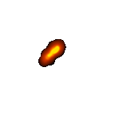 | primary blast sequence, no blank frames |
| `table_explo2` | 20 | 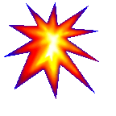 | scattered debris, several `-1` blank frames |
| `table_explo3` | 20 | 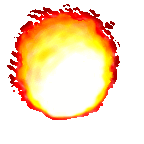 | smoke puff, no blank frames |
| `table_explo4` | 9 |  | short impact flash |
| `table_explo5` | 12 | 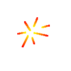 | strobing fragments (alternating visible/blank) |
| `table_explo6` | 6 |  | dense burst |
| `table_explo7` | 128 | 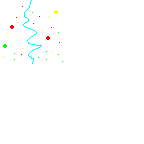 | large multi-particle scatter, staggered blanks, fades out |
| `table_explo8` | 5 | 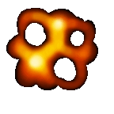 | dying-ember tail |

Which `ObjectType` triggers which `explo1`..`8` table was not resolved in this pass (the
`ObjectType8`–`12`/`36`–`38`/`41`/`42`/`53`/`90`–`93`/`98`–`100` "explosions/visual effects"
category in `03-objects.md` covers ~20 IDs for only 8 tables, so it's a many-to-one or
context-dependent mapping) — flagged as an open item, not guessed here.

## 5. Door opening (positional slide, not a frame-cycle — see `06-doors.md`)

Mobile-eggbert's door-open animation is a **position change**, not an icon-frame cycle: the door's
own static icon (334/335/336) slides upward by one tile over `Config::ScaleTime(50)` ticks (real
elapsed time depends on `Config::ScaleTime`'s scale factor, not resolved in this pass). Represented
here as a 10-frame linear slide of `Door1` (icon 334) from its resting position up and out of a
64×128 window — an illustrative approximation of the motion, not a frame-accurate port of the real
50-tick timing:

## 6. `Tables.cpp` completeness sweep

Every `table_*` identifier found in mobile-eggbert's `Tables.cpp` (`grep`, exhaustive), categorized:

**Covered above:** `table_blupi` (Blupi states, §2), `table_decor_lave`/`_eau1`/`_eau2`/`_ecraseur`/
`_scie`/`_temp`/`_piege1`/`_piege2` (tiles, §1 — Spike's two `_piege` tables both map into the
single `Spike` sequence already documented), `table_marine` (§1), `table_decor_ventillob`/
`_ventillod`/`_ventillog`/`_ventilloh` (the 4 fan tiles at icons 126-137, §1 — icons match
`BlockTypes::FanLeft`/etc. exactly), `table_cle1`/`_cle2`/`_cle3` (keys, §3.1), `table_tresortrack`
(treasure, §3.1), `table_blupih_left` (§3.2), `table_guepe_left` (§3.2), `table_creature_left`
(§3.2, "same for both directions in source" per `GEDecorSystem.cpp`'s comment), `table_chenille`
(§3.2), `table_follow1`/`table_follow2` (§3.2), `table_skate` (§3.2 as `24`'s table), `table_power`
(§3.2 as `26`'s table), `table_invert` (§3.2 as `40`'s table), `table_cle` (generic key table, used
as `21`'s secret-exit animation), `table_explo1`–`table_explo8` (§4).

**Deferred — real animation tables that exist but were not built into a GIF this pass** (mostly
directional-variant tables for enemies whose "left" cycle is already shown, or effects for
`ObjectType`s confirmed in `03-objects.md` Category B as never placed in any real level, so lower
value to visualize): `table_blupih_right`/`_turn2l`/`_turn2r`, `table_blupit_left`/`_right`/
`_turn2l`/`_turn2r` (blupit's own directional tables — the existing `kBlupit[8]` in `GetObjIcon` is
a simplification, not sourced 1:1 from these), `table_bulldozer_left`/`_right`/`_turn2l`/`_turn2r`,
`table_guepe_right`/`_turn2l`/`_turn2r`, `table_creature_turn2`, `table_oiseau_left`/`_right`/
`_turn2l`/`_turn2r`, `table_poisson_left`/`_right`/`_turn2l`/`_turn2r`, `table_bridge` (`ObjectType52`),
`table_charge` (`ObjectType31`), `table_chenillei` (inverse/return chenille direction), `table_clear`
(`ObjectType37`), `table_decor_goutte` (unidentified — droplet decoration?), `table_decor_ventb`/
`_ventd`/`_ventg`/`_venth` (icons 110-125, a distinct 4-frame "wind-vent particle stream" tile,
separate from the fan tiles already covered in §1 — not built into a GIF this pass), `table_drinkeffect`/`_drinkoffset`/
`_drinkoffsetLength` (`ObjectType30`'s drink effect, beyond its already-documented static icon 178),
`table_dynamitef` (`ObjectType56`, dynamite fuse), `table_electro` (`ObjectType38`), `table_glu`
(`ObjectType34`), `table_invertpanel`/`_invertstart`/`_invertstop` (`ObjectType41`/`42` particle
bursts, related to but distinct from `table_invert` already covered), `table_magicloop`/
`_magictrack` (`ObjectType27`), `table_mirror` (unidentified — possibly redundant with
`table_invert`, not resolved), `table_plouf` (`ObjectType14`), `table_pollution` (`ObjectType36`),
`table_ressort` (Spring tile bounce visual, if any — `Spring`/211 is documented as non-animated in
`02-tiles.md`, this table's exact role wasn't resolved), `table_shield_blupi`/`_shieldloop`/
`_shieldtrack` (`ObjectType57`/`58` shield effects beyond the base `kShield` already covered),
`table_sploutch1`/`_2`/`_3` (`ObjectType98`/`99`/`100` splash variants), `table_tentacule`
(`ObjectType53`), `table_tiplouf` (`ObjectType35`).

**Out of scope — not a visual frame-cycle animation:** `table_decor_quart` (7056-entry passability
lookup, the basis of `isMobileTransparent` — already documented in `02-tiles.md`), `table_decor_action`
(519-entry tile-motion sub-pixel displacement scripts, not a sprite sequence), `table_adapt_decor`/
`_adapt_fromage` (tile corner-blending replacement lookups, not animation), `table_explo_size`
(per-channel bounding-box size parameter, referenced in §4 above, not a sequence itself),
`table_training1`–`4` (tutorial-overlay placement records — column/row/action/text-ID, not sprite
frames), `table_vitesse_march`/`_nage`/`_surf` (movement speed-per-tick parameters, not visuals).

## 7. Not yet covered / open items

- Real timing (frame duration) for object animations is unconfirmed — see the correction note at
  the top of this file.
- ~35 tables listed as "deferred" in §6 have real source data but no GIF yet.
- The `explo1`–`8` → `ObjectType` trigger mapping (§4) and `table_explo_size`'s real per-icon
  bounding boxes are unresolved.
- `06-doors.md`'s exact `Config::ScaleTime(50)` real-time duration for the door slide (§5) wasn't
  resolved (depends on a scale factor not looked up in this pass).

## 8. galaxy-eggbert (CNA) implementation status, all 87 `BlupiAction` values

Added 2026-07-18 after a user asked "did you even check `mobile-eggbert-reference`?" while doing a
from-scratch `table_blupi` extraction that, in hindsight, exactly duplicated §2 above (independent
confirmation both are correct: every frame count matched byte-for-byte). This section is the
cross-reference that should have existed from the start — which of the 84 real recorded actions
`BlupiController.cpp`'s `AnimState` system actually implements, and why not for the rest. See
`plan.md`'s `BLUPI-0xx` checklist (especially `BLUPI-047`'s shared writeup) for full citations —
this is a compact index into that, not a duplicate of it.

**Wired (46 of 84):** `Stop`(1), `March`(2), `Jump`(4), `Air`(5), `Down`(6, real 3-frame icon set
33/34/35 — was truncated to a single frame `{33}` until fixed 2026-07-19, found while
cross-checking `table_blupi` for the skate/tank items below), `Up`(7), `Clear1`(11, via
`DeathLocked`), `Push`(14), `StopHelico`/`MarchHelico`(15/16), `StopNage`/`MarchNage`(18/19),
`StopSurf`/`MarchSurf`(21/22), `Drown`(24, via `DeathLocked`), `StopJeep`/`MarchJeep`(25/26),
`Bye`(30), `Hide`(35), `StopSkate`/`MarchSkate`(37/38), `JumpSkate`/`AirSkate`(40/41, wired
2026-07-19: the airborne case in `vehicleAnimState()`'s `Skateboard` branch, split by
`m_velocityY` sign the same way the base `Jump`/`Air` split already works — the only vehicle mode
with its own airborne icon pair), `TakeSkate`/`DeposeSkate`(42/43, wired 2026-07-19 via
`TriggerOneShotAnim()` at the real Skateboard mount/dismount hook points in
`GalaxyEggbertGame.cpp` — confirmed the only vehicle mode with a dedicated mount/dismount
pose), `Sucette`(49, via `PickupBusy`), `StopTank`/`MarchTank`(50/51), `FireTank`(53, wired
2026-07-19 via a new `InteractionSystem::TankFiredThisFrame()` per-frame signal, mirroring the
existing `CrateBeingPushedThisFrame()` pattern since that class has no `BlupiController` access —
fires only the frame a bullet actually launches, not the empty-clip click), `Glu`(54, via
`DeathLocked`), `Drink`(55, via `PickupBusy`), `Charge`(56, via `PickupBusy`),
`Mockery`/`Mockeryi`/`Mockeryp`(63/64/83), `Balloon`(66), `StopOver`/`MarchOver`(67/68),
`StopEcrase`/`MarchEcrase`(72/73), `Teleporte`(74), `Clear2`/`Clear3`/`Clear4`(75/76/77, via
`DeathLocked`), `Switch`(82), `PutDynamite`(87).

**Not wired — no matching mechanic/edge-event exists in this engine (38 of 84, plus the 3 with no
real record at all):**
- **Turn variants** (never modeled for anything, including the base humanoid): `Turn`(3),
  `TurnHelico`(17), `TurnNage`(20), `TurnSurf`(23), `TurnJeep`(27), `TurnSkate`(39), `TurnTank`(52),
  `TurnAir`(59), `TurnOver`(69) — precise real turn-trigger detection (a direction-change edge,
  distinct from just "moving") needs its own dedicated research pass. **Re-checked 2026-07-19**
  (a fork tasked with finding the exact real trigger, not just confirming the gap): the real
  condition lives in `Decor::BlupiStep()` (`Decor.cpp` ~2734-3596) as a direction-mismatch between
  the sign of `m_blupiSpeedX` and the current `m_blupiDir` — i.e. Blupi's horizontal velocity
  points opposite his facing, for one frame, right as he reverses direction while moving. This is
  a genuine edge-detection problem (needs last-frame facing compared to this-frame facing, plus
  the base humanoid `Turn`(3) itself still isn't modeled either, `BLUPI-025`) — still deliberately
  deferred, not implemented this session; the citation above is so a future pass doesn't have to
  re-derive it from scratch.
- **Deferred mechanics** (the underlying gameplay feature itself is deliberately not modeled this
  session, not just the icon): `Vertigo`(8, edge-hang, `PICKUP-024`), `StopSuspend`/`MarchSuspend`/
  `JumpSuspend`(31/32/34, rope-hang, `BLUPI-101`/`177`, deferred render-geometry decision).
- **No matching real mechanic exists at all**: `Recede`/`Advance`(9/10, no distinct backward-
  movement state), `StopPop`/`Pop`(28/29, no pop-star costume), `JumpAie`(36, no distinct
  "hurt but not dead" state), `Electro`(57, no electric-field hazard), `HelicoGlu`(58, no
  helicopter-in-glue interaction), `StopMarch`(60, no coast-down sub-state), `StopJump`/
  `StopJumph`(61/62, no distinct landing-transition frame), `Non`(84, unclear real trigger
  condition, not researched), `SlowdownSkate`(85, no distinct braking input/state).
- **Confirmed real dead code, no death-cause path can ever reach these** (re-verified 2026-07-19,
  same fork pass as the Turn-trigger research above): `Clear5`-`Clear8`(78/79/80/81). Checked
  `Decor::BlupiDead()` directly (`Decor.cpp:6547-6552`) — it only ever assigns
  `Clear1`/`Clear2`/`Clear3`/`Clear4`/`Glu` as a death-cause action; nothing in real source ever
  produces `Clear5`-`Clear8`. Intentionally not implemented — this is not an engine gap, the real
  game never plays these either. A future session finding this doesn't need to re-investigate.
- **Data extracted, real trigger exists but has no edge-detected signal to hook an animation to
  yet**: `Ouf1a`-`Ouf5`(44/45/46/47/48/65, blocked on a "close call"/idle-fidget detection
  prerequisite, `BLUPI-018`/`019`, `SOUND-046`-family), `TakeDynamite`(86, real pickup goes
  through the deferred "Voyage" reward system, unclear whether the hand-gesture belongs at
  touch-time or Voyage-resolution time without further research), `Win`(13, this engine's own
  separate Win-screen UI — a static `blupiyoupie.png` background, not this icon system — already
  covers level-win, so this specific `BlupiAction` was never a gap in practice).
- **No `table_blupi` record exists at all** (see §2's own note): `Set`(12), `Recedeq`(70),
  `Advanceq`(71).
