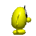

# Animations

**Status: PARTIAL — 31 animated sequences documented (12 tiles, 5 Blupi states, 14 objects).**
Tracked as `DOC-004` in `plan.md`. Not yet covered: explosions (`explo.png`), the door slide
animation, and the 12 `ObjectType`s newly made to spawn (`03-objects.md`) that have not had their
animations (where they cycle at all) cropped into GIFs yet.

Every animated sequence mobile-eggbert's tile/character/object system can produce, as looping
GIFs assembled (with ImageMagick) from per-sheet grid crops — this is meant as a full overview of
what the animation system does, to inform what galaxy-eggbert eventually needs to replicate. Frame
data and tick rates are taken from galaxy-eggbert's own already-approved, verified-against-source
ports (`GETerrainRenderer.cpp`'s `kAnim*` tables at 6 fps, `GEBlupiController.cpp`'s state tables
at 8 fps, `GEDecorSystem::GetObjIcon`'s per-type tables at 6 fps ÷ a per-type divisor), not
re-derived here. Real-world duration = frame count × frame duration; all loop (last frame connects
back to the first).

## 1. Animated tiles (`object-m.png`, 6 fps base tick ≈ 167 ms/frame)

| Animation | Frames | Duration/frame | Loop length | GIF |
|---|---|---|---|---|
| Lava | 8 | 167 ms | 1.33 s |  |
| Spike | 16 | 167 ms | 2.67 s |  |
| Crusher | 10 | 167 ms | 1.67 s |  |
| Saw | 6 | 167 ms | 1.0 s |  |
| Water1 | 6 | 167 ms | 1.0 s |  |
| Water2 | 6 | 167 ms | 1.0 s |  |
| Temp | 20 (incl. 2 fully-transparent "vanish" frames) | 167 ms | 3.33 s |  |
| Marine | 11 | 167 ms | 1.83 s |  |
| FanLeft | 3 | 167 ms | 0.5 s |  |
| FanRight | 3 | 167 ms | 0.5 s |  |
| FanUp | 3 | 167 ms | 0.5 s |  |
| FanDown | 3 | 167 ms | 0.5 s |  |

The two `-1` ("invisible") frames in `Temp`'s table are rendered as fully-transparent frames here
(verified: alpha channel mean 0 on both), not skipped — matching the real vanish-then-reappear
behavior (Blupi falls through while invisible, per `02-tiles.md`).

## 2. Blupi character states (`blupi.png`, 8 fps base tick = 125 ms/frame)

`Stop`={0}, `Down`={33}, `Up`={44} are single static frames (no animation) — see `03-objects.md`
for those.

| State | Frames | Duration/frame | Loop length | GIF |
|---|---|---|---|---|
| March (walk) | 6 | 125 ms | 0.75 s |  |
| Jump | 3 | 125 ms | 0.375 s |  |
| Air (falling) | 5 | 125 ms | 0.625 s |  |
| SwimIdle | 10 | 125 ms | 1.25 s |  |
| SwimMove | 14 | 125 ms | 1.75 s |  |

## 3. Object/pickup/enemy animations (`element.png`, 6 fps base tick, per-type divisor)

Only the `ObjectType`s that actually cycle through multiple icons are shown (from the original
18-type `GetObjIcon` coverage — the 12 types added 2026-07-03 are not yet covered here, see status
note at top); `ObjectType1`/`12`/`13`/`30` return one constant icon — no animation, already covered
as static crops in `03-objects.md`.

| ObjectType | Frames | Duration/frame | Loop length | GIF |
|---|---|---|---|---|
| 2 (patrol enemy A) | 9 | 1.0 s | 9.0 s |  |
| 3 (patrol enemy B) | 9 | 1.0 s | 9.0 s |  |
| 4 (bulldozer) | 8 | 1.5 s | 12.0 s |  |
| 16 (spider) | 9 | 0.5 s | 4.5 s |  |
| 17 (fish) | 8 | 1.0 s | 8.0 s |  |
| 20 (bird) | 8 | 1.0 s | 8.0 s |  |
| 33 (`blupit`) | 8 | 1.0 s | 8.0 s |  |
| 5 (treasure sparkle) | 22 (11-icon ping-pong) | 1.5 s | 33.0 s |  |
| 6 (extra-life egg) | 8 | 2.0 s | 16.0 s |  |
| 7 (level-exit goal) | 8 | 1.5 s | 12.0 s |  |
| 25 (shield) | 8 | 1.0 s | 8.0 s |  |
| 49 (key, `Key1`) | 12 | 1.5 s | 18.0 s |  |
| 50 (key, `Key2`) | 12 | 1.5 s | 18.0 s |  |
| 51 (key, `Key3`) | 12 | 1.5 s | 18.0 s |  |

## Not yet covered (tracked under `DOC-004`)

- **Explosions** (`explo.png`) — per-explosion-type frame counts/sizes come from
  `Tables::table_explo_size[icon]` in mobile-eggbert, not yet cross-referenced.
- **Door opening** (`06-doors.md`) — a *positional slide* (the door sprite moves up and off-screen
  over `Config::ScaleTime(50)` ticks), not an icon-frame cycle, so a conventional frame-sequence GIF
  doesn't represent it the same way as the animations above — needs its own approach (e.g. a short
  clip compositing the sprite's Y motion against a background) rather than a plain frame-cycle GIF.
- **The 12 newly-supported `ObjectType`s** (`03-objects.md` — `19,21,24,26,32,40,44,46,47,54,55,96`)
  — several of these do cycle through animation tables (`table_blupih_left`, `table_guepe_left`,
  `table_creature_left`, `table_chenille`, `table_follow1`/`table_follow2`) that now exist in
  `GEDecorSystem.cpp` but haven't been turned into GIFs here yet.
