# Otázky ke zbývajícím dlaždicím (druhé kolo, ~280 ikon)

**Účel:** stejné jako `questionnaire-unidentified-tiles.md` (první kolo, 34 ikon, hotovo — viz
`15-3d-render-mapping-design.md` §11), ale tentokrát pro úplně všechny zbývající pojmenované
dlaždice — včetně těch, které jsem už dřív (8 agentů, první průchod, 2026-07-06) odhadl jako
`Billboard`/`ThinMechanical`/`special-surface`/`architectural-kit`, i těch, co jsem nechal jako
výchozí krychli (`UniformCube`) bez poznámky, protože jsem u nich neviděl žádný problém.

Vyplň odpovědi za `Odpověď:` u každé dlaždice, kterou poznáš — klidně přeskoč ty, u kterých si
nejsi jistý. Až to uložíš, dej mi vědět a zpracuji to zpět do `02-tiles.md`.

## Co rozlišujeme (render mód)

- **`UniformCube`** (krychle) — textura na všech 6 stranách. Výchozí varianta pro hromadný materiál
  (hlína, kámen, tráva, obyčejná zeď).
- **`Billboard`** — plochá tabule/sprite, vždy otočená čelem ke kameře. Sloupky, sochy, cedule,
  pilíře — "stojící předmět", ne plný objemový blok.
- **`ThinMechanical`** — tenký, plochý mechanický/nebezpečný prvek (pila, mřížka, ventilátor,
  potrubí, spínač...). Přesná geometrie ještě není rozhodnutá.
- **`DirectionalCube`** — krychle, ale textura je jen na některých stranách (řekni na kolika a
  kterých — 1 čelo? 2 protilehlé? 4 boční? shora/zdola?), zbylé strany mají jednu plochou barvu
  (řekni jakou) nebo jsou úplně průhledné/otevřené (řekni to taky).
- **speciální povrch** — voda, rostlina/chaluha — plochý povrch, ani krychle, ani billboard.
- **jiná/nová geometrie** — pokud tvar neodpovídá ničemu výše (jako dřívější "tyč" u ikony 202),
  popiš ho vlastními slovy.
- **nevím / nejde poznat** — klidně napiš "nevím", je to lepší než hádat.

U každé dlaždice napiš, prosím:
1. **Co to podle tebe je** (vlastními slovy, co obrázek zobrazuje)
2. **Jaký render mód by měl mít** (a pokud `DirectionalCube`, které strany mají texturu a jakou
   barvu/průhlednost mají ty ostatní)

Níže uvedená "moje dřívější poznámka" je buď z prvního 8-agentního průchodu (nezávisle
neověřeno), nebo prázdná/"unnamed variant" pokud jsem dlaždici nechal jako výchozí krychli.

---

## Icon 2

- Aktuální jméno v katalogu: (unnamed)
- Moje dřívější poznámka (kategorie): unnamed variant
- Animace: no, passable: no
- Použití: 8/78 files

**Co to je?**
Odpověď: kus nějakého stroje

**Render mód?**
Odpověď: DirectionalCube — textura na 4 bočních stranách, shora a zdola plná barva (modrý odstín, stejný jako pozadí ikony)

---

## Icon 3

- Aktuální jméno v katalogu: (unnamed)
- Moje dřívější poznámka (kategorie): unnamed variant
- Animace: no, passable: no
- Použití: 20/78 files

**Co to je?**
Odpověď: kus stroje s červeným světlem, které něco signalizuje

**Render mód?**
Odpověď: DirectionalCube — textura jen na jedné boční straně, zbylých 5 stran plná barva (modrý odstín); natočení textury (ze 4 možných stran) je uložené v metadatech daného bloku

---

## Icon 4

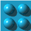

- Aktuální jméno v katalogu: (unnamed)
- Moje dřívější poznámka (kategorie): unnamed variant
- Animace: no, passable: no
- Použití: 11/78 files

**Co to je?**
Odpověď: kus stroje s nějakými výstupky

**Render mód?**
Odpověď: DirectionalCube — textura jen na jedné boční straně, zbylých 5 stran plná barva (modrý odstín); natočení textury (ze 4 možných stran) je uložené v metadatech daného bloku

---

## Icon 5

- Aktuální jméno v katalogu: (unnamed)
- Moje dřívější poznámka (kategorie): unnamed variant
- Animace: no, passable: no
- Použití: 14/78 files

**Co to je?**
Odpověď: kus stroje s nějakými výstupky

**Render mód?**
Odpověď: DirectionalCube — textura jen na jedné boční straně, zbylých 5 stran plná barva (modrý odstín); natočení textury (ze 4 možných stran) je uložené v metadatech daného bloku

---

## Icon 6

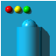

- Aktuální jméno v katalogu: (unnamed)
- Moje dřívější poznámka (kategorie): unnamed variant
- Animace: no, passable: no
- Použití: 8/78 files

**Co to je?**
Odpověď: kus stroje s nějakými výstupky

**Render mód?**
Odpověď: DirectionalCube — textura jen na jedné boční straně, zbylých 5 stran plná barva (modrý odstín); natočení textury (ze 4 možných stran) je uložené v metadatech daného bloku

---

## Icon 8

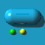

- Aktuální jméno v katalogu: (unnamed)
- Moje dřívější poznámka (kategorie): unnamed variant
- Animace: no, passable: no
- Použití: 9/78 files

**Co to je?**
Odpověď: kus stroje s nějakými výstupky

**Render mód?**
Odpověď: DirectionalCube — textura jen na jedné boční straně, zbylých 5 stran plná barva (modrý odstín); natočení textury (ze 4 možných stran) je uložené v metadatech daného bloku

---

## Icon 9

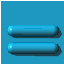

- Aktuální jméno v katalogu: (unnamed)
- Moje dřívější poznámka (kategorie): unnamed variant
- Animace: no, passable: no
- Použití: 12/78 files

**Co to je?**
Odpověď: kus stroje s nějakými výstupky

**Render mód?**
Odpověď: DirectionalCube — textura jen na jedné boční straně, zbylých 5 stran plná barva (modrý odstín); natočení textury (ze 4 možných stran) je uložené v metadatech daného bloku

---

## Icon 10

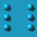

- Aktuální jméno v katalogu: `Ground`
- Moje dřívější poznámka (kategorie): ground
- Animace: no, passable: no
- Použití: 30/78 files

**Co to je?**
Odpověď: kus stroje s nějakými výstupky (katalogové jméno `Ground` je podle uživatele nesprávné)

**Render mód?**
Odpověď: DirectionalCube — textura jen na jedné boční straně, zbylých 5 stran plná barva (modrý odstín); natočení textury (ze 4 možných stran) je uložené v metadatech daného bloku

---

## Icon 11

- Aktuální jméno v katalogu: (unnamed)
- Moje dřívější poznámka (kategorie): unnamed variant
- Animace: no, passable: no
- Použití: 14/78 files

**Co to je?**
Odpověď: kus stroje s nějakými výstupky

**Render mód?**
Odpověď: DirectionalCube — textura jen na jedné boční straně, zbylých 5 stran plná barva (modrý odstín); natočení textury (ze 4 možných stran) je uložené v metadatech daného bloku

---

## Icon 12

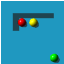

- Aktuální jméno v katalogu: (unnamed)
- Moje dřívější poznámka (kategorie): unnamed variant
- Animace: no, passable: no
- Použití: 8/78 files

**Co to je?**
Odpověď: kus stroje s 3 barevnými světly signalizujícími něco

**Render mód?**
Odpověď: DirectionalCube — textura jen na jedné boční straně, zbylých 5 stran plná barva (modrý odstín); natočení textury (ze 4 možných stran) je uložené v metadatech daného bloku

---

## Icon 13

- Aktuální jméno v katalogu: (unnamed)
- Moje dřívější poznámka (kategorie): unnamed variant
- Animace: no, passable: no
- Použití: 10/78 files

**Co to je?**
Odpověď: kus stroje s nějakými výstupky

**Render mód?**
Odpověď: DirectionalCube — textura jen na jedné boční straně, zbylých 5 stran plná barva (modrý odstín); natočení textury (ze 4 možných stran) je uložené v metadatech daného bloku

---

## Icon 14

- Aktuální jméno v katalogu: (unnamed)
- Moje dřívější poznámka (kategorie): unnamed variant
- Animace: no, passable: no
- Použití: 7/78 files

**Co to je?**
Odpověď: kus stroje s 2 barevnými světly signalizujícími něco

**Render mód?**
Odpověď: DirectionalCube — textura jen na jedné boční straně, zbylých 5 stran plná barva (modrý odstín); natočení textury (ze 4 možných stran) je uložené v metadatech daného bloku

---

## Icon 15

- Aktuální jméno v katalogu: (unnamed)
- Moje dřívější poznámka (kategorie): unnamed variant
- Animace: no, passable: no
- Použití: 16/78 files

**Co to je?**
Odpověď: kus stroje

**Render mód?**
Odpověď: DirectionalCube — textura na 2 protilehlých bočních stranách (směr nastavitelný v metadatech bloku), shora plná barva (modrý odstín), zdola průhledné, ze zbylých 2 bočních stran jedna průhledná a druhá plná barva (modrý odstín)

---

## Icon 16

- Aktuální jméno v katalogu: (unnamed)
- Moje dřívější poznámka (kategorie): unnamed variant
- Animace: no, passable: no
- Použití: 21/78 files

**Co to je?**
Odpověď: kus stroje

**Render mód?**
Odpověď: DirectionalCube — textura na 2 protilehlých bočních stranách (směr nastavitelný v metadatech bloku), shora plná barva (modrý odstín), zdola průhledné, ze zbylých 2 bočních stran jedna průhledná a druhá plná barva (modrý odstín)

---

## Icon 17

- Aktuální jméno v katalogu: (unnamed)
- Moje dřívější poznámka (kategorie): unnamed variant
- Animace: no, passable: no
- Použití: 16/78 files

**Co to je?**
Odpověď: kus stroje

**Render mód?**
Odpověď: DirectionalCube — textura na 2 protilehlých bočních stranách (směr nastavitelný v metadatech bloku), shora plná barva (modrý odstín), zdola průhledné, ze zbylých 2 bočních stran jedna průhledná a druhá plná barva (modrý odstín)

---

## Icon 18

- Aktuální jméno v katalogu: `StoneA`
- Moje dřívější poznámka (kategorie): ground/decoration
- Animace: no, passable: no
- Použití: 21/78 files

**Co to je?**
Odpověď: kus stroje (katalogové jméno `StoneA` je podle uživatele nesprávné)

**Render mód?**
Odpověď: DirectionalCube — textura na 2 protilehlých bočních stranách (směr nastavitelný v metadatech bloku), shora plná barva (modrý odstín), zdola průhledné, ze zbylých 2 bočních stran jedna průhledná a druhá plná barva (modrý odstín)

---

## Icon 19

- Aktuální jméno v katalogu: (unnamed)
- Moje dřívější poznámka (kategorie): unnamed variant
- Animace: no, passable: no
- Použití: 4/78 files

**Co to je?**
Odpověď: kus stroje

**Render mód?**
Odpověď: DirectionalCube — textura jen na jedné ze 4 bočních stran, shora plná barva (modrý odstín), zbylé 4 strany (3 boční + zdola) průhledné

---

## Icon 20

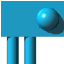

- Aktuální jméno v katalogu: (unnamed)
- Moje dřívější poznámka (kategorie): unnamed variant
- Animace: no, passable: no
- Použití: 10/78 files

**Co to je?**
Odpověď: kus stroje

**Render mód?**
Odpověď: DirectionalCube — textura jen na jedné ze 4 bočních stran, shora plná barva (modrý odstín), zbylé 4 strany (3 boční + zdola) průhledné

---

## Icon 21

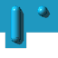

- Aktuální jméno v katalogu: (unnamed)
- Moje dřívější poznámka (kategorie): unnamed variant
- Animace: no, passable: no
- Použití: 10/78 files

**Co to je?**
Odpověď: kus stroje

**Render mód?**
Odpověď: DirectionalCube — textura jen na jedné ze 4 bočních stran, shora plná barva (modrý odstín), zbylé 4 strany (3 boční + zdola) průhledné

---

## Icon 22

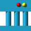

- Aktuální jméno v katalogu: (unnamed)
- Moje dřívější poznámka (kategorie): unnamed variant
- Animace: no, passable: yes
- Použití: 17/78 files

**Co to je?**
Odpověď: kus stroje

**Render mód?**
Odpověď: DirectionalCube — krychle, textura na všech 4 bočních stranách, shora i zdola plná barva (modrý odstín)

---

## Icon 23

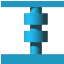

- Aktuální jméno v katalogu: (unnamed)
- Moje dřívější poznámka (kategorie): unnamed variant
- Animace: no, passable: no
- Použití: 34/78 files

**Co to je?**
Odpověď: kus stroje

**Render mód?**
Odpověď: DirectionalCube — krychle, textura na všech 4 bočních stranách, shora i zdola plná barva (modrý odstín)

---

## Icon 24

- Aktuální jméno v katalogu: (unnamed)
- Moje dřívější poznámka (kategorie): unnamed variant
- Animace: no, passable: no
- Použití: 35/78 files

**Co to je?**
Odpověď: kus stroje

**Render mód?**
Odpověď: DirectionalCube — krychle, textura na všech 4 bočních stranách, shora i zdola plná barva (modrý odstín)

---

## Icon 25

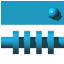

- Aktuální jméno v katalogu: `StoneB`
- Moje dřívější poznámka (kategorie): ground/decoration
- Animace: no, passable: no
- Použití: 42/78 files

**Co to je?**
Odpověď: kus stroje (katalogové jméno `StoneB` je podle uživatele nesprávné)

**Render mód?**
Odpověď: DirectionalCube — krychle, textura na všech 4 bočních stranách, shora plná barva (modrý odstín), zdola průhledné

---

## Icon 26

- Aktuální jméno v katalogu: (unnamed)
- Moje dřívější poznámka (kategorie): unnamed variant
- Animace: no, passable: no
- Použití: 12/78 files

**Co to je?**
Odpověď: kus stroje

**Render mód?**
Odpověď: DirectionalCube — krychle, textura na všech 4 bočních stranách, shora plná barva (modrý odstín), zdola průhledné

---

## Icon 27

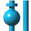

- Aktuální jméno v katalogu: (unnamed)
- Moje dřívější poznámka (kategorie): unnamed variant
- Animace: no, passable: no
- Použití: 15/78 files

**Co to je?**
Odpověď: kus stroje, 2 trubky, jedna z trubek má na sobě koule

**Render mód?**
Odpověď: DirectionalCube — krychle, textura na všech 4 bočních stranách, shora plná barva (modrý odstín), zdola průhledné

---

## Icon 28

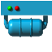

- Aktuální jméno v katalogu: (unnamed)
- Moje dřívější poznámka (kategorie): unnamed variant
- Animace: no, passable: no
- Použití: 10/78 files

**Co to je?**
Odpověď: kus stroje

**Render mód?**
Odpověď: DirectionalCube — textura jen na jedné boční straně, shora plná barva (modrý odstín), zbylé 4 strany (3 boční + zdola) průhledné

---

## Icon 29

- Aktuální jméno v katalogu: (unnamed)
- Moje dřívější poznámka (kategorie): unnamed variant
- Animace: no, passable: no
- Použití: 13/78 files

**Co to je?**
Odpověď: kus stroje

**Render mód?**
Odpověď: DirectionalCube — krychle, textura na všech 4 bočních stranách, shora plná barva (modrý odstín), zdola průhledné

---

## Icon 30

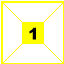

- Aktuální jméno v katalogu: (unnamed)
- Moje dřívější poznámka (kategorie): unnamed variant — **Billboard** (§10.2): yellow sign with painted numeral "1"
- Animace: no, passable: no
- Použití: 10/78 files

**Co to je?**
Odpověď: NENÍ Billboard (dřívější poznámka je špatně). Startovní pozice pohyblivého (moveable) objektu — editorová ikona, pozůstatek z desktopové Speedy Blupi (C++98/DirectX3). Ikony 30 a 31 se v Galaxy Eggbert použijí jen ve 3D editoru světa, ne ve hře samotné.

**Render mód?**
Odpověď: DirectionalCube — krychle, textura na všech 4 bočních stranách (textura má i průhlednost), shora i zdola plná barva (žlutá)

---

## Icon 31

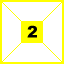

- Aktuální jméno v katalogu: (unnamed)
- Moje dřívější poznámka (kategorie): unnamed variant — **Billboard** (§10.2): yellow sign with painted numeral "2"
- Animace: no, passable: no
- Použití: 4/78 files

**Co to je?**
Odpověď: NENÍ Billboard (dřívější poznámka je špatně). Koncová pozice pohyblivého (moveable) objektu, dvojice k ikoně 30 — editorová ikona, pozůstatek z desktopové Speedy Blupi (C++98/DirectX3). Použije se jen ve 3D editoru světa, ne ve hře samotné.

**Render mód?**
Odpověď: DirectionalCube — krychle, textura na všech 4 bočních stranách (textura má i průhlednost), shora i zdola plná barva (žlutá)

---

## Icon 35

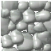

- Aktuální jméno v katalogu: (unnamed)
- Moje dřívější poznámka (kategorie): unnamed variant
- Animace: no, passable: no
- Použití: 14/78 files

**Co to je?**
Odpověď: hromada kamenů

**Render mód?**
Odpověď: UniformCube — textura na všech 6 stranách

---

## Icon 36

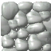

- Aktuální jméno v katalogu: (unnamed)
- Moje dřívější poznámka (kategorie): unnamed variant
- Animace: no, passable: no
- Použití: 18/78 files

**Co to je?**
Odpověď: hromada kamenů

**Render mód?**
Odpověď: UniformCube — textura na všech 6 stranách

---

## Icon 37

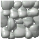

- Aktuální jméno v katalogu: (unnamed)
- Moje dřívější poznámka (kategorie): unnamed variant
- Animace: no, passable: no
- Použití: 18/78 files

**Co to je?**
Odpověď: hromada kamenů

**Render mód?**
Odpověď: UniformCube — textura na všech 6 stranách

---

## Icon 38

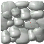

- Aktuální jméno v katalogu: (unnamed)
- Moje dřívější poznámka (kategorie): unnamed variant
- Animace: no, passable: no
- Použití: 10/78 files

**Co to je?**
Odpověď: hromada kamenů

**Render mód?**
Odpověď: UniformCube — textura na všech 6 stranách

---

## Icon 39

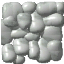

- Aktuální jméno v katalogu: (unnamed)
- Moje dřívější poznámka (kategorie): unnamed variant
- Animace: no, passable: no
- Použití: 12/78 files

**Co to je?**
Odpověď: hromada kamenů

**Render mód?**
Odpověď: UniformCube — textura na všech 6 stranách

---

## Icon 40

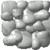

- Aktuální jméno v katalogu: (unnamed)
- Moje dřívější poznámka (kategorie): unnamed variant
- Animace: no, passable: no
- Použití: 9/78 files

**Co to je?**
Odpověď: hromada kamenů

**Render mód?**
Odpověď: UniformCube — textura na všech 6 stranách

---

## Icon 41

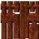

- Aktuální jméno v katalogu: (unnamed)
- Moje dřívější poznámka (kategorie): unnamed variant
- Animace: no, passable: no
- Použití: 5/78 files

**Co to je?**
Odpověď: dřevěná stěna

**Render mód?**
Odpověď: UniformCube — textura na všech 6 stranách

---

## Icon 42

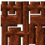

- Aktuální jméno v katalogu: (unnamed)
- Moje dřívější poznámka (kategorie): unnamed variant
- Animace: no, passable: no
- Použití: 3/78 files

**Co to je?**
Odpověď: dřevěná stěna

**Render mód?**
Odpověď: UniformCube — textura na všech 6 stranách

---

## Icon 43

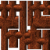

- Aktuální jméno v katalogu: (unnamed)
- Moje dřívější poznámka (kategorie): unnamed variant
- Animace: no, passable: no
- Použití: 1/78 files

**Co to je?**
Odpověď: dřevěná stěna

**Render mód?**
Odpověď: UniformCube — textura na všech 6 stranách

---

## Icon 44

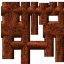

- Aktuální jméno v katalogu: (unnamed)
- Moje dřívější poznámka (kategorie): unnamed variant
- Animace: no, passable: no
- Použití: 1/78 files

**Co to je?**
Odpověď: dřevěná stěna

**Render mód?**
Odpověď: DirectionalCube — krychle, textura na 4 bočních stranách, shora plná barva (hnědý odstín), zdola průhledné

---

## Icon 45

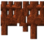

- Aktuální jméno v katalogu: (unnamed)
- Moje dřívější poznámka (kategorie): unnamed variant
- Animace: no, passable: no
- Použití: 6/78 files

**Co to je?**
Odpověď: dřevěná stěna

**Render mód?**
Odpověď: DirectionalCube — krychle, textura na 4 bočních stranách, shora plná barva (hnědý odstín), zdola průhledné

---

## Icon 46

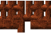

- Aktuální jméno v katalogu: (unnamed)
- Moje dřívější poznámka (kategorie): unnamed variant
- Animace: no, passable: no
- Použití: 2/78 files

**Co to je?**
Odpověď: dřevěná stěna

**Render mód?**
Odpověď: DirectionalCube — krychle, textura na 4 bočních stranách, shora plná barva (hnědý odstín), zdola průhledné

---

## Icon 47

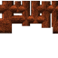

- Aktuální jméno v katalogu: (unnamed)
- Moje dřívější poznámka (kategorie): unnamed variant
- Animace: no, passable: no
- Použití: 3/78 files

**Co to je?**
Odpověď: dřevěná stěna

**Render mód?**
Odpověď: DirectionalCube — krychle, textura na 4 bočních stranách, shora plná barva (hnědý odstín), zdola průhledné

---

## Icon 48

- Aktuální jméno v katalogu: (unnamed)
- Moje dřívější poznámka (kategorie): unnamed variant — **Billboard** (§10.2): yellow warning-triangle sign (name candidate: `WarningSign`)
- Animace: no, passable: no
- Použití: 11/78 files

**Co to je?**
Odpověď: NENÍ Billboard (dřívější poznámka je špatně). Kus stroje — textura je nálepka výstražného trojúhelníku.

**Render mód?**
Odpověď: DirectionalCube — krychle, textura jen na jedné straně, zbylých 5 stran plná barva (modrý odstín)

---

## Icon 49

- Aktuální jméno v katalogu: (unnamed)
- Moje dřívější poznámka (kategorie): unnamed variant
- Animace: no, passable: yes
- Použití: 10/78 files

**Co to je?**
Odpověď: kus stroje

**Render mód?**
Odpověď: DirectionalCube — krychle, textura na 2 bočních stranách + shora + zdola (správně natočené textury), zbylé 2 boční strany plná barva (modrý odstín)

---

## Icon 50

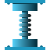

- Aktuální jméno v katalogu: (unnamed)
- Moje dřívější poznámka (kategorie): unnamed variant
- Animace: no, passable: yes
- Použití: 14/78 files

**Co to je?**
Odpověď: kus stroje

**Render mód?**
Odpověď: DirectionalCube — krychle, textura na 4 bočních stranách, shora i zdola plná barva (modrý odstín)

---

## Icon 51

- Aktuální jméno v katalogu: (unnamed)
- Moje dřívější poznámka (kategorie): unnamed variant
- Animace: no, passable: yes
- Použití: 14/78 files

**Co to je?**
Odpověď: kus stroje s tyčemi

**Render mód?**
Odpověď: DirectionalCube — krychle, textura na 4 bočních stranách, shora plná barva (modrý odstín), zdola průhledné

---

## Icon 52

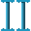

- Aktuální jméno v katalogu: (unnamed)
- Moje dřívější poznámka (kategorie): unnamed variant
- Animace: no, passable: yes
- Použití: 16/78 files

**Co to je?**
Odpověď: tyče, co něco podpírají

**Render mód?**
Odpověď: DirectionalCube — krychle, textura na 4 bočních stranách, shora i zdola plná barva (modrý odstín)

---

## Icon 53

- Aktuální jméno v katalogu: (unnamed)
- Moje dřívější poznámka (kategorie): unnamed variant
- Animace: no, passable: yes
- Použití: 23/78 files

**Co to je?**
Odpověď: šroub

**Render mód?**
Odpověď: nová geometrie — `TripleCrossBillboard`: stejná textura vykreslená 3× uprostřed bloku, každá rovina pootočená o 60° vůči ostatním, v půdorysu tvoří trojúhelník (obdoba "cross" billboardu u rostlin, ale se 3 rovinami místo 2)

---

## Icon 54

- Aktuální jméno v katalogu: (unnamed)
- Moje dřívější poznámka (kategorie): unnamed variant
- Animace: no, passable: yes
- Použití: 25/78 files

**Co to je?**
Odpověď: šroub

**Render mód?**
Odpověď: nová geometrie — `TripleCrossBillboard`: stejná textura vykreslená 3× uprostřed bloku, každá rovina pootočená o 60° vůči ostatním, v půdorysu tvoří trojúhelník (obdoba "cross" billboardu u rostlin, ale se 3 rovinami místo 2)

---

## Icon 55

- Aktuální jméno v katalogu: (unnamed)
- Moje dřívější poznámka (kategorie): unnamed variant
- Animace: no, passable: yes
- Použití: 26/78 files

**Co to je?**
Odpověď: šroub

**Render mód?**
Odpověď: nová geometrie — `TripleCrossBillboard`: stejná textura vykreslená 3× uprostřed bloku, každá rovina pootočená o 60° vůči ostatním, v půdorysu tvoří trojúhelník (obdoba "cross" billboardu u rostlin, ale se 3 rovinami místo 2)

---

## Icon 56

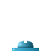

- Aktuální jméno v katalogu: (unnamed)
- Moje dřívější poznámka (kategorie): unnamed variant
- Animace: no, passable: yes
- Použití: 29/78 files

**Co to je?**
Odpověď: šroub

**Render mód?**
Odpověď: nová geometrie — `TripleCrossBillboard`: stejná textura vykreslená 3× uprostřed bloku, každá rovina pootočená o 60° vůči ostatním, v půdorysu tvoří trojúhelník (obdoba "cross" billboardu u rostlin, ale se 3 rovinami místo 2)

---

## Icon 57

- Aktuální jméno v katalogu: (unnamed)
- Moje dřívější poznámka (kategorie): unnamed variant
- Animace: no, passable: yes
- Použití: 18/78 files

**Co to je?**
Odpověď: šroub

**Render mód?**
Odpověď: nová geometrie — `TripleCrossBillboard`: stejná textura vykreslená 3× uprostřed bloku, každá rovina pootočená o 60° vůči ostatním, v půdorysu tvoří trojúhelník (obdoba "cross" billboardu u rostlin, ale se 3 rovinami místo 2)

---

## Icon 58

- Aktuální jméno v katalogu: (unnamed)
- Moje dřívější poznámka (kategorie): unnamed variant
- Animace: no, passable: yes
- Použití: 17/78 files

**Co to je?**
Odpověď: šroub

**Render mód?**
Odpověď: nová geometrie — `TripleCrossBillboard`: stejná textura vykreslená 3× uprostřed bloku, každá rovina pootočená o 60° vůči ostatním, v půdorysu tvoří trojúhelník (obdoba "cross" billboardu u rostlin, ale se 3 rovinami místo 2)

---

## Icon 59

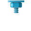

- Aktuální jméno v katalogu: (unnamed)
- Moje dřívější poznámka (kategorie): unnamed variant
- Animace: no, passable: yes
- Použití: 24/78 files

**Co to je?**
Odpověď: šroub

**Render mód?**
Odpověď: nová geometrie — `TripleCrossBillboard`: stejná textura vykreslená 3× uprostřed bloku, každá rovina pootočená o 60° vůči ostatním, v půdorysu tvoří trojúhelník (obdoba "cross" billboardu u rostlin, ale se 3 rovinami místo 2)

---

## Icon 60

- Aktuální jméno v katalogu: (unnamed)
- Moje dřívější poznámka (kategorie): unnamed variant
- Animace: no, passable: yes
- Použití: 24/78 files

**Co to je?**
Odpověď: šroub

**Render mód?**
Odpověď: nová geometrie — `TripleCrossBillboard`: stejná textura vykreslená 3× uprostřed bloku, každá rovina pootočená o 60° vůči ostatním, v půdorysu tvoří trojúhelník (obdoba "cross" billboardu u rostlin, ale se 3 rovinami místo 2)

---

## Icon 63

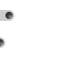

- Aktuální jméno v katalogu: (unnamed)
- Moje dřívější poznámka (kategorie): unnamed variant
- Animace: no, passable: yes
- Použití: 10/78 files

**Co to je?**
Odpověď: šroub

**Render mód?**
Odpověď: nová geometrie — `TripleCrossBillboard`: stejná textura vykreslená 3× uprostřed bloku, každá rovina pootočená o 60° vůči ostatním, v půdorysu tvoří trojúhelník (obdoba "cross" billboardu u rostlin, ale se 3 rovinami místo 2)

---

## Icon 64

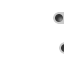

- Aktuální jméno v katalogu: (unnamed)
- Moje dřívější poznámka (kategorie): unnamed variant
- Animace: no, passable: yes
- Použití: 9/78 files

**Co to je?**
Odpověď: šroub

**Render mód?**
Odpověď: nová geometrie — `TripleCrossBillboard`: stejná textura vykreslená 3× uprostřed bloku, každá rovina pootočená o 60° vůči ostatním, v půdorysu tvoří trojúhelník (obdoba "cross" billboardu u rostlin, ale se 3 rovinami místo 2)

---

## Icon 66

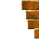

- Aktuální jméno v katalogu: (unnamed)
- Moje dřívější poznámka (kategorie): unnamed variant — **ThinMechanical** (§10.3): vertical rung-segmented column, reads as a ladder, passable
- Animace: no, passable: yes
- Použití: 15/78 files

**Co to je?**
Odpověď: NENÍ ThinMechanical/žebřík (dřívější poznámka je špatně). Několik cihel.

**Render mód?**
Odpověď: DirectionalCube — krychle, průchozí, textura jen na jedné ze 4 bočních stran (směr v metadatech bloku), zbylých 5 stran průhledných

---

## Icon 68

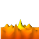

- Aktuální jméno v katalogu: `Lava (base)`
- Moje dřívější poznámka (kategorie): hazard
- Animace: yes, 8 frames (68-72), passable: no
- Použití: 41/78 files — kills Blupi on contact

**Co to je?**
Odpověď: láva

**Render mód?**
Odpověď: UniformCube — textura na všech 6 stranách (zachovává stávající animovaný render, žádná nová geometrie)

---

## Icon 69

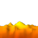

- Aktuální jméno v katalogu: (unnamed)
- Moje dřívější poznámka (kategorie): unnamed variant
- Animace: no, passable: yes
- Použití: 9/78 files

**Co to je?**
Odpověď: láva (animační snímek stejné sekvence jako ikona 68)

**Render mód?**
Odpověď: UniformCube — textura na všech 6 stranách (zachovává stávající animovaný render, žádná nová geometrie)

---

## Icon 74

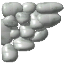

- Aktuální jméno v katalogu: (unnamed)
- Moje dřívější poznámka (kategorie): unnamed variant
- Animace: no, passable: no
- Použití: 9/78 files

**Co to je?**
Odpověď: hromada kamení

**Render mód?**
Odpověď: DirectionalCube — krychle, textura jen na jedné boční straně, shora plná barva (šedivá), zdola průhledné

---

## Icon 75

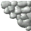

- Aktuální jméno v katalogu: (unnamed)
- Moje dřívější poznámka (kategorie): unnamed variant
- Animace: no, passable: no
- Použití: 10/78 files

**Co to je?**
Odpověď: hromada kamení

**Render mód?**
Odpověď: DirectionalCube — krychle, textura jen na jedné boční straně, shora plná barva (šedivá), zdola průhledné

---

## Icon 76

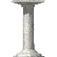

- Aktuální jméno v katalogu: (unnamed)
- Moje dřívější poznámka (kategorie): unnamed variant — **Billboard** (§10.2): stone pedestal/column
- Animace: no, passable: yes
- Užití: 22/78 files

**Co to je?**
Odpověď: kamenný podstavec/sloup, průchozí

**Render mód?**
Odpověď: NENÍ Billboard. Nová geometrie — `InnerPillarBox`: vnější krychle bloku je celá (všech 6 stran) průhledná; uvnitř bloku je menší kvádr (sloup), který má texturu na svých 4 bočních stranách

---

## Icon 77

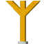

- Aktuální jméno v katalogu: (unnamed)
- Moje dřívější poznámka (kategorie): unnamed variant — **Billboard** (§10.2): yellow "Y" signpost/antenna
- Animace: no, passable: yes
- Použití: 11/78 files

**Co to je?**
Odpověď: dřevěný podstavec/sloupek, průchozí

**Render mód?**
Odpověď: NENÍ Billboard. Nová geometrie — `InnerFlatPlate` (varianta `InnerPillarBox` z ikony 76, ale místo kvádru je uvnitř tenká deska): vnější krychle bloku celá průhledná; uvnitř je plochá deska s texturou na obou stranách

---

## Icon 86

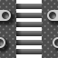

- Aktuální jméno v katalogu: (unnamed)
- Moje dřívější poznámka (kategorie): unnamed variant — **ThinMechanical** (§10.3): gate/portcullis-with-counterweight mechanism (metal bar racks + hinged/chained balls)
- Animace: no, passable: yes
- Použití: 5/78 files

**Co to je?**
Odpověď: brána/mříž s protizávažím (mechanismus s kovovými tyčemi a závěsnými koulemi)

**Render mód?**
Odpověď: DirectionalCube — krychle, textura na bočních stranách, shora i zdola plná barva (šedivý odstín)

---

## Icon 87

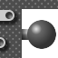

- Aktuální jméno v katalogu: (unnamed)
- Moje dřívější poznámka (kategorie): unnamed variant — **ThinMechanical** (§10.3): gate/portcullis-with-counterweight mechanism (metal bar racks + hinged/chained balls)
- Animace: no, passable: no
- Použití: 18/78 files

**Co to je?**
Odpověď: brána/mříž s protizávažím (mechanismus s kovovými tyčemi a závěsnými koulemi)

**Render mód?**
Odpověď: DirectionalCube — krychle, textura na bočních stranách, shora plná barva (šedivý odstín), zdola průhledné

---

## Icon 88

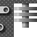

- Aktuální jméno v katalogu: (unnamed)
- Moje dřívější poznámka (kategorie): unnamed variant — **ThinMechanical** (§10.3): gate/portcullis-with-counterweight mechanism (metal bar racks + hinged/chained balls)
- Animace: no, passable: no
- Použití: 14/78 files

**Co to je?**
Odpověď: brána/mříž s protizávažím (mechanismus s kovovými tyčemi a závěsnými koulemi)

**Render mód?**
Odpověď: DirectionalCube — krychle, textura na bočních stranách, shora plná barva (šedivý odstín), zdola průhledné

---

## Icon 89

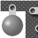

- Aktuální jméno v katalogu: (unnamed)
- Moje dřívější poznámka (kategorie): unnamed variant — **ThinMechanical** (§10.3): gate/portcullis-with-counterweight mechanism (metal bar racks + hinged/chained balls)
- Animace: no, passable: no
- Použití: 14/78 files

**Co to je?**
Odpověď: brána/mříž s protizávažím (mechanismus s kovovými tyčemi a závěsnými koulemi)

**Render mód?**
Odpověď: DirectionalCube — krychle, textura na bočních stranách, shora plná barva (šedivý odstín), zdola průhledné

---

## Icon 90

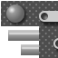

- Aktuální jméno v katalogu: (unnamed)
- Moje dřívější poznámka (kategorie): unnamed variant — **ThinMechanical** (§10.3): gate/portcullis-with-counterweight mechanism (metal bar racks + hinged/chained balls)
- Animace: no, passable: no
- Použití: 9/78 files

**Co to je?**
Odpověď: brána/mříž s protizávažím (mechanismus s kovovými tyčemi a závěsnými koulemi)

**Render mód?**
Odpověď: DirectionalCube — krychle, textura na bočních stranách, shora plná barva (šedivý odstín), zdola průhledné

---

## Icon 91

- Aktuální jméno v katalogu: (unnamed)
- Moje dřívější poznámka (kategorie): `Water2` sub-frame (per `table_decor_eau2`, not `Water1`) — **special-surface** (§10.4): liquid surface sub-frame, not bulk material
- Animace: yes, part of `Water2`'s 6-frame cycle, passable: no
- Použití: 25/78 files

**Co to je?**
Odpověď: voda

**Render mód?**
Odpověď: OTEVŘENÁ OTÁZKA — uživatel zatím neví, jak vodu v 3D renderovat, rozhodne se později (viz task "Decide water tile render mode")

---

## Icon 92

- Aktuální jméno v katalogu: `Water1 (base)`
- Moje dřívější poznámka (kategorie): decorative/swimmable — **special-surface** (§10.4): flat liquid surface with wavy top-edge silhouette, not bulk material
- Animace: yes, 6 frames (92-95), passable: no
- Použití: 38/78 files — Blupi swims when grounded

**Co to je?**
Odpověď: voda

**Render mód?**
Odpověď: OTEVŘENÁ OTÁZKA — uživatel zatím neví, jak vodu v 3D renderovat, rozhodne se později (viz task "Decide water tile render mode")

---

## Icon 96

- Aktuální jméno v katalogu: `Water2 (base)`
- Moje dřívější poznámka (kategorie): decorative/swimmable — **special-surface** (§10.4): flat liquid surface with wavy top-edge silhouette, not bulk material
- Animace: yes, 6 frames (91, 96-98), passable: no
- Použití: not found in scanned files — Blupi swims when grounded

**Co to je?**
Odpověď: voda

**Render mód?**
Odpověď: OTEVŘENÁ OTÁZKA — uživatel zatím neví, jak vodu v 3D renderovat, rozhodne se později (viz task "Decide water tile render mode")

---

## Icon 107

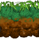

- Aktuální jméno v katalogu: (unnamed)
- Moje dřívější poznámka (kategorie): unnamed variant
- Animace: no, passable: no
- Použití: 6/78 files

**Co to je?**
Odpověď: tráva

**Render mód?**
Odpověď: DirectionalCube — krychle, textura (stávající dlaždice) na bočních stranách, zdola hnědá plná barva, shora samostatná textura trávy (viz task "Source/generate a grass-top texture" — potřeba sehnat licenčně vhodný asset nebo vygenerovat)

---

## Icon 108

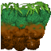

- Aktuální jméno v katalogu: (unnamed)
- Moje dřívější poznámka (kategorie): unnamed variant
- Animace: no, passable: no
- Použití: 3/78 files

**Co to je?**
Odpověď: tráva

**Render mód?**
Odpověď: DirectionalCube — krychle, 2 boční strany vlastní textura ikony 108, 1 boční strana textura ikony 107, 1 boční strana průhledná, zdola hnědá plná barva, shora samostatná textura trávy (viz task "Source/generate a grass-top texture")

---

## Icon 109

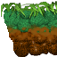

- Aktuální jméno v katalogu: (unnamed)
- Moje dřívější poznámka (kategorie): unnamed variant
- Animace: no, passable: no
- Použití: 2/78 files

**Co to je?**
Odpověď: tráva

**Render mód?**
Odpověď: DirectionalCube — krychle, 2 boční strany vlastní textura ikony 109, 1 boční strana textura ikony 107, 1 boční strana průhledná, zdola hnědá plná barva, shora samostatná textura trávy (viz task "Source/generate a grass-top texture")

---

## Icon 110

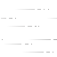

- Aktuální jméno v katalogu: (unnamed)
- Moje dřívější poznámka (kategorie): unnamed variant — **ThinMechanical** (§10.3): thin dashed wire/spark/cable line segment, exact identity unclear
- Animace: no, passable: yes
- Použití: 8/78 files

**Co to je?**
Odpověď: grafické znázornění větru od větráku, který Blupiho na daném místě táhne směrem pryč od větráku

**Render mód?**
Odpověď: NENÍ ThinMechanical. `InnerFlatPlate` — deska uprostřed krychle, textura na obou stranách

---

## Icon 114

- Aktuální jméno v katalogu: (unnamed)
- Moje dřívější poznámka (kategorie): unnamed variant — **ThinMechanical** (§10.3): thin dashed wire/spark/cable line segment, exact identity unclear
- Animace: no, passable: yes
- Použití: 7/78 files

**Co to je?**
Odpověď: grafické znázornění větru od větráku, který Blupiho na daném místě táhne směrem pryč od větráku

**Render mód?**
Odpověď: NENÍ ThinMechanical. `InnerFlatPlate` — deska uprostřed krychle, textura na obou stranách

---

## Icon 118

- Aktuální jméno v katalogu: (unnamed)
- Moje dřívější poznámka (kategorie): unnamed variant — **ThinMechanical** (§10.3): thin dashed wire/spark/cable line segment, exact identity unclear
- Animace: no, passable: yes
- Použití: 4/78 files

**Co to je?**
Odpověď: grafické znázornění větru od větráku, který Blupiho na daném místě táhne směrem pryč od větráku

**Render mód?**
Odpověď: NENÍ ThinMechanical. `InnerFlatPlate` — deska uprostřed krychle, textura na obou stranách

---

## Icon 122

- Aktuální jméno v katalogu: (unnamed)
- Moje dřívější poznámka (kategorie): unnamed variant — **ThinMechanical** (§10.3): thin dashed wire/spark/cable line segment, exact identity unclear
- Animace: no, passable: yes
- Použití: 1/78 files

**Co to je?**
Odpověď: grafické znázornění větru od větráku, který Blupiho na daném místě táhne směrem pryč od větráku

**Render mód?**
Odpověď: NENÍ ThinMechanical. `InnerFlatPlate` — deska uprostřed krychle, textura na obou stranách

---

## Icon 126

- Aktuální jméno v katalogu: `FanLeft (base)`
- Moje dřívější poznámka (kategorie): hazard — **ThinMechanical** (§10.3): ventilator with thin propeller blades on a hub, wall panel
- Animace: yes, 3 frames (126-128), passable: no
- Použití: 8/78 files — kills unless shielded

**Co to je?**
Odpověď: větrák (fan)

**Render mód?**
Odpověď: DirectionalCube — krychle, textura na 4 bočních stranách, 5. strana (základna větráku) plná barva (modrý odstín), 6. strana průhledná

---

## Icon 129

- Aktuální jméno v katalogu: `FanRight (base)`
- Moje dřívější poznámka (kategorie): hazard — **ThinMechanical** (§10.3): ventilator with thin propeller blades on a hub, wall panel
- Animace: yes, 3 frames (129-131), passable: no
- Použití: 7/78 files — kills unless shielded

**Co to je?**
Odpověď: větrák (fan)

**Render mód?**
Odpověď: DirectionalCube — krychle, textura na 4 bočních stranách, 5. strana (základna větráku) plná barva (modrý odstín), 6. strana průhledná

---

## Icon 132

- Aktuální jméno v katalogu: `FanUp (base)`
- Moje dřívější poznámka (kategorie): hazard — **ThinMechanical** (§10.3): ventilator with thin propeller blades on a hub, wall panel
- Animace: yes, 3 frames (132-134), passable: no
- Použití: 4/78 files — kills unless shielded

**Co to je?**
Odpověď: větrák (fan)

**Render mód?**
Odpověď: DirectionalCube — krychle, textura na 4 bočních stranách, 5. strana (základna větráku) plná barva (modrý odstín), 6. strana průhledná

---

## Icon 135

- Aktuální jméno v katalogu: `FanDown (base)`
- Moje dřívější poznámka (kategorie): hazard — **ThinMechanical** (§10.3): ventilator with thin propeller blades on a hub, wall panel
- Animace: yes, 3 frames (135-137), passable: no
- Použití: 1/78 files — kills unless shielded

**Co to je?**
Odpověď: větrák (fan)

**Render mód?**
Odpověď: DirectionalCube — krychle, textura na 4 bočních stranách, 5. strana (základna větráku) plná barva (modrý odstín), 6. strana průhledná

---

## Icon 138

- Aktuální jméno v katalogu: (unnamed)
- Moje dřívější poznámka (kategorie): unnamed variant — **ThinMechanical** (§10.3): single blue pipe segment with flanged joints
- Animace: no, passable: yes
- Použití: 19/78 files

**Co to je?**
Odpověď: trubka, přichycená nahoře k nějakému dalšímu bloku

**Render mód?**
Odpověď: NENÍ ThinMechanical. `InnerFlatPlate` — deska uprostřed krychle

---

## Icon 144

- Aktuální jméno v katalogu: (unnamed)
- Moje dřívější poznámka (kategorie): unnamed variant
- Animace: no, passable: no
- Použití: 14/78 files

**Co to je?**
Odpověď: hromada kamenů

**Render mód?**
Odpověď: UniformCube — textura na všech 6 stranách

---

## Icon 145

- Aktuální jméno v katalogu: (unnamed)
- Moje dřívější poznámka (kategorie): unnamed variant
- Animace: no, passable: no
- Použití: 14/78 files

**Co to je?**
Odpověď: hromada kamenů

**Render mód?**
Odpověď: UniformCube — textura na všech 6 stranách

---

## Icon 146

- Aktuální jméno v katalogu: (unnamed)
- Moje dřívější poznámka (kategorie): unnamed variant
- Animace: no, passable: no
- Použití: 9/78 files

**Co to je?**
Odpověď: hromada kamenů

**Render mód?**
Odpověď: UniformCube — textura na všech 6 stranách

---

## Icon 147

- Aktuální jméno v katalogu: (unnamed)
- Moje dřívější poznámka (kategorie): unnamed variant
- Animace: no, passable: no
- Použití: 8/78 files

**Co to je?**
Odpověď: hromada kamenů

**Render mód?**
Odpověď: UniformCube — textura na všech 6 stranách

---

## Icon 148

- Aktuální jméno v katalogu: (unnamed)
- Moje dřívější poznámka (kategorie): unnamed variant
- Animace: no, passable: no
- Použití: 6/78 files

**Co to je?**
Odpověď: hromada kamenů

**Render mód?**
Odpověď: UniformCube — textura na všech 6 stranách

---

## Icon 149

- Aktuální jméno v katalogu: (unnamed)
- Moje dřívější poznámka (kategorie): unnamed variant
- Animace: no, passable: no
- Použití: 13/78 files

**Co to je?**
Odpověď: hromada kamenů

**Render mód?**
Odpověď: UniformCube — textura na všech 6 stranách

---

## Icon 150

- Aktuální jméno v katalogu: (unnamed)
- Moje dřívější poznámka (kategorie): unnamed variant
- Animace: no, passable: no
- Použití: 13/78 files

**Co to je?**
Odpověď: hromada kamenů

**Render mód?**
Odpověď: UniformCube — textura na všech 6 stranách

---

## Icon 151

- Aktuální jméno v katalogu: (unnamed)
- Moje dřívější poznámka (kategorie): unnamed variant
- Animace: no, passable: no
- Použití: 14/78 files

**Co to je?**
Odpověď: hromada kamenů

**Render mód?**
Odpověď: UniformCube — textura na všech 6 stranách

---

## Icon 152

- Aktuální jméno v katalogu: (unnamed)
- Moje dřívější poznámka (kategorie): unnamed variant
- Animace: no, passable: no
- Použití: 13/78 files

**Co to je?**
Odpověď: hromada kamenů

**Render mód?**
Odpověď: UniformCube — textura na všech 6 stranách

---

## Icon 153

- Aktuální jméno v katalogu: (unnamed)
- Moje dřívější poznámka (kategorie): unnamed variant
- Animace: no, passable: no
- Použití: 1/78 files

**Co to je?**
Odpověď: hromada kamenů

**Render mód?**
Odpověď: UniformCube — textura na všech 6 stranách

---

## Icon 154

- Aktuální jméno v katalogu: (unnamed)
- Moje dřívější poznámka (kategorie): unnamed variant
- Animace: no, passable: no
- Použití: 10/78 files

**Co to je?**
Odpověď: hromada kamenů

**Render mód?**
Odpověď: DirectionalCube — krychle, textura na 4 bočních stranách, shora plná barva (šedivá), zdola průhledné

---

## Icon 155

- Aktuální jméno v katalogu: (unnamed)
- Moje dřívější poznámka (kategorie): unnamed variant
- Animace: no, passable: no
- Použití: 11/78 files

**Co to je?**
Odpověď: hromada kamenů

**Render mód?**
Odpověď: DirectionalCube — krychle, textura na 4 bočních stranách, shora plná barva (šedivá), zdola průhledné

---

## Icon 156

- Aktuální jméno v katalogu: (unnamed)
- Moje dřívější poznámka (kategorie): unnamed variant
- Animace: no, passable: no
- Použití: 14/78 files

**Co to je?**
Odpověď: hromada kamenů

**Render mód?**
Odpověď: UniformCube — textura na všech 6 stranách

---

## Icon 158

- Aktuální jméno v katalogu: `Sp0`
- Moje dřívější poznámka (kategorie): unclassified — **Billboard** (§10.2): gold pedestal, likely `SecretPower` value 0
- Animace: no, passable: yes
- Použití: 1/78 files — named but no behavior attached yet

**Co to je?**
Odpověď: stanoviště pro přenesení do jiného světa

**Render mód?**
Odpověď: Billboard

---

## Icon 159

- Aktuální jméno v katalogu: `Sp1`
- Moje dřívější poznámka (kategorie): unclassified — **Billboard** (§10.2): gold pedestal, likely `SecretPower` value 1
- Animace: no, passable: yes
- Použití: 1/78 files — named but no behavior attached yet

**Co to je?**
Odpověď: stanoviště pro přenesení do jiného světa

**Render mód?**
Odpověď: Billboard

---

## Icon 160

- Aktuální jméno v katalogu: `Sp2`
- Moje dřívější poznámka (kategorie): unclassified — **Billboard** (§10.2): gold pedestal, likely `SecretPower` value 2
- Animace: no, passable: yes
- Použití: 1/78 files — named but no behavior attached yet

**Co to je?**
Odpověď: stanoviště pro přenesení do jiného světa

**Render mód?**
Odpověď: Billboard

---

## Icon 161

- Aktuální jméno v katalogu: `Sp3`
- Moje dřívější poznámka (kategorie): unclassified — **Billboard** (§10.2): gold pedestal, likely `SecretPower` value 3
- Animace: no, passable: yes
- Použití: 1/78 files — named but no behavior attached yet

**Co to je?**
Odpověď: stanoviště pro přenesení do jiného světa

**Render mód?**
Odpověď: Billboard

---

## Icon 162

- Aktuální jméno v katalogu: `Sp4`
- Moje dřívější poznámka (kategorie): unclassified — **Billboard** (§10.2): gold pedestal, likely `SecretPower` value 4
- Animace: no, passable: yes
- Použití: 1/78 files — named but no behavior attached yet

**Co to je?**
Odpověď: stanoviště pro přenesení do jiného světa

**Render mód?**
Odpověď: Billboard

---

## Icon 163

- Aktuální jméno v katalogu: `Sp5`
- Moje dřívější poznámka (kategorie): unclassified — **Billboard** (§10.2): gold pedestal, likely `SecretPower` value 5
- Animace: no, passable: yes
- Použití: 1/78 files — named but no behavior attached yet

**Co to je?**
Odpověď: stanoviště pro přenesení do jiného světa

**Render mód?**
Odpověď: Billboard

---

## Icon 164

- Aktuální jméno v katalogu: `Sp6`
- Moje dřívější poznámka (kategorie): unclassified — **Billboard** (§10.2): gold pedestal, likely `SecretPower` value 6
- Animace: no, passable: yes
- Použití: 1/78 files — named but no behavior attached yet

**Co to je?**
Odpověď: stanoviště pro přenesení do jiného světa

**Render mód?**
Odpověď: Billboard

---

## Icon 165

- Aktuální jméno v katalogu: `Sp7`
- Moje dřívější poznámka (kategorie): unclassified — **Billboard** (§10.2): gold pedestal, likely `SecretPower` value 7
- Animace: no, passable: yes
- Použití: 1/78 files — named but no behavior attached yet

**Co to je?**
Odpověď: stanoviště pro přenesení do jiného světa

**Render mód?**
Odpověď: Billboard

---

## Icon 174

- Aktuální jméno v katalogu: (unnamed)
- Moje dřívější poznámka (kategorie): unnamed variant — **Billboard** (§10.2): red disc + digit on a post, numbered-marker family 174-181; exact purpose not yet identified
- Animace: no, passable: yes
- Použití: 12/78 files

**Co to je?**
Odpověď: stanoviště pro přenesení do jiného světa

**Render mód?**
Odpověď: Billboard

---

## Icon 175

- Aktuální jméno v katalogu: (unnamed)
- Moje dřívější poznámka (kategorie): unnamed variant — **Billboard** (§10.2): red disc + digit on a post, numbered-marker family 174-181; exact purpose not yet identified
- Animace: no, passable: yes
- Použití: 12/78 files

**Co to je?**
Odpověď: stanoviště pro přenesení do jiného světa

**Render mód?**
Odpověď: Billboard

---

## Icon 176

- Aktuální jméno v katalogu: (unnamed)
- Moje dřívější poznámka (kategorie): unnamed variant — **Billboard** (§10.2): red disc + digit on a post, numbered-marker family 174-181; exact purpose not yet identified
- Animace: no, passable: yes
- Použití: 12/78 files

**Co to je?**
Odpověď: stanoviště pro přenesení do jiného světa

**Render mód?**
Odpověď: Billboard

---

## Icon 177

- Aktuální jméno v katalogu: (unnamed)
- Moje dřívější poznámka (kategorie): unnamed variant — **Billboard** (§10.2): red disc + digit on a post, numbered-marker family 174-181; exact purpose not yet identified
- Animace: no, passable: yes
- Použití: 12/78 files

**Co to je?**
Odpověď: stanoviště pro přenesení do jiného světa

**Render mód?**
Odpověď: Billboard

---

## Icon 178

- Aktuální jméno v katalogu: (unnamed)
- Moje dřívější poznámka (kategorie): unnamed variant — **Billboard** (§10.2): red disc + digit on a post, numbered-marker family 174-181; exact purpose not yet identified
- Animace: no, passable: yes
- Použití: 9/78 files

**Co to je?**
Odpověď: stanoviště pro přenesení do jiného světa

**Render mód?**
Odpověď: Billboard

---

## Icon 179

- Aktuální jméno v katalogu: (unnamed)
- Moje dřívější poznámka (kategorie): unnamed variant — **Billboard** (§10.2): red disc + digit on a post, numbered-marker family 174-181; exact purpose not yet identified
- Animace: no, passable: yes
- Použití: 4/78 files

**Co to je?**
Odpověď: stanoviště pro přenesení do jiného světa

**Render mód?**
Odpověď: Billboard

---

## Icon 180

- Aktuální jméno v katalogu: (unnamed)
- Moje dřívější poznámka (kategorie): unnamed variant — **Billboard** (§10.2): red disc + digit on a post, numbered-marker family 174-181; exact purpose not yet identified
- Animace: no, passable: yes
- Použití: 2/78 files

**Co to je?**
Odpověď: stanoviště pro přenesení do jiného světa

**Render mód?**
Odpověď: Billboard

---

## Icon 181

- Aktuální jméno v katalogu: (unnamed)
- Moje dřívější poznámka (kategorie): unnamed variant — **Billboard** (§10.2): red disc + digit on a post, numbered-marker family 174-181; exact purpose not yet identified
- Animace: no, passable: yes
- Použití: 1/78 files

**Co to je?**
Odpověď: stanoviště pro přenesení do jiného světa

**Render mód?**
Odpověď: Billboard

---

## Icon 182

- Aktuální jméno v katalogu: (unnamed)
- Moje dřívější poznámka (kategorie): unnamed variant — **Billboard** (§10.2): plain post/pillar; per `06-doors.md`'s `SearchDoor` this is the real door-trigger tile
- Animace: no, passable: no
- Použití: 12/78 files

**Co to je?**
Odpověď: obyčejný sloup/pilíř — skutečná spouštěcí dlaždice dveří (`SearchDoor`, viz `06-doors.md`)

**Render mód?**
Odpověď: Billboard

---

## Icon 183

- Aktuální jméno v katalogu: `GoldPillar` (renamed from `Wall`, 2026-07-06 — the old name/description was wrong)
- Moje dřívější poznámka (kategorie): decorative/gate-adjacent
- Animace: no, passable: no
- Použití: 1/78 files (`world001.txt`, 12 cells forming two parallel 6-7-tile-tall columns — a gate/portal-frame shape, not tiled wall material) — **correction:** the crop is visibly a golden pillar/post, not brick-wall texture; sits immediately after icon 182 (the real door tile, see `06-doors.md`'s `SearchDoor`), consistent with a door/gate-adjacent decorative element. Separately, `Decor::AdaptDoors` gives icon 183 a special meaning on mobile-eggbert's hub/world-select screen (`m_mission==1`): it marks an uncollected world's gold, removed via a rising open-door-style animation once collected (see `06-doors.md`) — whether that specific hub context is `world001.txt` itself wasn't confirmed, but it shows this icon carries real symbolic weight beyond ordinary terrain.

**Co to je?**
Odpověď: sloup, nepruchozí

**Render mód?**
Odpověď: Billboard — uživatel se domnívá, že se sloup zvedá/animuje při otevírání dveří (potvrdit proti `Decor::AdaptDoors`/`06-doors.md` při implementaci)

---

## Icon 185

- Aktuální jméno v katalogu: (unnamed)
- Moje dřívější poznámka (kategorie): unnamed variant
- Animace: no, passable: yes
- Použití: 8/78 files

**Co to je?**
Odpověď: hromada kamenů, průchozí

**Render mód?**
Odpověď: UniformCube — textura na všech 6 stranách

---

## Icon 186

- Aktuální jméno v katalogu: (unnamed)
- Moje dřívější poznámka (kategorie): unnamed variant
- Animace: no, passable: no
- Použití: 11/78 files

**Co to je?**
Odpověď: okno na straně domu

**Render mód?**
Odpověď: DirectionalCube — krychle, textura jen na jedné boční straně (směr v metadatech bloku), zbylých 5 stran plná barva (béžový odstín)

---

## Icon 187

- Aktuální jméno v katalogu: (unnamed)
- Moje dřívější poznámka (kategorie): unnamed variant — **ThinMechanical** (§10.3): green ventilation-grille bars
- Animace: no, passable: no
- Použití: 9/78 files

**Co to je?**
Odpověď: NENÍ ventilační mřížka (dřívější poznámka je špatně). Okno na straně domu.

**Render mód?**
Odpověď: DirectionalCube — krychle, textura jen na jedné boční straně (směr v metadatech bloku), zbylých 5 stran plná barva (béžový odstín)

---

## Icon 188

- Aktuální jméno v katalogu: (unnamed)
- Moje dřívější poznámka (kategorie): unnamed variant — **ThinMechanical** (§10.3): green ventilation-grille bars
- Animace: no, passable: no
- Použití: 9/78 files

**Co to je?**
Odpověď: NENÍ ventilační mřížka (dřívější poznámka je špatně). Okno na straně domu.

**Render mód?**
Odpověď: DirectionalCube — krychle, textura jen na jedné boční straně (směr v metadatech bloku), zbylých 5 stran plná barva (béžový odstín)

---

## Icon 189

- Aktuální jméno v katalogu: (unnamed)
- Moje dřívější poznámka (kategorie): unnamed variant — **ThinMechanical** (§10.3): green ventilation-grille bars
- Animace: no, passable: no
- Použití: 10/78 files

**Co to je?**
Odpověď: NENÍ ventilační mřížka (dřívější poznámka je špatně). Okno na straně domu.

**Render mód?**
Odpověď: DirectionalCube — krychle, textura jen na jedné boční straně (směr v metadatech bloku), zbylých 5 stran plná barva (béžový odstín)

---

## Icon 190

- Aktuální jméno v katalogu: (unnamed)
- Moje dřívější poznámka (kategorie): unnamed variant
- Animace: no, passable: no
- Použití: 9/78 files

**Co to je?**
Odpověď: okno na straně domu

**Render mód?**
Odpověď: DirectionalCube — krychle, textura jen na jedné boční straně (směr v metadatech bloku), zbylých 5 stran plná barva (béžový odstín)

---

## Icon 191

- Aktuální jméno v katalogu: (unnamed)
- Moje dřívější poznámka (kategorie): unnamed variant — **Billboard** (§10.2): thin red post
- Animace: no, passable: no
- Použití: 6/78 files

**Co to je?**
Odpověď: NENÍ billboard/tenký červený sloup (dřívější poznámka je špatně). Okno na straně domu.

**Render mód?**
Odpověď: DirectionalCube — krychle, textura jen na jedné boční straně (směr v metadatech bloku), zbylých 5 stran plná barva (béžový odstín)

---

## Icon 192

- Aktuální jméno v katalogu: (unnamed)
- Moje dřívější poznámka (kategorie): unnamed variant — **ThinMechanical** (§10.3): painted door-with-hinges graphic
- Animace: no, passable: no
- Použití: 11/78 files

**Co to je?**
Odpověď: dveře na straně domu (identita souhlasí s dřívější poznámkou, render mód ne)

**Render mód?**
Odpověď: NENÍ ThinMechanical. DirectionalCube — krychle, textura jen na jedné boční straně (směr v metadatech bloku), zbylých 5 stran plná barva (béžový odstín)

---

## Icon 193

- Aktuální jméno v katalogu: (unnamed)
- Moje dřívější poznámka (kategorie): unnamed variant
- Animace: no, passable: no
- Použití: 7/78 files

**Co to je?**
Odpověď: střecha domu s okny

**Render mód?**
Odpověď: DirectionalCube — krychle, textura na 4 bočních stranách, shora plná barva (šedivý odstín), zdola plná barva (béžový odstín)

---

## Icon 194

- Aktuální jméno v katalogu: (unnamed)
- Moje dřívější poznámka (kategorie): unnamed variant
- Animace: no, passable: no
- Použití: 9/78 files

**Co to je?**
Odpověď: střecha domu s okny

**Render mód?**
Odpověď: DirectionalCube — krychle, textura na 4 bočních stranách, shora plná barva (šedivý odstín), zdola plná barva (béžový odstín)

---

## Icon 195

- Aktuální jméno v katalogu: (unnamed)
- Moje dřívější poznámka (kategorie): unnamed variant
- Animace: no, passable: no
- Použití: 8/78 files

**Co to je?**
Odpověď: střecha domu s okny

**Render mód?**
Odpověď: DirectionalCube — krychle, textura na 4 bočních stranách, shora plná barva (šedivý odstín), zdola plná barva (béžový odstín)

---

## Icon 196

- Aktuální jméno v katalogu: (unnamed)
- Moje dřívější poznámka (kategorie): unnamed variant
- Animace: no, passable: no
- Použití: 9/78 files

**Co to je?**
Odpověď: střecha domu, bez okna

**Render mód?**
Odpověď: DirectionalCube — krychle, textura na 4 bočních stranách, shora plná barva (šedivý odstín), zdola plná barva (béžový odstín)

---

## Icon 197

- Aktuální jméno v katalogu: (unnamed)
- Moje dřívější poznámka (kategorie): unnamed variant
- Animace: no, passable: no
- Použití: 9/78 files

**Co to je?**
Odpověď: střecha domu, bez okna

**Render mód?**
Odpověď: DirectionalCube — krychle, textura na 4 bočních stranách, shora plná barva (šedivý odstín), zdola plná barva (béžový odstín)

---

## Icon 199

- Aktuální jméno v katalogu: (unnamed)
- Moje dřívější poznámka (kategorie): unnamed variant — **ThinMechanical** (§10.3): yellow crossed-bar A-frame/brace, passable
- Animace: no, passable: yes
- Použití: 9/78 files

**Co to je?**
Odpověď: stejné jako ikona 77 (podstavec), jen jiný tvar podstavce

**Render mód?**
Odpověď: NENÍ ThinMechanical. `InnerFlatPlate` (stejně jako ikona 77) — deska uprostřed krychle, textura na obou stranách

---

## Icon 201

- Aktuální jméno v katalogu: (unnamed)
- Moje dřívější poznámka (kategorie): unnamed variant — **ThinMechanical** (§10.3): metal cross-braced grate, passable — most common flagged icon in this pass (36/78 files)
- Animace: no, passable: yes
- Použití: 36/78 files

**Co to je?**
Odpověď: železné mříže (anglický popis "metal cross-braced grate" je přesnější než ThinMechanical klasifikace)

**Render mód?**
Odpověď: NENÍ ThinMechanical. UniformCube — krychle, textura na všech 6 stranách

---

## Icon 203

- Aktuální jméno v katalogu: `Marine (base)`
- Moje dřívější poznámka (kategorie): decorative/animated water — **special-surface** (§10.4): green seaweed/kelp frond — thin plant, not bulk; foliage-style billboard/cross-plane treatment recommended
- Animace: yes, 11 frames (203-208), passable: yes
- Použití: 18/78 files

**Co to je?**
Odpověď: Marine (mořská řasa)

**Render mód?**
Odpověď: Billboard

---

## Icon 211

- Aktuální jméno v katalogu: `Spring`
- Moje dřívější poznámka (kategorie): interactive — **ThinMechanical** (§10.3): coiled spring, direct `Saw`-precedent parallel
- Animace: no, passable: no
- Použití: not found in scanned files — auto-launches Blupi upward

**Co to je?**
Odpověď: Spring (pružina)

**Render mód?**
Odpověď: NENÍ ThinMechanical. Billboard

---

## Icon 214

- Aktuální jméno v katalogu: (unnamed)
- Moje dřívější poznámka (kategorie): unnamed variant — **Billboard** (§10.2): dashed red/yellow boundary-marker outline
- Animace: no, passable: no
- Použití: 7/78 files

**Co to je?**
Odpověď: (dřívější poznámka — přerušovaný červený/žlutý ohraničující obrys)

**Render mód?**
Odpověď: NENÍ Billboard. UniformCube — krychle, textura na všech 6 stranách

---

## Icon 215

- Aktuální jméno v katalogu: (unnamed)
- Moje dřívější poznámka (kategorie): unnamed variant — **Billboard** (§10.2): plain sphere/orb
- Animace: no, passable: no
- Použití: 13/78 files

**Co to je?**
Odpověď: krychle s dětským motivem

**Render mód?**
Odpověď: NENÍ Billboard. UniformCube — krychle, textura na všech 6 stranách

---

## Icon 216

- Aktuální jméno v katalogu: (unnamed)
- Moje dřívější poznámka (kategorie): unnamed variant — **Billboard** (§10.2): plain sphere/orb
- Animace: no, passable: no
- Použití: 10/78 files

**Co to je?**
Odpověď: krychle s dětským motivem

**Render mód?**
Odpověď: NENÍ Billboard. UniformCube — krychle, textura na všech 6 stranách

---

## Icon 217

- Aktuální jméno v katalogu: (unnamed)
- Moje dřívější poznámka (kategorie): unnamed variant — **Billboard** (§10.2): plain sphere/orb
- Animace: no, passable: no
- Použití: 14/78 files

**Co to je?**
Odpověď: krychle s dětským motivem

**Render mód?**
Odpověď: NENÍ Billboard. UniformCube — krychle, textura na všech 6 stranách

---

## Icon 218

- Aktuální jméno v katalogu: (unnamed)
- Moje dřívější poznámka (kategorie): unnamed variant — **Billboard** (§10.2): colored balls/marbles on candy-striped poles
- Animace: no, passable: no
- Použití: 10/78 files

**Co to je?**
Odpověď: krychle s dětským motivem

**Render mód?**
Odpověď: NENÍ Billboard. UniformCube — krychle, textura na všech 6 stranách

---

## Icon 219

- Aktuální jméno v katalogu: (unnamed)
- Moje dřívější poznámka (kategorie): unnamed variant — **Billboard** (§10.2): colored balls/marbles on candy-striped poles
- Animace: no, passable: no
- Použití: 6/78 files

**Co to je?**
Odpověď: krychle s dětským motivem

**Render mód?**
Odpověď: NENÍ Billboard. UniformCube — krychle, textura na všech 6 stranách

---

## Icon 220

- Aktuální jméno v katalogu: (unnamed)
- Moje dřívější poznámka (kategorie): unnamed variant — **Billboard** (§10.2): colored balls/marbles on candy-striped poles
- Animace: no, passable: no
- Použití: 5/78 files

**Co to je?**
Odpověď: krychle s dětským motivem

**Render mód?**
Odpověď: NENÍ Billboard. UniformCube — krychle, textura na všech 6 stranách

---

## Icon 221

- Aktuální jméno v katalogu: (unnamed)
- Moje dřívější poznámka (kategorie): unnamed variant — **Billboard** (§10.2): colored balls/marbles on candy-striped poles
- Animace: no, passable: no
- Použití: 4/78 files

**Co to je?**
Odpověď: krychle s dětským motivem

**Render mód?**
Odpověď: NENÍ Billboard. UniformCube — krychle, textura na všech 6 stranách

---

## Icon 222

- Aktuální jméno v katalogu: (unnamed)
- Moje dřívější poznámka (kategorie): unnamed variant — **Billboard** (§10.2): colored balls/marbles on candy-striped poles
- Animace: no, passable: no
- Použití: 4/78 files

**Co to je?**
Odpověď: krychle s dětským motivem

**Render mód?**
Odpověď: NENÍ Billboard. UniformCube — krychle, textura na všech 6 stranách

---

## Icon 230

- Aktuální jméno v katalogu: (unnamed)
- Moje dřívější poznámka (kategorie): unnamed variant — **Billboard** (§10.2): star badge
- Animace: no, passable: no
- Použití: 6/78 files

**Co to je?**
Odpověď: krychle s dětským motivem

**Render mód?**
Odpověď: NENÍ Billboard. UniformCube — krychle, textura na všech 6 stranách

---

## Icon 231

- Aktuální jméno v katalogu: (unnamed)
- Moje dřívější poznámka (kategorie): unnamed variant — **Billboard** (§10.2): star badge
- Animace: no, passable: no
- Použití: 7/78 files

**Co to je?**
Odpověď: krychle s dětským motivem

**Render mód?**
Odpověď: NENÍ Billboard. UniformCube — krychle, textura na všech 6 stranách

---

## Icon 233

- Aktuální jméno v katalogu: (unnamed)
- Moje dřívější poznámka (kategorie): unnamed variant — **Billboard** (§10.2): mushroom/tree silhouette
- Animace: no, passable: no
- Použití: 4/78 files

**Co to je?**
Odpověď: krychle s dětským motivem

**Render mód?**
Odpověď: NENÍ Billboard. UniformCube — krychle, textura na všech 6 stranách

---

## Icon 234

- Aktuální jméno v katalogu: (unnamed)
- Moje dřívější poznámka (kategorie): unnamed variant — **Billboard** (§10.2): mushroom/tree silhouette
- Animace: no, passable: no
- Použití: 4/78 files

**Co to je?**
Odpověď: krychle s dětským motivem

**Render mód?**
Odpověď: NENÍ Billboard. UniformCube — krychle, textura na všech 6 stranách

---

## Icon 235

- Aktuální jméno v katalogu: (unnamed)
- Moje dřívější poznámka (kategorie): unnamed variant — **Billboard** (§10.2): candy-striped pole (same art family as 218-222), passable
- Animace: no, passable: yes
- Použití: 15/78 files

**Co to je?**
Odpověď: sloup

**Render mód?**
Odpověď: Billboard

---

## Icon 236

- Aktuální jméno v katalogu: (unnamed)
- Moje dřívější poznámka (kategorie): unnamed variant — **Billboard** (§10.2): candy-striped pole (same art family as 218-222), passable
- Animace: no, passable: yes
- Použití: 14/78 files

**Co to je?**
Odpověď: sloup

**Render mód?**
Odpověď: Billboard

---

## Icon 245

- Aktuální jméno v katalogu: (unnamed)
- Moje dřívější poznámka (kategorie): unnamed variant — **Billboard** (§10.2): arched window/doorway pair
- Animace: no, passable: yes
- Použití: 3/78 files

**Co to je?**
Odpověď: okna paláce

**Render mód?**
Odpověď: NENÍ Billboard. DirectionalCube — krychle, shora i zdola plná barva (šedivý odstín), textura jen na jedné boční straně, zbylé 3 boční strany průhledné

---

## Icon 250

- Aktuální jméno v katalogu: (unnamed)
- Moje dřívější poznámka (kategorie): unnamed variant — **ThinMechanical** (§10.3): blue pipe/valve/gauge-fitting family (straight run/elbow/T-junction/valve; exact sub-type per icon not resolved)
- Animace: no, passable: no
- Použití: 2/78 files

**Co to je?**
Odpověď: modrá trubka/ventil/měřicí přípojka (identita souhlasí, render mód ne)

**Render mód?**
Odpověď: NENÍ ThinMechanical. DirectionalCube — krychle, textura na bočních stranách, shora plná barva (modrý odstín), zdola průhledné

---

## Icon 251

- Aktuální jméno v katalogu: (unnamed)
- Moje dřívější poznámka (kategorie): unnamed variant — **ThinMechanical** (§10.3): blue pipe/valve/gauge-fitting family (straight run/elbow/T-junction/valve; exact sub-type per icon not resolved)
- Animace: no, passable: no
- Použití: 9/78 files

**Co to je?**
Odpověď: modrá trubka/ventil/měřicí přípojka (identita souhlasí, render mód ne)

**Render mód?**
Odpověď: NENÍ ThinMechanical. DirectionalCube — krychle, textura na bočních stranách, shora plná barva (modrý odstín), zdola průhledné

---

## Icon 252

- Aktuální jméno v katalogu: (unnamed)
- Moje dřívější poznámka (kategorie): unnamed variant — **ThinMechanical** (§10.3): blue pipe/valve/gauge-fitting family (straight run/elbow/T-junction/valve; exact sub-type per icon not resolved)
- Animace: no, passable: no
- Použití: 9/78 files

**Co to je?**
Odpověď: modrá trubka/ventil/měřicí přípojka (identita souhlasí, render mód ne)

**Render mód?**
Odpověď: NENÍ ThinMechanical. DirectionalCube — krychle, textura na bočních stranách, shora plná barva (modrý odstín), zdola průhledné

---

## Icon 253

- Aktuální jméno v katalogu: (unnamed)
- Moje dřívější poznámka (kategorie): unnamed variant — **ThinMechanical** (§10.3): blue pipe/valve/gauge-fitting family (straight run/elbow/T-junction/valve; exact sub-type per icon not resolved)
- Animace: no, passable: no
- Použití: 8/78 files

**Co to je?**
Odpověď: modrá trubka/ventil/měřicí přípojka (identita souhlasí, render mód ne)

**Render mód?**
Odpověď: NENÍ ThinMechanical. DirectionalCube — krychle, textura na bočních stranách, shora plná barva (modrý odstín), zdola průhledné

---

## Icon 254

- Aktuální jméno v katalogu: (unnamed)
- Moje dřívější poznámka (kategorie): unnamed variant — **ThinMechanical** (§10.3): blue pipe/valve/gauge-fitting family (straight run/elbow/T-junction/valve; exact sub-type per icon not resolved)
- Animace: no, passable: no
- Použití: 3/78 files

**Co to je?**
Odpověď: modrá trubka/ventil/měřicí přípojka (identita souhlasí, render mód ne)

**Render mód?**
Odpověď: NENÍ ThinMechanical. DirectionalCube — krychle, textura na bočních stranách, shora plná barva (modrý odstín), zdola průhledné

---

## Icon 255

- Aktuální jméno v katalogu: (unnamed)
- Moje dřívější poznámka (kategorie): unnamed variant — **ThinMechanical** (§10.3): blue pipe/valve/gauge-fitting family (straight run/elbow/T-junction/valve; exact sub-type per icon not resolved)
- Animace: no, passable: no
- Použití: 3/78 files

**Co to je?**
Odpověď: modrá trubka/ventil/měřicí přípojka (identita souhlasí, render mód ne)

**Render mód?**
Odpověď: NENÍ ThinMechanical. DirectionalCube — krychle, textura na bočních stranách, shora plná barva (modrý odstín), zdola průhledné

---

## Icon 256

- Aktuální jméno v katalogu: (unnamed)
- Moje dřívější poznámka (kategorie): unnamed variant — **ThinMechanical** (§10.3): blue pipe/valve/gauge-fitting family (straight run/elbow/T-junction/valve; exact sub-type per icon not resolved)
- Animace: no, passable: no
- Použití: 2/78 files

**Co to je?**
Odpověď: modrá trubka/ventil/měřicí přípojka (identita souhlasí, render mód ne)

**Render mód?**
Odpověď: NENÍ ThinMechanical. DirectionalCube — krychle, textura na bočních stranách, shora plná barva (modrý odstín), zdola průhledné

---

## Icon 257

- Aktuální jméno v katalogu: (unnamed)
- Moje dřívější poznámka (kategorie): unnamed variant — **ThinMechanical** (§10.3): blue pipe/valve/gauge-fitting family (straight run/elbow/T-junction/valve; exact sub-type per icon not resolved)
- Animace: no, passable: no
- Použití: 2/78 files

**Co to je?**
Odpověď: modrá trubka/ventil/měřicí přípojka (identita souhlasí, render mód ne)

**Render mód?**
Odpověď: NENÍ ThinMechanical. DirectionalCube — krychle, textura na bočních stranách, shora plná barva (modrý odstín), zdola průhledné

---

## Icon 258

- Aktuální jméno v katalogu: (unnamed)
- Moje dřívější poznámka (kategorie): unnamed variant — **ThinMechanical** (§10.3): blue pipe/valve/gauge-fitting family (straight run/elbow/T-junction/valve; exact sub-type per icon not resolved)
- Animace: no, passable: no
- Použití: 2/78 files

**Co to je?**
Odpověď: modrá trubka/ventil/měřicí přípojka (identita souhlasí, render mód ne)

**Render mód?**
Odpověď: NENÍ ThinMechanical. DirectionalCube — krychle, textura na bočních stranách, shora plná barva (modrý odstín), zdola průhledné

---

## Icon 259

- Aktuální jméno v katalogu: (unnamed)
- Moje dřívější poznámka (kategorie): unnamed variant — **ThinMechanical** (§10.3): blue pipe/valve/gauge-fitting family (straight run/elbow/T-junction/valve; exact sub-type per icon not resolved)
- Animace: no, passable: no
- Použití: 2/78 files

**Co to je?**
Odpověď: modrá trubka/ventil/měřicí přípojka (identita souhlasí, render mód ne)

**Render mód?**
Odpověď: NENÍ ThinMechanical. DirectionalCube — krychle, textura na bočních stranách, shora plná barva (modrý odstín), zdola průhledné

---

## Icon 260

- Aktuální jméno v katalogu: (unnamed)
- Moje dřívější poznámka (kategorie): unnamed variant — **ThinMechanical** (§10.3): blue pipe/valve/gauge-fitting family (straight run/elbow/T-junction/valve; exact sub-type per icon not resolved)
- Animace: no, passable: no
- Použití: 1/78 files

**Co to je?**
Odpověď: modrá trubka/ventil/měřicí přípojka (identita souhlasí, render mód ne)

**Render mód?**
Odpověď: NENÍ ThinMechanical. DirectionalCube — krychle, textura na bočních stranách, shora plná barva (modrý odstín), zdola průhledné

---

## Icon 261

- Aktuální jméno v katalogu: (unnamed)
- Moje dřívější poznámka (kategorie): unnamed variant
- Animace: no, passable: no
- Použití: 12/78 files

**Co to je?**
Odpověď: zeď z cihel

**Render mód?**
Odpověď: UniformCube — krychle, textura na všech 6 stranách

---

## Icon 262

- Aktuální jméno v katalogu: (unnamed)
- Moje dřívější poznámka (kategorie): unnamed variant
- Animace: no, passable: no
- Použití: 12/78 files

**Co to je?**
Odpověď: zeď z cihel

**Render mód?**
Odpověď: UniformCube — krychle, textura na všech 6 stranách

---

## Icon 263

- Aktuální jméno v katalogu: (unnamed)
- Moje dřívější poznámka (kategorie): unnamed variant
- Animace: no, passable: no
- Použití: 12/78 files

**Co to je?**
Odpověď: zeď z cihel

**Render mód?**
Odpověď: UniformCube — krychle, textura na všech 6 stranách

---

## Icon 264

- Aktuální jméno v katalogu: (unnamed)
- Moje dřívější poznámka (kategorie): unnamed variant — **ThinMechanical** (§10.3): sparse yellow drip/goo/liquid overlay; marked `animated:no` but shape suggests an undetected animation cycle
- Animace: no, passable: yes
- Použití: 8/78 files

**Co to je?**
Odpověď: okraje sýra (nejistota u uživatele)

**Render mód?**
Odpověď: NEJISTÉ — uživatel neví jistě, návrh: `InnerFlatPlate` (textura na desce uprostřed krychle)

---

## Icon 265

- Aktuální jméno v katalogu: (unnamed)
- Moje dřívější poznámka (kategorie): unnamed variant — **ThinMechanical** (§10.3): sparse yellow drip/goo/liquid overlay; marked `animated:no` but shape suggests an undetected animation cycle
- Animace: no, passable: yes
- Použití: 8/78 files

**Co to je?**
Odpověď: okraje sýra (nejistota u uživatele)

**Render mód?**
Odpověď: NEJISTÉ — uživatel neví jistě, návrh: `InnerFlatPlate` (textura na desce uprostřed krychle)

---

## Icon 266

- Aktuální jméno v katalogu: (unnamed)
- Moje dřívější poznámka (kategorie): unnamed variant — **ThinMechanical** (§10.3): sparse yellow drip/goo/liquid overlay; marked `animated:no` but shape suggests an undetected animation cycle
- Animace: no, passable: yes
- Použití: 7/78 files

**Co to je?**
Odpověď: okraje sýra (nejistota u uživatele)

**Render mód?**
Odpověď: NEJISTÉ — uživatel neví jistě, návrh: `InnerFlatPlate` (textura na desce uprostřed krychle)

---

## Icon 267

- Aktuální jméno v katalogu: (unnamed)
- Moje dřívější poznámka (kategorie): unnamed variant — **ThinMechanical** (§10.3): sparse yellow drip/goo/liquid overlay; marked `animated:no` but shape suggests an undetected animation cycle
- Animace: no, passable: yes
- Použití: 8/78 files

**Co to je?**
Odpověď: okraje sýra (nejistota u uživatele)

**Render mód?**
Odpověď: NEJISTÉ — uživatel neví jistě, návrh: `InnerFlatPlate` (textura na desce uprostřed krychle)

---

## Icon 268

- Aktuální jméno v katalogu: (unnamed)
- Moje dřívější poznámka (kategorie): unnamed variant — **ThinMechanical** (§10.3): sparse yellow drip/goo/liquid overlay; marked `animated:no` but shape suggests an undetected animation cycle
- Animace: no, passable: yes
- Použití: 7/78 files

**Co to je?**
Odpověď: okraje sýra (nejistota u uživatele)

**Render mód?**
Odpověď: NEJISTÉ — uživatel neví jistě, návrh: `InnerFlatPlate` (textura na desce uprostřed krychle)

---

## Icon 269

- Aktuální jméno v katalogu: (unnamed)
- Moje dřívější poznámka (kategorie): unnamed variant — **ThinMechanical** (§10.3): sparse yellow drip/goo/liquid overlay; marked `animated:no` but shape suggests an undetected animation cycle
- Animace: no, passable: yes
- Použití: 6/78 files

**Co to je?**
Odpověď: okraje sýra (nejistota u uživatele)

**Render mód?**
Odpověď: NEJISTÉ — uživatel neví jistě, návrh: `InnerFlatPlate` (textura na desce uprostřed krychle)

---

## Icon 270

- Aktuální jméno v katalogu: (unnamed)
- Moje dřívější poznámka (kategorie): unnamed variant — **ThinMechanical** (§10.3): sparse yellow drip/goo/liquid overlay; marked `animated:no` but shape suggests an undetected animation cycle
- Animace: no, passable: yes
- Použití: 8/78 files

**Co to je?**
Odpověď: okraje sýra

**Render mód?**
Odpověď: `InnerFlatPlate` — textura na desce uprostřed krychle

---

## Icon 271

- Aktuální jméno v katalogu: (unnamed)
- Moje dřívější poznámka (kategorie): unnamed variant — **ThinMechanical** (§10.3): sparse yellow drip/goo/liquid overlay; marked `animated:no` but shape suggests an undetected animation cycle
- Animace: no, passable: yes
- Použití: 8/78 files

**Co to je?**
Odpověď: okraje sýra

**Render mód?**
Odpověď: `InnerFlatPlate` — textura na desce uprostřed krychle

---

## Icon 272

- Aktuální jméno v katalogu: (unnamed)
- Moje dřívější poznámka (kategorie): unnamed variant — **ThinMechanical** (§10.3): sparse yellow drip/goo/liquid overlay; marked `animated:no` but shape suggests an undetected animation cycle
- Animace: no, passable: yes
- Použití: 8/78 files

**Co to je?**
Odpověď: okraje sýra

**Render mód?**
Odpověď: `InnerFlatPlate` — textura na desce uprostřed krychle

---

## Icon 273

- Aktuální jméno v katalogu: (unnamed)
- Moje dřívější poznámka (kategorie): unnamed variant — **ThinMechanical** (§10.3): sparse yellow drip/goo/liquid overlay; marked `animated:no` but shape suggests an undetected animation cycle
- Animace: no, passable: yes
- Použití: 8/78 files

**Co to je?**
Odpověď: okraje sýra

**Render mód?**
Odpověď: `InnerFlatPlate` — textura na desce uprostřed krychle

---

## Icon 274

- Aktuální jméno v katalogu: (unnamed)
- Moje dřívější poznámka (kategorie): unnamed variant
- Animace: no, passable: yes
- Použití: 7/78 files

**Co to je?**
Odpověď: okraje sýra

**Render mód?**
Odpověď: `InnerFlatPlate` — textura na desce uprostřed krychle

---

## Icon 275

- Aktuální jméno v katalogu: (unnamed)
- Moje dřívější poznámka (kategorie): unnamed variant
- Animace: no, passable: yes
- Použití: 7/78 files

**Co to je?**
Odpověď: okraje sýra

**Render mód?**
Odpověď: `InnerFlatPlate` — textura na desce uprostřed krychle

---

## Icon 276

- Aktuální jméno v katalogu: (unnamed)
- Moje dřívější poznámka (kategorie): unnamed variant
- Animace: no, passable: yes
- Použití: 6/78 files

**Co to je?**
Odpověď: okraje sýra

**Render mód?**
Odpověď: `InnerFlatPlate` — textura na desce uprostřed krychle

---

## Icon 277

- Aktuální jméno v katalogu: (unnamed)
- Moje dřívější poznámka (kategorie): unnamed variant
- Animace: no, passable: yes
- Použití: 4/78 files

**Co to je?**
Odpověď: okraje sýra

**Render mód?**
Odpověď: `InnerFlatPlate` — textura na desce uprostřed krychle

---

## Icon 278

- Aktuální jméno v katalogu: (unnamed)
- Moje dřívější poznámka (kategorie): unnamed variant
- Animace: no, passable: yes
- Použití: 4/78 files

**Co to je?**
Odpověď: okraje sýra

**Render mód?**
Odpověď: `InnerFlatPlate` — textura na desce uprostřed krychle

---

## Icon 279

- Aktuální jméno v katalogu: (unnamed)
- Moje dřívější poznámka (kategorie): unnamed variant
- Animace: no, passable: yes
- Použití: 7/78 files

**Co to je?**
Odpověď: okraje sýra

**Render mód?**
Odpověď: `InnerFlatPlate` — textura na desce uprostřed krychle

---

## Icon 280

- Aktuální jméno v katalogu: (unnamed)
- Moje dřívější poznámka (kategorie): unnamed variant
- Animace: no, passable: yes
- Použití: 8/78 files

**Co to je?**
Odpověď: okraje sýra

**Render mód?**
Odpověď: `InnerFlatPlate` — textura na desce uprostřed krychle

---

## Icon 281

- Aktuální jméno v katalogu: (unnamed)
- Moje dřívější poznámka (kategorie): unnamed variant
- Animace: no, passable: yes
- Použití: 8/78 files

**Co to je?**
Odpověď: okraje sýra

**Render mód?**
Odpověď: `InnerFlatPlate` — textura na desce uprostřed krychle

---

## Icon 282

- Aktuální jméno v katalogu: (unnamed)
- Moje dřívější poznámka (kategorie): unnamed variant
- Animace: no, passable: yes
- Použití: 8/78 files

**Co to je?**
Odpověď: okraje sýra

**Render mód?**
Odpověď: `InnerFlatPlate` — textura na desce uprostřed krychle

---

## Icon 283

- Aktuální jméno v katalogu: (unnamed)
- Moje dřívější poznámka (kategorie): unnamed variant
- Animace: no, passable: no
- Použití: 9/78 files

**Co to je?**
Odpověď: zeď z cihel

**Render mód?**
Odpověď: DirectionalCube — krychle, textura na 4 bočních stranách, shora i zdola plná barva (oranžový odstín)

---

## Icon 284

- Aktuální jméno v katalogu: (unnamed)
- Moje dřívější poznámka (kategorie): unnamed variant
- Animace: no, passable: no
- Použití: 12/78 files

**Co to je?**
Odpověď: hroudy země

**Render mód?**
Odpověď: UniformCube — krychle, textura na všech 6 stranách

---

## Icon 285

- Aktuální jméno v katalogu: (unnamed)
- Moje dřívější poznámka (kategorie): unnamed variant
- Animace: no, passable: yes
- Použití: 11/78 files

**Co to je?**
Odpověď: okraje hroudy hlíny

**Render mód?**
Odpověď: `InnerFlatPlate` — textura na desce uprostřed krychle

---

## Icon 286

- Aktuální jméno v katalogu: (unnamed)
- Moje dřívější poznámka (kategorie): unnamed variant
- Animace: no, passable: yes
- Použití: 12/78 files

**Co to je?**
Odpověď: okraje hroudy hlíny

**Render mód?**
Odpověď: `InnerFlatPlate` — textura na desce uprostřed krychle

---

## Icon 287

- Aktuální jméno v katalogu: (unnamed)
- Moje dřívější poznámka (kategorie): unnamed variant
- Animace: no, passable: yes
- Použití: 12/78 files

**Co to je?**
Odpověď: okraje hroudy hlíny

**Render mód?**
Odpověď: `InnerFlatPlate` — textura na desce uprostřed krychle

---

## Icon 288

- Aktuální jméno v katalogu: (unnamed)
- Moje dřívější poznámka (kategorie): unnamed variant
- Animace: no, passable: yes
- Použití: 12/78 files

**Co to je?**
Odpověď: okraje hroudy hlíny

**Render mód?**
Odpověď: `InnerFlatPlate` — textura na desce uprostřed krychle

---

## Icon 289

- Aktuální jméno v katalogu: (unnamed)
- Moje dřívější poznámka (kategorie): unnamed variant
- Animace: no, passable: yes
- Použití: 11/78 files

**Co to je?**
Odpověď: okraje hroudy hlíny

**Render mód?**
Odpověď: `InnerFlatPlate` — textura na desce uprostřed krychle

---

## Icon 290

- Aktuální jméno v katalogu: (unnamed)
- Moje dřívější poznámka (kategorie): unnamed variant
- Animace: no, passable: yes
- Použití: 11/78 files

**Co to je?**
Odpověď: okraje hroudy hlíny

**Render mód?**
Odpověď: `InnerFlatPlate` — textura na desce uprostřed krychle

---

## Icon 291

- Aktuální jméno v katalogu: (unnamed)
- Moje dřívější poznámka (kategorie): unnamed variant
- Animace: no, passable: yes
- Použití: 11/78 files

**Co to je?**
Odpověď: okraje hroudy hlíny

**Render mód?**
Odpověď: `InnerFlatPlate` — textura na desce uprostřed krychle

---

## Icon 292

- Aktuální jméno v katalogu: (unnamed)
- Moje dřívější poznámka (kategorie): unnamed variant
- Animace: no, passable: yes
- Použití: 11/78 files

**Co to je?**
Odpověď: okraje hroudy hlíny

**Render mód?**
Odpověď: `InnerFlatPlate` — textura na desce uprostřed krychle

---

## Icon 293

- Aktuální jméno v katalogu: (unnamed)
- Moje dřívější poznámka (kategorie): unnamed variant
- Animace: no, passable: yes
- Použití: 12/78 files

**Co to je?**
Odpověď: okraje hroudy hlíny

**Render mód?**
Odpověď: `InnerFlatPlate` — textura na desce uprostřed krychle

---

## Icon 294

- Aktuální jméno v katalogu: (unnamed)
- Moje dřívější poznámka (kategorie): unnamed variant
- Animace: no, passable: yes
- Použití: 11/78 files

**Co to je?**
Odpověď: okraje hroudy hlíny

**Render mód?**
Odpověď: `InnerFlatPlate` — textura na desce uprostřed krychle

---

## Icon 295

- Aktuální jméno v katalogu: (unnamed)
- Moje dřívější poznámka (kategorie): unnamed variant
- Animace: no, passable: yes
- Použití: 11/78 files

**Co to je?**
Odpověď: okraje hroudy hlíny

**Render mód?**
Odpověď: `InnerFlatPlate` — textura na desce uprostřed krychle

---

## Icon 296

- Aktuální jméno v katalogu: (unnamed)
- Moje dřívější poznámka (kategorie): unnamed variant
- Animace: no, passable: yes
- Použití: 11/78 files

**Co to je?**
Odpověď: okraje hroudy hlíny

**Render mód?**
Odpověď: `InnerFlatPlate` — textura na desce uprostřed krychle

---

## Icon 297

- Aktuální jméno v katalogu: (unnamed)
- Moje dřívější poznámka (kategorie): unnamed variant
- Animace: no, passable: yes
- Použití: 11/78 files

**Co to je?**
Odpověď: okraje hroudy hlíny

**Render mód?**
Odpověď: `InnerFlatPlate` — textura na desce uprostřed krychle

---

## Icon 298

- Aktuální jméno v katalogu: (unnamed)
- Moje dřívější poznámka (kategorie): unnamed variant
- Animace: no, passable: yes
- Použití: 10/78 files

**Co to je?**
Odpověď: okraje hroudy hlíny

**Render mód?**
Odpověď: `InnerFlatPlate` — textura na desce uprostřed krychle

---

## Icon 299

- Aktuální jméno v katalogu: (unnamed)
- Moje dřívější poznámka (kategorie): unnamed variant
- Animace: no, passable: yes
- Použití: 9/78 files

**Co to je?**
Odpověď: okraje hroudy hlíny

**Render mód?**
Odpověď: `InnerFlatPlate` — textura na desce uprostřed krychle

---

## Icon 300

- Aktuální jméno v katalogu: (unnamed)
- Moje dřívější poznámka (kategorie): unnamed variant
- Animace: no, passable: yes
- Použití: 11/78 files

**Co to je?**
Odpověď: okraje hroudy hlíny

**Render mód?**
Odpověď: `InnerFlatPlate` — textura na desce uprostřed krychle

---

## Icon 301

- Aktuální jméno v katalogu: (unnamed)
- Moje dřívější poznámka (kategorie): unnamed variant
- Animace: no, passable: no
- Použití: 12/78 files

**Co to je?**
Odpověď: hroudy hlíny

**Render mód?**
Odpověď: UniformCube — krychle, textura na všech 6 stranách

---

## Icon 302

- Aktuální jméno v katalogu: (unnamed)
- Moje dřívější poznámka (kategorie): unnamed variant
- Animace: no, passable: yes
- Použití: 11/78 files

**Co to je?**
Odpověď: okraje hroudy hlíny

**Render mód?**
Odpověď: `InnerFlatPlate` — textura na desce uprostřed krychle

---

## Icon 303

- Aktuální jméno v katalogu: (unnamed)
- Moje dřívější poznámka (kategorie): unnamed variant
- Animace: no, passable: yes
- Použití: 12/78 files

**Co to je?**
Odpověď: okraje hroudy hlíny

**Render mód?**
Odpověď: `InnerFlatPlate` — textura na desce uprostřed krychle

---

## Icon 304

- Aktuální jméno v katalogu: (unnamed)
- Moje dřívější poznámka (kategorie): unnamed variant — **Billboard** (§10.2): gold ball on a red spring/screw bumper
- Animace: no, passable: no
- Použití: 15/78 files

**Co to je?**
Odpověď: generátor blesku

**Render mód?**
Odpověď: Billboard

---

## Icon 305

- Aktuální jméno v katalogu: `Blitz`
- Moje dřívější poznámka (kategorie): hazard — **ThinMechanical** (§10.3): thin jagged lightning-bolt/arc line, not bulk
- Animace: tick-gated, passable: no
- Použití: 15/78 files — kills 25% of ticks

**Co to je?**
Odpověď: blesk (identita souhlasí s dřívější poznámkou)

**Render mód?**
Odpověď: NENÍ ThinMechanical. Billboard

---

## Icon 309

- Aktuální jméno v katalogu: `Marker`
- Moje dřívější poznámka (kategorie): unclassified — **Billboard** (§10.2): small gold trophy/cup on a pedestal
- Animace: no, passable: yes
- Použití: 1/78 files

**Co to je?**
Odpověď: malý zlatý pohár na podstavci (souhlasí s dřívější poznámkou)

**Render mód?**
Odpověď: Billboard

---

## Icon 317

- Aktuální jméno v katalogu: `Crusher (base)`
- Moje dřívější poznámka (kategorie): hazard — **Billboard** (§10.2): teal segmented piston shaft on a small base, thin mechanical rod not a solid block
- Animace: yes, 10 frames (317-323), passable: no
- Použití: 3/78 files — kills Blupi on contact

**Co to je?**
Odpověď: Crusher (souhlasí s dřívější poznámkou)

**Render mód?**
Odpověď: Billboard

---

## Icon 324

- Aktuální jméno v katalogu: `Temp (base)`
- Moje dřívější poznámka (kategorie): hazard/passable-timing — **ThinMechanical** (§10.3): stepped triangular/pyramid wedge, non-cuboid silhouette
- Animace: yes, 20 frames, 2 blank (324-329), passable: no
- Použití: 5/78 files — vanishes 2/20 frames

**Co to je?**
Odpověď: Temp (souhlasí s dřívější poznámkou)

**Render mód?**
Odpověď: NENÍ ThinMechanical. Billboard

---

## Icon 330

- Aktuální jméno v katalogu: `Teleport1`
- Moje dřívější poznámka (kategorie): interactive — **Billboard** (§10.2): cone/pyramid beacon post with colored indicator dots + emblem letter
- Animace: no, passable: no
- Použití: 11/78 files — solid pillar

**Co to je?**
Odpověď: Teleport1 (souhlasí s dřívější poznámkou)

**Render mód?**
Odpověď: Billboard

---

## Icon 331

- Aktuální jméno v katalogu: `Teleport2`
- Moje dřívější poznámka (kategorie): interactive — **Billboard** (§10.2): cone/pyramid beacon post with colored indicator dots + emblem letter
- Animace: no, passable: no
- Použití: 6/78 files — solid pillar

**Co to je?**
Odpověď: Teleport2 (souhlasí s dřívější poznámkou)

**Render mód?**
Odpověď: Billboard

---

## Icon 332

- Aktuální jméno v katalogu: `Teleport3`
- Moje dřívější poznámka (kategorie): interactive — **Billboard** (§10.2): cone/pyramid beacon post with colored indicator dots + emblem letter
- Animace: no, passable: no
- Použití: 4/78 files — solid pillar

**Co to je?**
Odpověď: Teleport3 (souhlasí s dřívější poznámkou)

**Render mód?**
Odpověď: Billboard

---

## Icon 333

- Aktuální jméno v katalogu: `Teleport4`
- Moje dřívější poznámka (kategorie): interactive — **Billboard** (§10.2): cone/pyramid beacon post with colored indicator dots + emblem letter
- Animace: no, passable: no
- Použití: 3/78 files — solid pillar

**Co to je?**
Odpověď: Teleport4 (souhlasí s dřívější poznámkou)

**Render mód?**
Odpověď: Billboard

---

## Icon 334

- Aktuální jméno v katalogu: `Door1`
- Moje dřívější poznámka (kategorie): interactive — **Billboard** (§10.2): red pillar/bollard shape, not a door panel; supersedes the earlier UniformCube call
- Animace: no, passable: no
- Použití: 12/78 files — key-gated, see 06-doors.md

**Co to je?**
Odpověď: Door1 (souhlasí s dřívější poznámkou)

**Render mód?**
Odpověď: Billboard

---

## Icon 335

- Aktuální jméno v katalogu: `Door2`
- Moje dřívější poznámka (kategorie): interactive — **Billboard** (§10.2): same red pillar/bollard family as 334, not a door panel
- Animace: no, passable: no
- Použití: 10/78 files — key-gated, see 06-doors.md

**Co to je?**
Odpověď: Door2 (souhlasí s dřívější poznámkou)

**Render mód?**
Odpověď: Billboard

---

## Icon 336

- Aktuální jméno v katalogu: `Door3`
- Moje dřívější poznámka (kategorie): interactive — **Billboard** (§10.2): same red pillar/bollard family as 334, not a door panel
- Animace: no, passable: no
- Použití: 11/78 files — key-gated, see 06-doors.md

**Co to je?**
Odpověď: Door3 (souhlasí s dřívější poznámkou)

**Render mód?**
Odpověď: Billboard

---

## Icon 337

- Aktuální jméno v katalogu: (unnamed)
- Moje dřívější poznámka (kategorie): unnamed variant
- Animace: no, passable: yes
- Použití: 8/78 files

**Co to je?**
Odpověď: (souhlas s dřívější poznámkou)

**Render mód?**
Odpověď: UniformCube — krychle, textura na všech 6 stranách

---

## Icon 339

- Aktuální jméno v katalogu: (unnamed)
- Moje dřívější poznámka (kategorie): unnamed variant
- Animace: no, passable: yes
- Použití: 4/78 files

**Co to je?**
Odpověď: sýr

**Render mód?**
Odpověď: UniformCube — krychle, textura na všech 6 stranách

---

## Icon 341

- Aktuální jméno v katalogu: (unnamed)
- Moje dřívější poznámka (kategorie): unnamed variant
- Animace: no, passable: no
- Použití: 11/78 files

**Co to je?**
Odpověď: zelený sliz

**Render mód?**
Odpověď: UniformCube — krychle, textura na všech 6 stranách

---

## Icon 342

- Aktuální jméno v katalogu: (unnamed)
- Moje dřívější poznámka (kategorie): unnamed variant
- Animace: no, passable: no
- Použití: 12/78 files

**Co to je?**
Odpověď: zelený sliz

**Render mód?**
Odpověď: UniformCube — krychle, textura na všech 6 stranách

---

## Icon 343

- Aktuální jméno v katalogu: (unnamed)
- Moje dřívější poznámka (kategorie): unnamed variant
- Animace: no, passable: no
- Použití: 12/78 files

**Co to je?**
Odpověď: zelený sliz

**Render mód?**
Odpověď: UniformCube — krychle, textura na všech 6 stranách

---

## Icon 344

- Aktuální jméno v katalogu: (unnamed)
- Moje dřívější poznámka (kategorie): unnamed variant
- Animace: no, passable: no
- Použití: 12/78 files

**Co to je?**
Odpověď: zelený sliz

**Render mód?**
Odpověď: UniformCube — krychle, textura na všech 6 stranách

---

## Icon 345

- Aktuální jméno v katalogu: (unnamed)
- Moje dřívější poznámka (kategorie): unnamed variant
- Animace: no, passable: no
- Použití: 12/78 files

**Co to je?**
Odpověď: zelený sliz

**Render mód?**
Odpověď: UniformCube — krychle, textura na všech 6 stranách

---

## Icon 346

- Aktuální jméno v katalogu: (unnamed)
- Moje dřívější poznámka (kategorie): unnamed variant
- Animace: no, passable: no
- Použití: 11/78 files

**Co to je?**
Odpověď: zelený sliz

**Render mód?**
Odpověď: UniformCube — krychle, textura na všech 6 stranách

---

## Icon 347

- Aktuální jméno v katalogu: (unnamed)
- Moje dřívější poznámka (kategorie): unnamed variant
- Animace: no, passable: no
- Použití: 13/78 files

**Co to je?**
Odpověď: zelený sliz

**Render mód?**
Odpověď: UniformCube — krychle, textura na všech 6 stranách

---

## Icon 348

- Aktuální jméno v katalogu: (unnamed)
- Moje dřívější poznámka (kategorie): unnamed variant
- Animace: no, passable: no
- Použití: 12/78 files

**Co to je?**
Odpověď: zelený sliz

**Render mód?**
Odpověď: UniformCube — krychle, textura na všech 6 stranách

---

## Icon 349

- Aktuální jméno v katalogu: (unnamed)
- Moje dřívější poznámka (kategorie): unnamed variant
- Animace: no, passable: no
- Použití: 13/78 files

**Co to je?**
Odpověď: zelený sliz

**Render mód?**
Odpověď: UniformCube — krychle, textura na všech 6 stranách

---

## Icon 350

- Aktuální jméno v katalogu: (unnamed)
- Moje dřívější poznámka (kategorie): unnamed variant
- Animace: no, passable: no
- Použití: 12/78 files

**Co to je?**
Odpověď: zelený sliz

**Render mód?**
Odpověď: UniformCube — krychle, textura na všech 6 stranách

---

## Icon 351

- Aktuální jméno v katalogu: (unnamed)
- Moje dřívější poznámka (kategorie): unnamed variant
- Animace: no, passable: no
- Použití: 12/78 files

**Co to je?**
Odpověď: zelený sliz

**Render mód?**
Odpověď: UniformCube — krychle, textura na všech 6 stranách

---

## Icon 352

- Aktuální jméno v katalogu: (unnamed)
- Moje dřívější poznámka (kategorie): unnamed variant
- Animace: no, passable: no
- Použití: 10/78 files

**Co to je?**
Odpověď: zelený sliz

**Render mód?**
Odpověď: UniformCube — krychle, textura na všech 6 stranách

---

## Icon 353

- Aktuální jméno v katalogu: (unnamed)
- Moje dřívější poznámka (kategorie): unnamed variant
- Animace: no, passable: no
- Použití: 12/78 files

**Co to je?**
Odpověď: zelený sliz

**Render mód?**
Odpověď: UniformCube — krychle, textura na všech 6 stranách

---

## Icon 354

- Aktuální jméno v katalogu: (unnamed)
- Moje dřívější poznámka (kategorie): unnamed variant
- Animace: no, passable: no
- Použití: 12/78 files

**Co to je?**
Odpověď: zelený sliz

**Render mód?**
Odpověď: UniformCube — krychle, textura na všech 6 stranách

---

## Icon 355

- Aktuální jméno v katalogu: (unnamed)
- Moje dřívější poznámka (kategorie): unnamed variant
- Animace: no, passable: no
- Použití: 13/78 files

**Co to je?**
Odpověď: zelený sliz

**Render mód?**
Odpověď: UniformCube — krychle, textura na všech 6 stranách

---

## Icon 356

- Aktuální jméno v katalogu: (unnamed)
- Moje dřívější poznámka (kategorie): unnamed variant
- Animace: no, passable: no
- Použití: 13/78 files

**Co to je?**
Odpověď: zelený sliz

**Render mód?**
Odpověď: UniformCube — krychle, textura na všech 6 stranách

---

## Icon 357

- Aktuální jméno v katalogu: (unnamed)
- Moje dřívější poznámka (kategorie): unnamed variant
- Animace: no, passable: no
- Použití: 10/78 files

**Co to je?**
Odpověď: zelený sliz

**Render mód?**
Odpověď: UniformCube — krychle, textura na všech 6 stranách

---

## Icon 358

- Aktuální jméno v katalogu: (unnamed)
- Moje dřívější poznámka (kategorie): unnamed variant
- Animace: no, passable: no
- Použití: 11/78 files

**Co to je?**
Odpověď: zelený sliz

**Render mód?**
Odpověď: UniformCube — krychle, textura na všech 6 stranách

---

## Icon 359

- Aktuální jméno v katalogu: (unnamed)
- Moje dřívější poznámka (kategorie): unnamed variant
- Animace: no, passable: no
- Použití: 13/78 files

**Co to je?**
Odpověď: zelený sliz

**Render mód?**
Odpověď: UniformCube — krychle, textura na všech 6 stranách

---

## Icon 360

- Aktuální jméno v katalogu: (unnamed)
- Moje dřívější poznámka (kategorie): unnamed variant
- Animace: no, passable: no
- Použití: 7/78 files

**Co to je?**
Odpověď: zelený sliz

**Render mód?**
Odpověď: UniformCube — krychle, textura na všech 6 stranách

---

## Icon 361

- Aktuální jméno v katalogu: (unnamed)
- Moje dřívější poznámka (kategorie): unnamed variant
- Animace: no, passable: no
- Použití: 5/78 files

**Co to je?**
Odpověď: zelený sliz

**Render mód?**
Odpověď: UniformCube — krychle, textura na všech 6 stranách

---

## Icon 362

- Aktuální jméno v katalogu: (unnamed)
- Moje dřívější poznámka (kategorie): unnamed variant
- Animace: no, passable: no
- Použití: 13/78 files

**Co to je?**
Odpověď: zelený sliz

**Render mód?**
Odpověď: UniformCube — krychle, textura na všech 6 stranách

---

## Icon 363

- Aktuální jméno v katalogu: (unnamed)
- Moje dřívější poznámka (kategorie): unnamed variant
- Animace: no, passable: no
- Použití: 12/78 files

**Co to je?**
Odpověď: zelený sliz

**Render mód?**
Odpověď: UniformCube — krychle, textura na všech 6 stranách

---

## Icon 364

- Aktuální jméno v katalogu: `Bridge`
- Moje dřívější poznámka (kategorie): interactive — **ThinMechanical** (§10.3): thin walkway/log structure — only the top 16px band is solid per `table_decor_quart`
- Animace: no, passable: no
- Použití: 9/78 files — mostly solid in 2D too (only its top quarter is solid per `table_decor_quart`, `IsPassIcon(364)` returns false); solid in galaxy-eggbert. **Correction (2026-07-05, DOC-306):** an earlier version of this row claimed 364 was fully "passable in 2D" — false, see `14-crates-lifts-bridges-effects.md` for the full construction-sequence behavior (the cell does become fully hollow for most of the 157-tick build animation, but the finished/idle tile itself is not simply "passable").

**Co to je?**
Odpověď: Bridge (souhlasí s dřívější poznámkou)

**Render mód?**
Odpověď: NENÍ ThinMechanical. DirectionalCube — krychle, textura na 4 bočních stranách, shora plná barva (hnědý odstín), zdola průhledné

---

## Icon 373

- Aktuální jméno v katalogu: `Spike (base)`
- Moje dřívější poznámka (kategorie): hazard — **ThinMechanical** (§10.3): lower confidence: may just be the glossy wall-texture family, not an obviously pointed spike; flagged for a closer look
- Animace: yes, 16 frames (347,373,374), passable: no
- Použití: 5/78 files — kills Blupi on contact

**Co to je?**
Odpověď: NENÍ Spike/hrot (dřívější poznámka je špatně) — zelený sliz

**Render mód?**
Odpověď: NENÍ ThinMechanical. UniformCube — krychle, textura na všech 6 stranách

---

## Icon 375

- Aktuální jméno v katalogu: (unnamed)
- Moje dřívější poznámka (kategorie): unnamed variant — **Billboard** (§10.2): twisted rope/banded decorative post
- Animace: no, passable: yes
- Použití: 3/78 files

**Co to je?**
Odpověď: podstavec/sloup

**Render mód?**
Odpověď: Billboard

---

## Icon 376

- Aktuální jméno v katalogu: (unnamed)
- Moje dřívější poznámka (kategorie): unnamed variant — **Billboard** (§10.2): twisted rope/banded decorative post
- Animace: no, passable: yes
- Použití: 5/78 files

**Co to je?**
Odpověď: podstavec/sloup

**Render mód?**
Odpověď: Billboard

---

## Icon 377

- Aktuální jméno v katalogu: (unnamed)
- Moje dřívější poznámka (kategorie): unnamed variant — **Billboard** (§10.2): twisted rope/banded decorative post
- Animace: no, passable: yes
- Použití: 1/78 files

**Co to je?**
Odpověď: podstavec/sloup

**Render mód?**
Odpověď: Billboard

---

## Icon 378

- Aktuální jméno v katalogu: `Saw (base)`
- Moje dřívější poznámka (kategorie): hazard — **ThinMechanical** (§10.3): circular saw blade — thin, flat, not bulk material
- Animace: yes, 6 frames (378-383), passable: no
- Použití: 15/78 files — kills Blupi on contact; stoppable by Switch

**Co to je?**
Odpověď: Saw (souhlasí s dřívější poznámkou)

**Render mód?**
Odpověď: NENÍ ThinMechanical. Billboard

---

## Icon 379

- Aktuální jméno v katalogu: `SawStopped`
- Moje dřívější poznámka (kategorie): interactive/hazard-adjacent — **ThinMechanical** (§10.3): same circular-blade shape as 378, stopped state
- Animace: no, passable: no
- Použití: not found in scanned files — the Saw's toggled-off, safe static state; `GETerrainRenderer` swaps a saw tile between icon 378 (spinning) and 379 (stopped) when a linked `Switch` is toggled

**Co to je?**
Odpověď: SawStopped (souhlasí s dřívější poznámkou)

**Render mód?**
Odpověď: NENÍ ThinMechanical. Billboard

---

## Icon 384

- Aktuální jméno v katalogu: `Switch`
- Moje dřívější poznámka (kategorie): interactive — **ThinMechanical** (§10.3): flat wall-mounted control box with ON/OFF lights
- Animace: no, passable: no
- Použití: 8/78 files — toggles linked Saw tiles

**Co to je?**
Odpověď: Switch (souhlasí s dřívější poznámkou)

**Render mód?**
Odpověď: NENÍ ThinMechanical. `InnerPillarBox` (jako ikona 76) — vnější krychle průhledná, uvnitř kvádr s texturou na jedné straně, zbylé strany kvádru plná barva (modrý odstín)

---

## Icon 385

- Aktuální jméno v katalogu: `SwitchOff`
- Moje dřívější poznámka (kategorie): interactive — **ThinMechanical** (§10.3): flat wall-mounted control box with ON/OFF lights
- Animace: no, passable: no
- Použití: not found in scanned files — toggles linked Saw tiles

**Co to je?**
Odpověď: SwitchOff (souhlasí s dřívější poznámkou)

**Render mód?**
Odpověď: NENÍ ThinMechanical. `InnerPillarBox` (jako ikona 76) — vnější krychle průhledná, uvnitř kvádr s texturou na jedné straně, zbylé strany kvádru plná barva (modrý odstín)

---

## Icon 390

- Aktuální jméno v katalogu: (unnamed)
- Moje dřívější poznámka (kategorie): unnamed variant
- Animace: no, passable: no
- Použití: 5/78 files

**Co to je?**
Odpověď: stavební blok paláce

**Render mód?**
Odpověď: DirectionalCube — krychle, textura jen na jedné boční straně, zbylé strany plná barva (šedivý odstín)

---

## Icon 391

- Aktuální jméno v katalogu: (unnamed)
- Moje dřívější poznámka (kategorie): unnamed variant — **architectural-kit** (§10.5): twin arch/window niches — likely a fragment of a modular door/archway sprite kit
- Animace: no, passable: no
- Použití: 7/78 files

**Co to je?**
Odpověď: stavební blok paláce

**Render mód?**
Odpověď: DirectionalCube — krychle, textura jen na jedné boční straně, zbylé strany plná barva (šedivý odstín)

---

## Icon 392

- Aktuální jméno v katalogu: (unnamed)
- Moje dřívější poznámka (kategorie): unnamed variant — **architectural-kit** (§10.5): left door-jamb edge piece — likely a fragment of a modular door/archway sprite kit
- Animace: no, passable: no
- Použití: 7/78 files

**Co to je?**
Odpověď: stavební blok paláce

**Render mód?**
Odpověď: DirectionalCube — krychle, textura jen na jedné boční straně, zbylé strany plná barva (šedivý odstín)

---

## Icon 393

- Aktuální jméno v katalogu: (unnamed)
- Moje dřívější poznámka (kategorie): unnamed variant — **architectural-kit** (§10.5): right door-jamb edge piece — likely a fragment of a modular door/archway sprite kit
- Animace: no, passable: no
- Použití: 7/78 files

**Co to je?**
Odpověď: stavební blok paláce

**Render mód?**
Odpověď: DirectionalCube — krychle, textura jen na jedné boční straně, zbylé strany plná barva (šedivý odstín)

---

## Icon 394

- Aktuální jméno v katalogu: (unnamed)
- Moje dřívější poznámka (kategorie): unnamed variant — **architectural-kit** (§10.5): lintel/corner-post fragment — likely a fragment of a modular door/archway sprite kit
- Animace: no, passable: no
- Použití: 7/78 files

**Co to je?**
Odpověď: stavební blok paláce

**Render mód?**
Odpověď: DirectionalCube — krychle, textura jen na jedné boční straně, zbylé strany plná barva (šedivý odstín)

---

## Icon 395

- Aktuální jméno v katalogu: (unnamed)
- Moje dřívější poznámka (kategorie): unnamed variant — **architectural-kit** (§10.5): lintel/corner-post fragment — likely a fragment of a modular door/archway sprite kit
- Animace: no, passable: no
- Použití: 7/78 files

**Co to je?**
Odpověď: stavební blok paláce

**Render mód?**
Odpověď: DirectionalCube — krychle, textura jen na jedné boční straně, zbylé strany plná barva (šedivý odstín)

---

## Icon 396

- Aktuální jméno v katalogu: (unnamed)
- Moje dřívější poznámka (kategorie): unnamed variant
- Animace: no, passable: no
- Použití: 7/78 files

**Co to je?**
Odpověď: stavební blok paláce

**Render mód?**
Odpověď: DirectionalCube — krychle, textura jen na jedné boční straně, zbylé strany plná barva (šedivý odstín)

---

## Icon 397

- Aktuální jméno v katalogu: (unnamed)
- Moje dřívější poznámka (kategorie): unnamed variant — **architectural-kit** (§10.5): lintel/corner-post fragment — likely a fragment of a modular door/archway sprite kit
- Animace: no, passable: no
- Použití: 7/78 files

**Co to je?**
Odpověď: stavební blok paláce

**Render mód?**
Odpověď: DirectionalCube — krychle, textura jen na jedné boční straně, zbylé strany plná barva (šedivý odstín)

---

## Icon 398

- Aktuální jméno v katalogu: (unnamed)
- Moje dřívější poznámka (kategorie): unnamed variant — **Billboard** (§10.2): fence rail on two posts
- Animace: no, passable: yes
- Použití: 7/78 files

**Co to je?**
Odpověď: zábradlí (souhlasí s dřívější poznámkou), ale je statické — neotáčí se dle pohledu hráče

**Render mód?**
Odpověď: NENÍ klasický (kamerou otočný) Billboard. `InnerFlatPlate` — deska uprostřed průhledné krychle, textura na obou stranách desky

---

## Icon 399

- Aktuální jméno v katalogu: (unnamed)
- Moje dřívější poznámka (kategorie): unnamed variant — **Billboard** (§10.2): fluted classical column
- Animace: no, passable: yes
- Použití: 5/78 files

**Co to je?**
Odpověď: sloupec (souhlasí s dřívější poznámkou)

**Render mód?**
Odpověď: Billboard — klasický, otáčí se dle pohledu hráče

---

## Icon 400

- Aktuální jméno v katalogu: (unnamed)
- Moje dřívější poznámka (kategorie): unnamed variant — **architectural-kit** (§10.5): the archway opening itself — likely a fragment of a modular door/archway sprite kit
- Animace: no, passable: yes
- Použití: 5/78 files

**Co to je?**
Odpověď: brána/vchod

**Render mód?**
Odpověď: DirectionalCube — krychle, textura na 2 protilehlých bočních stranách, zbylé strany plná barva (šedivý odstín); průchozí je to jen skrz tuto texturovanou stranu (otvor)

---

## Icon 404

- Aktuální jméno v katalogu: (unnamed)
- Moje dřívější poznámka (kategorie): unnamed variant — **Billboard** (§10.2): green vase/bulb on a neck
- Animace: no, passable: yes
- Použití: 3/78 files

**Co to je?**
Odpověď: zelený sliz

**Render mód?**
Odpověď: Billboard

---

## Icon 410

- Aktuální jméno v katalogu: (unnamed)
- Moje dřívější poznámka (kategorie): unnamed variant — **Billboard** (§10.2): small green knob/dome, mostly cropped
- Animace: no, passable: yes
- Použití: 5/78 files

**Co to je?**
Odpověď: zelený sliz

**Render mód?**
Odpověď: Billboard

---

## Icon 411

- Aktuální jméno v katalogu: `Tile411`
- Moje dřívější poznámka (kategorie): unclassified — **Billboard** (§10.2): gold picture-frame-on-pedestal display stand
- Animace: no, passable: yes
- Použití: 1/78 files

**Co to je?**
Odpověď: budka do jiného světa

**Render mód?**
Odpověď: Billboard

---

## Icon 412

- Aktuální jméno v katalogu: `Tile412`
- Moje dřívější poznámka (kategorie): unclassified — **Billboard** (§10.2): gold picture-frame-on-pedestal display stand
- Animace: no, passable: yes
- Použití: 1/78 files

**Co to je?**
Odpověď: budka do jiného světa

**Render mód?**
Odpověď: Billboard

---

## Icon 413

- Aktuální jméno v katalogu: `Tile413`
- Moje dřívější poznámka (kategorie): unclassified — **Billboard** (§10.2): gold picture-frame-on-pedestal display stand
- Animace: no, passable: yes
- Použití: 1/78 files

**Co to je?**
Odpověď: budka do jiného světa

**Render mód?**
Odpověď: Billboard

---

## Icon 421

- Aktuální jméno v katalogu: (unnamed)
- Moje dřívější poznámka (kategorie): unnamed variant — **Billboard** (§10.2): gold ball + digit on a post, numbered-marker family 421-437; exact purpose not yet identified
- Animace: no, passable: no
- Použití: 10/78 files

**Co to je?**
Odpověď: sloup

**Render mód?**
Odpověď: Billboard

---

## Icon 422

- Aktuální jméno v katalogu: (unnamed)
- Moje dřívější poznámka (kategorie): unnamed variant — **Billboard** (§10.2): gold ball + digit on a post, numbered-marker family 421-437; exact purpose not yet identified
- Animace: no, passable: no
- Použití: 15/78 files

**Co to je?**
Odpověď: sloup

**Render mód?**
Odpověď: Billboard

---

## Icon 423

- Aktuální jméno v katalogu: (unnamed)
- Moje dřívější poznámka (kategorie): unnamed variant — **Billboard** (§10.2): gold ball + digit on a post, numbered-marker family 421-437; exact purpose not yet identified
- Animace: no, passable: no
- Použití: 4/78 files

**Co to je?**
Odpověď: sloup

**Render mód?**
Odpověď: Billboard

---

## Icon 424

- Aktuální jméno v katalogu: (unnamed)
- Moje dřívější poznámka (kategorie): unnamed variant — **Billboard** (§10.2): gold ball + digit on a post, numbered-marker family 421-437; exact purpose not yet identified
- Animace: no, passable: no
- Použití: 9/78 files

**Co to je?**
Odpověď: sloup

**Render mód?**
Odpověď: Billboard

---

## Icon 425

- Aktuální jméno v katalogu: (unnamed)
- Moje dřívější poznámka (kategorie): unnamed variant — **Billboard** (§10.2): gold ball + digit on a post, numbered-marker family 421-437; exact purpose not yet identified
- Animace: no, passable: no
- Použití: 4/78 files

**Co to je?**
Odpověď: sloup

**Render mód?**
Odpověď: Billboard

---

## Icon 426

- Aktuální jméno v katalogu: (unnamed)
- Moje dřívější poznámka (kategorie): unnamed variant — **Billboard** (§10.2): gold ball + digit on a post, numbered-marker family 421-437; exact purpose not yet identified
- Animace: no, passable: no
- Použití: 7/78 files

**Co to je?**
Odpověď: sloup

**Render mód?**
Odpověď: Billboard

---

## Icon 427

- Aktuální jméno v katalogu: (unnamed)
- Moje dřívější poznámka (kategorie): unnamed variant — **Billboard** (§10.2): gold ball + digit on a post, numbered-marker family 421-437; exact purpose not yet identified
- Animace: no, passable: no
- Použití: 7/78 files

**Co to je?**
Odpověď: sloup

**Render mód?**
Odpověď: Billboard

---

## Icon 428

- Aktuální jméno v katalogu: (unnamed)
- Moje dřívější poznámka (kategorie): unnamed variant — **Billboard** (§10.2): gold ball + digit on a post, numbered-marker family 421-437; exact purpose not yet identified
- Animace: no, passable: no
- Použití: 2/78 files

**Co to je?**
Odpověď: sloup

**Render mód?**
Odpověď: Billboard

---

## Icon 429

- Aktuální jméno v katalogu: (unnamed)
- Moje dřívější poznámka (kategorie): unnamed variant — **Billboard** (§10.2): gold ball + digit on a post, numbered-marker family 421-437; exact purpose not yet identified
- Animace: no, passable: no
- Použití: 2/78 files

**Co to je?**
Odpověď: sloup

**Render mód?**
Odpověď: Billboard

---

## Icon 430

- Aktuální jméno v katalogu: (unnamed)
- Moje dřívější poznámka (kategorie): unnamed variant — **Billboard** (§10.2): gold ball + digit on a post, numbered-marker family 421-437; exact purpose not yet identified
- Animace: no, passable: no
- Použití: 2/78 files

**Co to je?**
Odpověď: sloup

**Render mód?**
Odpověď: Billboard

---

## Icon 431

- Aktuální jméno v katalogu: (unnamed)
- Moje dřívější poznámka (kategorie): unnamed variant — **Billboard** (§10.2): gold ball + digit on a post, numbered-marker family 421-437; exact purpose not yet identified
- Animace: no, passable: no
- Použití: 1/78 files

**Co to je?**
Odpověď: sloup

**Render mód?**
Odpověď: Billboard

---

## Icon 432

- Aktuální jméno v katalogu: (unnamed)
- Moje dřívější poznámka (kategorie): unnamed variant — **Billboard** (§10.2): gold ball + digit on a post, numbered-marker family 421-437; exact purpose not yet identified
- Animace: no, passable: no
- Použití: 2/78 files

**Co to je?**
Odpověď: sloup

**Render mód?**
Odpověď: Billboard

---

## Icon 433

- Aktuální jméno v katalogu: (unnamed)
- Moje dřívější poznámka (kategorie): unnamed variant — **Billboard** (§10.2): gold ball + digit on a post, numbered-marker family 421-437; exact purpose not yet identified
- Animace: no, passable: no
- Použití: 1/78 files

**Co to je?**
Odpověď: sloup

**Render mód?**
Odpověď: Billboard

---

## Icon 434

- Aktuální jméno v katalogu: (unnamed)
- Moje dřívější poznámka (kategorie): unnamed variant — **Billboard** (§10.2): gold ball + digit on a post, numbered-marker family 421-437; exact purpose not yet identified
- Animace: no, passable: no
- Použití: 1/78 files

**Co to je?**
Odpověď: sloup

**Render mód?**
Odpověď: Billboard

---

## Icon 435

- Aktuální jméno v katalogu: (unnamed)
- Moje dřívější poznámka (kategorie): unnamed variant — **Billboard** (§10.2): gold ball + digit on a post, numbered-marker family 421-437; exact purpose not yet identified
- Animace: no, passable: no
- Použití: 1/78 files

**Co to je?**
Odpověď: sloup

**Render mód?**
Odpověď: Billboard

---

## Icon 437

- Aktuální jméno v katalogu: (unnamed)
- Moje dřívější poznámka (kategorie): unnamed variant — **Billboard** (§10.2): gold ball + digit on a post, numbered-marker family 421-437; exact purpose not yet identified
- Animace: no, passable: no
- Použití: 1/78 files

**Co to je?**
Odpověď: sloup

**Render mód?**
Odpověď: Billboard

---
