# Otázky ke zbývajícím dlaždicím (třetí kolo, nepojmenované/nepoužité ikony)

**Účel:** stejné jako `questionnaire-unidentified-tiles.md` (kolo 1, 34 ikon) a
`questionnaire-all-remaining-tiles.md` (kolo 2, 280 ikon), ale tentokrát pro ikony, které
`02-tiles.md` eviduje jako "nepojmenované/nepoužité" (žádné jméno v `BlockTypes.hpp`, nulové
použití ve 78 skenovaných level souborech) — sekce "Unused/unnamed icons (128 of 441)". Kola 1+2
dohromady pokryla všech 314 pojmenovaných/chovajících se dlaždic; toto kolo je nad rámec toho, na
uživatelovo explicitní přání (2026-07-08) i přesto, že tyto ikony jsou dokumentovaně nepoužité.

**Vynechané ikony (nepotřebují vlastní odpověď):**
- Ikona 0 = `Air` (prázdno/žádný blok) — není skutečná viditelná dlaždice.
- Ikona 440 — potvrzeno, že nemá žádná reálná pixelová data (sheet končí na indexu 439).
- Animační sub-snímky již identifikovaných objektů (dědí odpověď ze základního snímku, nemá cenu
  se ptát znovu): Lava 70-72 (viz ikona 68/69), Fan 127-128/130-131/133-134/136-137 (viz ikony
  126/129/132/135), Crusher 318-323 (viz ikona 317), Temp 325-329 (viz ikona 324), Saw 380-383
  (viz ikona 378), Water2 97-98 (viz ikony 91/96 — render mód zatím otevřená otázka, task "Decide
  water tile render mode").

**Oprava (2026-07-08):** tvrzení "nepoužité/0-78 souborů" bylo založeno jen na skenu statické
`Decor:`/`BigDecor:` mřížky — nezahrnovalo `MoveObject:` řádky, které mají vlastní `icon=` pole a
mohou odkazovat do stejného `object-m.png` sheetu (`PixmapChannel::Object`). Křížovou kontrolou
`Decor.cpp`/`Tables.cpp` bylo potvrzeno reálné použití u ikon 32-34 (bedny/`ObjectType12`),
99-102+244 (šplouchnutí vody), 103-106 (bublinky Blupiho), 238-243 (Charge pickup), 311-316
(chenille/běžící pás), 365-372 (konstrukce mostu) — viz `02-tiles.md`'s "Unused/unnamed icons"
sekce pro plné detaily. Všechny tyto identity **odpovídají** odpovědím, které jsi níže dal ještě
předtím, než byla tato oprava nalezena — render módy zůstávají v platnosti beze změny.

Vyplň odpovědi za `Odpověď:` u každé dlaždice, kterou poznáš — klidně napiš "nevím" nebo přeskoč ty,
u kterých si nejsi jistý (jsou to nepoužité sloty, takže "nevím/nepoužité" je zcela validní
odpověď). Sloupec "Vizuální signál" níže je mechanické měření (průměrná alpha), ne odhad obsahu —
nízká hodnota znamená, že slot je většinou/úplně průhledný.

## Co rozlišujeme (render mód)

- **`UniformCube`** (krychle) — textura na všech 6 stranách. Výchozí varianta pro hromadný materiál.
- **`Billboard`** — plochá tabule/sprite, vždy otočená čelem ke kameře.
- **`DirectionalCube`** — krychle, textura jen na některých stranách, zbylé strany mají plnou barvu
  nebo jsou průhledné (řekni na kolika/kterých stranách a jakou barvu mají zbylé).
- **`InnerPillarBox`** — vnější krychle průhledná, uvnitř menší kvádr/sloup s texturou na jedné
  nebo více stranách.
- **`InnerFlatPlate`** — deska uprostřed průhledné krychle, textura na jedné nebo obou stranách.
- **`TripleCrossBillboard`** — stejná textura 3× pod úhlem 60°, tvoří v půdorysu trojúhelník.
- **speciální povrch** — voda, rostlina — plochý povrch, ani krychle, ani billboard.
- **jiná/nová geometrie** — pokud tvar neodpovídá ničemu výše, popiš ho vlastními slovy.
- **prázdné/nepoužité** — pokud je slot skutečně jen prázdný/nevyužitý grafický zbytek, napiš to —
  je to nejpravděpodobnější odpověď u většiny těchto ikon.

U každé dlaždice napiš, prosím:
1. **Co to podle tebe je** (vlastními slovy, nebo "nevím"/"nepoužité")
2. **Jaký render mód by měl mít** (pokud vůbec nějaký)

---

## Icon 32

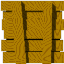

- Aktuální jméno v katalogu: (unnamed/unused)
- Katalogová poznámka (`02-tiles.md`): žádné jméno v `BlockTypes.hpp`, 0/78 souborů (nepoužito)
- Passable: no
- Vizuální signál (průměrná alpha): solid/textured tile, uncategorized

**Co to je?**
Odpověď: bedny

**Render mód?**
Odpověď: UniformCube — krychle, textura na všech 6 stranách

---

## Icon 33

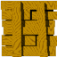

- Aktuální jméno v katalogu: (unnamed/unused)
- Katalogová poznámka (`02-tiles.md`): žádné jméno v `BlockTypes.hpp`, 0/78 souborů (nepoužito)
- Passable: no
- Vizuální signál (průměrná alpha): solid/textured tile, uncategorized

**Co to je?**
Odpověď: bedny

**Render mód?**
Odpověď: UniformCube — krychle, textura na všech 6 stranách

---

## Icon 34

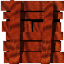

- Aktuální jméno v katalogu: (unnamed/unused)
- Katalogová poznámka (`02-tiles.md`): žádné jméno v `BlockTypes.hpp`, 0/78 souborů (nepoužito)
- Passable: no
- Vizuální signál (průměrná alpha): solid/textured tile, uncategorized

**Co to je?**
Odpověď: bedny

**Render mód?**
Odpověď: UniformCube — krychle, textura na všech 6 stranách

---

## Icon 93

- Aktuální jméno v katalogu: (unnamed/unused)
- Katalogová poznámka (`02-tiles.md`): žádné jméno v `BlockTypes.hpp`, 0/78 souborů (nepoužito)
- Passable: no
- Vizuální signál (průměrná alpha): sparse/decorative (mostly transparent)

**Co to je?**
Odpověď: voda

**Render mód?**
Odpověď: OTEVŘENÁ OTÁZKA — uživatel zatím neví, jak vodu v 3D renderovat, rozhodne se později (viz task "Decide water tile render mode")

---

## Icon 94

- Aktuální jméno v katalogu: (unnamed/unused)
- Katalogová poznámka (`02-tiles.md`): žádné jméno v `BlockTypes.hpp`, 0/78 souborů (nepoužito)
- Passable: no
- Vizuální signál (průměrná alpha): sparse/decorative (mostly transparent)

**Co to je?**
Odpověď: voda

**Render mód?**
Odpověď: OTEVŘENÁ OTÁZKA — uživatel zatím neví, jak vodu v 3D renderovat, rozhodne se později (viz task "Decide water tile render mode")

---

## Icon 95

- Aktuální jméno v katalogu: (unnamed/unused)
- Katalogová poznámka (`02-tiles.md`): žádné jméno v `BlockTypes.hpp`, 0/78 souborů (nepoužito)
- Passable: no
- Vizuální signál (průměrná alpha): sparse/decorative (mostly transparent)

**Co to je?**
Odpověď: voda

**Render mód?**
Odpověď: OTEVŘENÁ OTÁZKA — uživatel zatím neví, jak vodu v 3D renderovat, rozhodne se později (viz task "Decide water tile render mode")

---

## Icon 99

- Aktuální jméno v katalogu: (unnamed/unused)
- Katalogová poznámka (`02-tiles.md`): žádné jméno v `BlockTypes.hpp`, 0/78 souborů (nepoužito)
- Passable: no
- Vizuální signál (průměrná alpha): empty sheet slot (near-fully transparent)

**Co to je?**
Odpověď: šplouchnutí vody

**Render mód?**
Odpověď: Billboard

---

## Icon 100

- Aktuální jméno v katalogu: (unnamed/unused)
- Katalogová poznámka (`02-tiles.md`): žádné jméno v `BlockTypes.hpp`, 0/78 souborů (nepoužito)
- Passable: no
- Vizuální signál (průměrná alpha): sparse/decorative (mostly transparent)

**Co to je?**
Odpověď: šplouchnutí vody

**Render mód?**
Odpověď: Billboard

---

## Icon 101

- Aktuální jméno v katalogu: (unnamed/unused)
- Katalogová poznámka (`02-tiles.md`): žádné jméno v `BlockTypes.hpp`, 0/78 souborů (nepoužito)
- Passable: no
- Vizuální signál (průměrná alpha): sparse/decorative (mostly transparent)

**Co to je?**
Odpověď: šplouchnutí vody

**Render mód?**
Odpověď: Billboard

---

## Icon 102

- Aktuální jméno v katalogu: (unnamed/unused)
- Katalogová poznámka (`02-tiles.md`): žádné jméno v `BlockTypes.hpp`, 0/78 souborů (nepoužito)
- Passable: no
- Vizuální signál (průměrná alpha): sparse/decorative (mostly transparent)

**Co to je?**
Odpověď: šplouchnutí vody

**Render mód?**
Odpověď: Billboard

---

## Icon 103

- Aktuální jméno v katalogu: (unnamed/unused)
- Katalogová poznámka (`02-tiles.md`): žádné jméno v `BlockTypes.hpp`, 0/78 souborů (nepoužito)
- Passable: no
- Vizuální signál (průměrná alpha): empty sheet slot (near-fully transparent)

**Co to je?**
Odpověď: bublinky od Blupiho, když je ve vodě a dýchá

**Render mód?**
Odpověď: Billboard

---

## Icon 104

- Aktuální jméno v katalogu: (unnamed/unused)
- Katalogová poznámka (`02-tiles.md`): žádné jméno v `BlockTypes.hpp`, 0/78 souborů (nepoužito)
- Passable: no
- Vizuální signál (průměrná alpha): empty sheet slot (near-fully transparent)

**Co to je?**
Odpověď: bublinky od Blupiho, když je ve vodě a dýchá

**Render mód?**
Odpověď: Billboard

---

## Icon 105

- Aktuální jméno v katalogu: (unnamed/unused)
- Katalogová poznámka (`02-tiles.md`): žádné jméno v `BlockTypes.hpp`, 0/78 souborů (nepoužito)
- Passable: no
- Vizuální signál (průměrná alpha): empty sheet slot (near-fully transparent)

**Co to je?**
Odpověď: bublinky od Blupiho, když je ve vodě a dýchá

**Render mód?**
Odpověď: Billboard

---

## Icon 106

- Aktuální jméno v katalogu: (unnamed/unused)
- Katalogová poznámka (`02-tiles.md`): žádné jméno v `BlockTypes.hpp`, 0/78 souborů (nepoužito)
- Passable: no
- Vizuální signál (průměrná alpha): empty sheet slot (near-fully transparent)

**Co to je?**
Odpověď: bublinky od Blupiho, když je ve vodě a dýchá

**Render mód?**
Odpověď: Billboard

---

## Icon 111

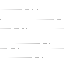

- Aktuální jméno v katalogu: (unnamed/unused)
- Katalogová poznámka (`02-tiles.md`): žádné jméno v `BlockTypes.hpp`, 0/78 souborů (nepoužito)
- Passable: yes
- Vizuální signál (průměrná alpha): sparse/decorative (mostly transparent)

**Co to je?**
Odpověď: vítr od větráku (stejné jako ikony 110/114/118/122)

**Render mód?**
Odpověď: NENÍ klasický Billboard — je statické. `InnerFlatPlate` — deska uprostřed průhledné krychle, textura na obou stranách (stejně jako 110/114/118/122)

---

## Icon 112

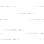

- Aktuální jméno v katalogu: (unnamed/unused)
- Katalogová poznámka (`02-tiles.md`): žádné jméno v `BlockTypes.hpp`, 0/78 souborů (nepoužito)
- Passable: yes
- Vizuální signál (průměrná alpha): sparse/decorative (mostly transparent)

**Co to je?**
Odpověď: vítr od větráku (stejné jako ikony 110/114/118/122)

**Render mód?**
Odpověď: NENÍ klasický Billboard — je statické. `InnerFlatPlate` — deska uprostřed průhledné krychle, textura na obou stranách (stejně jako 110/114/118/122)

---

## Icon 113

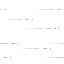

- Aktuální jméno v katalogu: (unnamed/unused)
- Katalogová poznámka (`02-tiles.md`): žádné jméno v `BlockTypes.hpp`, 0/78 souborů (nepoužito)
- Passable: yes
- Vizuální signál (průměrná alpha): sparse/decorative (mostly transparent)

**Co to je?**
Odpověď: vítr od větráku (stejné jako ikony 110/114/118/122)

**Render mód?**
Odpověď: NENÍ klasický Billboard — je statické. `InnerFlatPlate` — deska uprostřed průhledné krychle, textura na obou stranách (stejně jako 110/114/118/122)

---

## Icon 115

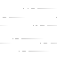

- Aktuální jméno v katalogu: (unnamed/unused)
- Katalogová poznámka (`02-tiles.md`): žádné jméno v `BlockTypes.hpp`, 0/78 souborů (nepoužito)
- Passable: yes
- Vizuální signál (průměrná alpha): sparse/decorative (mostly transparent)

**Co to je?**
Odpověď: vítr od větráku (stejné jako ikony 110/114/118/122)

**Render mód?**
Odpověď: NENÍ klasický Billboard — je statické. `InnerFlatPlate` — deska uprostřed průhledné krychle, textura na obou stranách (stejně jako 110/114/118/122)

---

## Icon 116

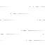

- Aktuální jméno v katalogu: (unnamed/unused)
- Katalogová poznámka (`02-tiles.md`): žádné jméno v `BlockTypes.hpp`, 0/78 souborů (nepoužito)
- Passable: yes
- Vizuální signál (průměrná alpha): sparse/decorative (mostly transparent)

**Co to je?**
Odpověď: vítr od větráku (stejné jako ikony 110/114/118/122)

**Render mód?**
Odpověď: NENÍ klasický Billboard — je statické. `InnerFlatPlate` — deska uprostřed průhledné krychle, textura na obou stranách (stejně jako 110/114/118/122)

---

## Icon 117

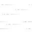

- Aktuální jméno v katalogu: (unnamed/unused)
- Katalogová poznámka (`02-tiles.md`): žádné jméno v `BlockTypes.hpp`, 0/78 souborů (nepoužito)
- Passable: yes
- Vizuální signál (průměrná alpha): sparse/decorative (mostly transparent)

**Co to je?**
Odpověď: vítr od větráku (stejné jako ikony 110/114/118/122)

**Render mód?**
Odpověď: NENÍ klasický Billboard — je statické. `InnerFlatPlate` — deska uprostřed průhledné krychle, textura na obou stranách (stejně jako 110/114/118/122)

---

## Icon 119

- Aktuální jméno v katalogu: (unnamed/unused)
- Katalogová poznámka (`02-tiles.md`): žádné jméno v `BlockTypes.hpp`, 0/78 souborů (nepoužito)
- Passable: yes
- Vizuální signál (průměrná alpha): sparse/decorative (mostly transparent)

**Co to je?**
Odpověď: vítr od větráku (stejné jako ikony 110/114/118/122)

**Render mód?**
Odpověď: NENÍ klasický Billboard — je statické. `InnerFlatPlate` — deska uprostřed průhledné krychle, textura na obou stranách (stejně jako 110/114/118/122)

---

## Icon 120

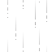

- Aktuální jméno v katalogu: (unnamed/unused)
- Katalogová poznámka (`02-tiles.md`): žádné jméno v `BlockTypes.hpp`, 0/78 souborů (nepoužito)
- Passable: yes
- Vizuální signál (průměrná alpha): sparse/decorative (mostly transparent)

**Co to je?**
Odpověď: vítr od větráku (stejné jako ikony 110/114/118/122)

**Render mód?**
Odpověď: NENÍ klasický Billboard — je statické. `InnerFlatPlate` — deska uprostřed průhledné krychle, textura na obou stranách (stejně jako 110/114/118/122)

---

## Icon 121

- Aktuální jméno v katalogu: (unnamed/unused)
- Katalogová poznámka (`02-tiles.md`): žádné jméno v `BlockTypes.hpp`, 0/78 souborů (nepoužito)
- Passable: yes
- Vizuální signál (průměrná alpha): sparse/decorative (mostly transparent)

**Co to je?**
Odpověď: vítr od větráku (stejné jako ikony 110/114/118/122)

**Render mód?**
Odpověď: NENÍ klasický Billboard — je statické. `InnerFlatPlate` — deska uprostřed průhledné krychle, textura na obou stranách (stejně jako 110/114/118/122)

---

## Icon 123

- Aktuální jméno v katalogu: (unnamed/unused)
- Katalogová poznámka (`02-tiles.md`): žádné jméno v `BlockTypes.hpp`, 0/78 souborů (nepoužito)
- Passable: yes
- Vizuální signál (průměrná alpha): sparse/decorative (mostly transparent)

**Co to je?**
Odpověď: vítr od větráku (stejné jako ikony 110/114/118/122)

**Render mód?**
Odpověď: NENÍ klasický Billboard — je statické. `InnerFlatPlate` — deska uprostřed průhledné krychle, textura na obou stranách (stejně jako 110/114/118/122)

---

## Icon 124

- Aktuální jméno v katalogu: (unnamed/unused)
- Katalogová poznámka (`02-tiles.md`): žádné jméno v `BlockTypes.hpp`, 0/78 souborů (nepoužito)
- Passable: yes
- Vizuální signál (průměrná alpha): sparse/decorative (mostly transparent)

**Co to je?**
Odpověď: vítr od větráku (stejné jako ikony 110/114/118/122)

**Render mód?**
Odpověď: NENÍ klasický Billboard — je statické. `InnerFlatPlate` — deska uprostřed průhledné krychle, textura na obou stranách (stejně jako 110/114/118/122)

---

## Icon 125

- Aktuální jméno v katalogu: (unnamed/unused)
- Katalogová poznámka (`02-tiles.md`): žádné jméno v `BlockTypes.hpp`, 0/78 souborů (nepoužito)
- Passable: yes
- Vizuální signál (průměrná alpha): sparse/decorative (mostly transparent)

**Co to je?**
Odpověď: vítr od větráku (stejné jako ikony 110/114/118/122)

**Render mód?**
Odpověď: NENÍ klasický Billboard — je statické. `InnerFlatPlate` — deska uprostřed průhledné krychle, textura na obou stranách (stejně jako 110/114/118/122)

---

## Icon 157

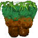

- Aktuální jméno v katalogu: (unnamed/unused)
- Katalogová poznámka (`02-tiles.md`): žádné jméno v `BlockTypes.hpp`, 0/78 souborů (nepoužito)
- Passable: no
- Vizuální signál (průměrná alpha): solid/textured tile, uncategorized

**Co to je?**
Odpověď: hrouda země, samostatná (bez sousedních), nahoře tráva

**Render mód?**
Odpověď: Billboard

---

## Icon 166

- Aktuální jméno v katalogu: (unnamed/unused)
- Katalogová poznámka (`02-tiles.md`): žádné jméno v `BlockTypes.hpp`, 0/78 souborů (nepoužito)
- Passable: yes
- Vizuální signál (průměrná alpha): solid/textured tile, uncategorized

**Co to je?**
Odpověď: budka pro teleportaci do jiného světa

**Render mód?**
Odpověď: Billboard

---

## Icon 167

- Aktuální jméno v katalogu: (unnamed/unused)
- Katalogová poznámka (`02-tiles.md`): žádné jméno v `BlockTypes.hpp`, 0/78 souborů (nepoužito)
- Passable: yes
- Vizuální signál (průměrná alpha): solid/textured tile, uncategorized

**Co to je?**
Odpověď: budka pro teleportaci do jiného světa

**Render mód?**
Odpověď: Billboard

---

## Icon 168

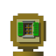

- Aktuální jméno v katalogu: (unnamed/unused)
- Katalogová poznámka (`02-tiles.md`): žádné jméno v `BlockTypes.hpp`, 0/78 souborů (nepoužito)
- Passable: yes
- Vizuální signál (průměrná alpha): solid/textured tile, uncategorized

**Co to je?**
Odpověď: budka pro teleportaci do jiného světa

**Render mód?**
Odpověď: Billboard

---

## Icon 169

- Aktuální jméno v katalogu: (unnamed/unused)
- Katalogová poznámka (`02-tiles.md`): žádné jméno v `BlockTypes.hpp`, 0/78 souborů (nepoužito)
- Passable: yes
- Vizuální signál (průměrná alpha): solid/textured tile, uncategorized

**Co to je?**
Odpověď: budka pro teleportaci do jiného světa

**Render mód?**
Odpověď: Billboard

---

## Icon 170

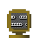

- Aktuální jméno v katalogu: (unnamed/unused)
- Katalogová poznámka (`02-tiles.md`): žádné jméno v `BlockTypes.hpp`, 0/78 souborů (nepoužito)
- Passable: yes
- Vizuální signál (průměrná alpha): solid/textured tile, uncategorized

**Co to je?**
Odpověď: budka pro teleportaci do jiného světa

**Render mód?**
Odpověď: Billboard

---

## Icon 171

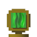

- Aktuální jméno v katalogu: (unnamed/unused)
- Katalogová poznámka (`02-tiles.md`): žádné jméno v `BlockTypes.hpp`, 0/78 souborů (nepoužito)
- Passable: yes
- Vizuální signál (průměrná alpha): solid/textured tile, uncategorized

**Co to je?**
Odpověď: budka pro teleportaci do jiného světa

**Render mód?**
Odpověď: Billboard

---

## Icon 172

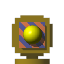

- Aktuální jméno v katalogu: (unnamed/unused)
- Katalogová poznámka (`02-tiles.md`): žádné jméno v `BlockTypes.hpp`, 0/78 souborů (nepoužito)
- Passable: yes
- Vizuální signál (průměrná alpha): solid/textured tile, uncategorized

**Co to je?**
Odpověď: budka pro teleportaci do jiného světa

**Render mód?**
Odpověď: Billboard

---

## Icon 173

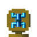

- Aktuální jméno v katalogu: (unnamed/unused)
- Katalogová poznámka (`02-tiles.md`): žádné jméno v `BlockTypes.hpp`, 0/78 souborů (nepoužito)
- Passable: yes
- Vizuální signál (průměrná alpha): solid/textured tile, uncategorized

**Co to je?**
Odpověď: budka pro teleportaci do jiného světa

**Render mód?**
Odpověď: Billboard

---

## Icon 184

- Aktuální jméno v katalogu: (unnamed/unused)
- Katalogová poznámka (`02-tiles.md`): žádné jméno v `BlockTypes.hpp`, 0/78 souborů (nepoužito)
- Passable: yes
- Vizuální signál (průměrná alpha): solid/textured tile, uncategorized

**Co to je?**
Odpověď: budka pro teleportaci do jiného světa

**Render mód?**
Odpověď: Billboard

---

## Icon 204

- Aktuální jméno v katalogu: (unnamed/unused)
- Katalogová poznámka (`02-tiles.md`): žádné jméno v `BlockTypes.hpp`, 0/78 souborů (nepoužito)
- Passable: yes
- Vizuální signál (průměrná alpha): sparse/decorative (mostly transparent)

**Co to je?**
Odpověď: tráva

**Render mód?**
Odpověď: Billboard

---

## Icon 205

- Aktuální jméno v katalogu: (unnamed/unused)
- Katalogová poznámka (`02-tiles.md`): žádné jméno v `BlockTypes.hpp`, 0/78 souborů (nepoužito)
- Passable: yes
- Vizuální signál (průměrná alpha): sparse/decorative (mostly transparent)

**Co to je?**
Odpověď: tráva

**Render mód?**
Odpověď: Billboard

---

## Icon 206

- Aktuální jméno v katalogu: (unnamed/unused)
- Katalogová poznámka (`02-tiles.md`): žádné jméno v `BlockTypes.hpp`, 0/78 souborů (nepoužito)
- Passable: yes
- Vizuální signál (průměrná alpha): sparse/decorative (mostly transparent)

**Co to je?**
Odpověď: tráva

**Render mód?**
Odpověď: Billboard

---

## Icon 207

- Aktuální jméno v katalogu: (unnamed/unused)
- Katalogová poznámka (`02-tiles.md`): žádné jméno v `BlockTypes.hpp`, 0/78 souborů (nepoužito)
- Passable: yes
- Vizuální signál (průměrná alpha): sparse/decorative (mostly transparent)

**Co to je?**
Odpověď: tráva

**Render mód?**
Odpověď: Billboard

---

## Icon 208

- Aktuální jméno v katalogu: (unnamed/unused)
- Katalogová poznámka (`02-tiles.md`): žádné jméno v `BlockTypes.hpp`, 0/78 souborů (nepoužito)
- Passable: yes
- Vizuální signál (průměrná alpha): sparse/decorative (mostly transparent)

**Co to je?**
Odpověď: tráva

**Render mód?**
Odpověď: Billboard

---

## Icon 209

- Aktuální jméno v katalogu: (unnamed/unused)
- Katalogová poznámka (`02-tiles.md`): žádné jméno v `BlockTypes.hpp`, 0/78 souborů (nepoužito)
- Passable: no
- Vizuální signál (průměrná alpha): solid/textured tile, uncategorized

**Co to je?**
Odpověď: pružina (Spring)

**Render mód?**
Odpověď: Billboard

---

## Icon 210

- Aktuální jméno v katalogu: (unnamed/unused)
- Katalogová poznámka (`02-tiles.md`): žádné jméno v `BlockTypes.hpp`, 0/78 souborů (nepoužito)
- Passable: no
- Vizuální signál (průměrná alpha): solid/textured tile, uncategorized

**Co to je?**
Odpověď: pružina (Spring)

**Render mód?**
Odpověď: Billboard

---

## Icon 212

- Aktuální jméno v katalogu: (unnamed/unused)
- Katalogová poznámka (`02-tiles.md`): žádné jméno v `BlockTypes.hpp`, 0/78 souborů (nepoužito)
- Passable: no
- Vizuální signál (průměrná alpha): solid/textured tile, uncategorized

**Co to je?**
Odpověď: pružina (Spring)

**Render mód?**
Odpověď: Billboard

---

## Icon 213

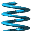

- Aktuální jméno v katalogu: (unnamed/unused)
- Katalogová poznámka (`02-tiles.md`): žádné jméno v `BlockTypes.hpp`, 0/78 souborů (nepoužito)
- Passable: no
- Vizuální signál (průměrná alpha): solid/textured tile, uncategorized

**Co to je?**
Odpověď: pružina (Spring)

**Render mód?**
Odpověď: Billboard

---

## Icon 223

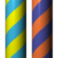

- Aktuální jméno v katalogu: (unnamed/unused)
- Katalogová poznámka (`02-tiles.md`): žádné jméno v `BlockTypes.hpp`, 0/78 souborů (nepoužito)
- Passable: no
- Vizuální signál (průměrná alpha): solid/textured tile, uncategorized

**Co to je?**
Odpověď: blok krychle s dětským motivem

**Render mód?**
Odpověď: UniformCube — krychle, textura na všech 6 stranách

---

## Icon 224

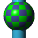

- Aktuální jméno v katalogu: (unnamed/unused)
- Katalogová poznámka (`02-tiles.md`): žádné jméno v `BlockTypes.hpp`, 0/78 souborů (nepoužito)
- Passable: no
- Vizuální signál (průměrná alpha): solid/textured tile, uncategorized

**Co to je?**
Odpověď: krychle

**Render mód?**
Odpověď: DirectionalCube — krychle, textura na 4 bočních stranách, shora i zdola plná barva (modrý odstín)

---

## Icon 225

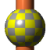

- Aktuální jméno v katalogu: (unnamed/unused)
- Katalogová poznámka (`02-tiles.md`): žádné jméno v `BlockTypes.hpp`, 0/78 souborů (nepoužito)
- Passable: no
- Vizuální signál (průměrná alpha): solid/textured tile, uncategorized

**Co to je?**
Odpověď: krychle

**Render mód?**
Odpověď: DirectionalCube — krychle, textura na 4 bočních stranách, shora i zdola plná barva (oranžový odstín)

---

## Icon 226

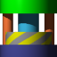

- Aktuální jméno v katalogu: (unnamed/unused)
- Katalogová poznámka (`02-tiles.md`): žádné jméno v `BlockTypes.hpp`, 0/78 souborů (nepoužito)
- Passable: no
- Vizuální signál (průměrná alpha): solid/textured tile, uncategorized

**Co to je?**
Odpověď: krychle

**Render mód?**
Odpověď: DirectionalCube — krychle, textura na 4 bočních stranách, shora zelená barva, zdola fialová barva

---

## Icon 227

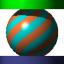

- Aktuální jméno v katalogu: (unnamed/unused)
- Katalogová poznámka (`02-tiles.md`): žádné jméno v `BlockTypes.hpp`, 0/78 souborů (nepoužito)
- Passable: no
- Vizuální signál (průměrná alpha): solid/textured tile, uncategorized

**Co to je?**
Odpověď: krychle

**Render mód?**
Odpověď: DirectionalCube — krychle, textura na 4 bočních stranách, shora zelená barva, zdola fialová barva

---

## Icon 228

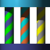

- Aktuální jméno v katalogu: (unnamed/unused)
- Katalogová poznámka (`02-tiles.md`): žádné jméno v `BlockTypes.hpp`, 0/78 souborů (nepoužito)
- Passable: no
- Vizuální signál (průměrná alpha): solid/textured tile, uncategorized

**Co to je?**
Odpověď: krychle

**Render mód?**
Odpověď: DirectionalCube — krychle, textura na 4 bočních stranách, shora modrá barva, zdola fialová barva

---

## Icon 229

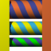

- Aktuální jméno v katalogu: (unnamed/unused)
- Katalogová poznámka (`02-tiles.md`): žádné jméno v `BlockTypes.hpp`, 0/78 souborů (nepoužito)
- Passable: no
- Vizuální signál (průměrná alpha): solid/textured tile, uncategorized

**Co to je?**
Odpověď: krychle

**Render mód?**
Odpověď: UniformCube — krychle, textura na všech 6 stranách

---

## Icon 232

- Aktuální jméno v katalogu: (unnamed/unused)
- Katalogová poznámka (`02-tiles.md`): žádné jméno v `BlockTypes.hpp`, 0/78 souborů (nepoužito)
- Passable: no
- Vizuální signál (průměrná alpha): solid/textured tile, uncategorized

**Co to je?**
Odpověď: krychle

**Render mód?**
Odpověď: DirectionalCube — krychle, textura na 4 bočních stranách, shora plná barva (modrá), zdola plná barva (žlutá)

---

## Icon 237

- Aktuální jméno v katalogu: (unnamed/unused)
- Katalogová poznámka (`02-tiles.md`): žádné jméno v `BlockTypes.hpp`, 0/78 souborů (nepoužito)
- Passable: yes
- Vizuální signál (průměrná alpha): solid/textured tile, uncategorized

**Co to je?**
Odpověď: nevím

**Render mód?**
Odpověď: nevím

---

## Icon 238

- Aktuální jméno v katalogu: (unnamed/unused)
- Katalogová poznámka (`02-tiles.md`): žádné jméno v `BlockTypes.hpp`, 0/78 souborů (nepoužito)
- Passable: yes
- Vizuální signál (průměrná alpha): sparse/decorative (mostly transparent)

**Co to je?**
Odpověď: (nejisté)

**Render mód?**
Odpověď: Billboard

---

## Icon 239

- Aktuální jméno v katalogu: (unnamed/unused)
- Katalogová poznámka (`02-tiles.md`): žádné jméno v `BlockTypes.hpp`, 0/78 souborů (nepoužito)
- Passable: yes
- Vizuální signál (průměrná alpha): sparse/decorative (mostly transparent)

**Co to je?**
Odpověď: (nejisté)

**Render mód?**
Odpověď: Billboard

---

## Icon 240

- Aktuální jméno v katalogu: (unnamed/unused)
- Katalogová poznámka (`02-tiles.md`): žádné jméno v `BlockTypes.hpp`, 0/78 souborů (nepoužito)
- Passable: yes
- Vizuální signál (průměrná alpha): sparse/decorative (mostly transparent)

**Co to je?**
Odpověď: (nejisté)

**Render mód?**
Odpověď: Billboard

---

## Icon 241

- Aktuální jméno v katalogu: (unnamed/unused)
- Katalogová poznámka (`02-tiles.md`): žádné jméno v `BlockTypes.hpp`, 0/78 souborů (nepoužito)
- Passable: yes
- Vizuální signál (průměrná alpha): sparse/decorative (mostly transparent)

**Co to je?**
Odpověď: (nejisté)

**Render mód?**
Odpověď: Billboard

---

## Icon 242

- Aktuální jméno v katalogu: (unnamed/unused)
- Katalogová poznámka (`02-tiles.md`): žádné jméno v `BlockTypes.hpp`, 0/78 souborů (nepoužito)
- Passable: yes
- Vizuální signál (průměrná alpha): sparse/decorative (mostly transparent)

**Co to je?**
Odpověď: (nejisté)

**Render mód?**
Odpověď: Billboard

---

## Icon 243

- Aktuální jméno v katalogu: (unnamed/unused)
- Katalogová poznámka (`02-tiles.md`): žádné jméno v `BlockTypes.hpp`, 0/78 souborů (nepoužito)
- Passable: yes
- Vizuální signál (průměrná alpha): sparse/decorative (mostly transparent)

**Co to je?**
Odpověď: (nejisté)

**Render mód?**
Odpověď: Billboard

---

## Icon 244

- Aktuální jméno v katalogu: (unnamed/unused)
- Katalogová poznámka (`02-tiles.md`): žádné jméno v `BlockTypes.hpp`, 0/78 souborů (nepoužito)
- Passable: yes
- Vizuální signál (průměrná alpha): empty sheet slot (near-fully transparent)

**Co to je?**
Odpověď: kapka vody

**Render mód?**
Odpověď: Billboard

---

## Icon 306

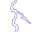

- Aktuální jméno v katalogu: (unnamed/unused)
- Katalogová poznámka (`02-tiles.md`): žádné jméno v `BlockTypes.hpp`, 0/78 souborů (nepoužito)
- Passable: yes
- Vizuální signál (průměrná alpha): sparse/decorative (mostly transparent)

**Co to je?**
Odpověď: blesk (Blitz)

**Render mód?**
Odpověď: Billboard

---

## Icon 307

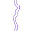

- Aktuální jméno v katalogu: (unnamed/unused)
- Katalogová poznámka (`02-tiles.md`): žádné jméno v `BlockTypes.hpp`, 0/78 souborů (nepoužito)
- Passable: yes
- Vizuální signál (průměrná alpha): sparse/decorative (mostly transparent)

**Co to je?**
Odpověď: blesk (Blitz)

**Render mód?**
Odpověď: Billboard

---

## Icon 308

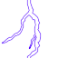

- Aktuální jméno v katalogu: (unnamed/unused)
- Katalogová poznámka (`02-tiles.md`): žádné jméno v `BlockTypes.hpp`, 0/78 souborů (nepoužito)
- Passable: yes
- Vizuální signál (průměrná alpha): sparse/decorative (mostly transparent)

**Co to je?**
Odpověď: blesk (Blitz)

**Render mód?**
Odpověď: Billboard

---

## Icon 310

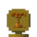

- Aktuální jméno v katalogu: (unnamed/unused)
- Katalogová poznámka (`02-tiles.md`): žádné jméno v `BlockTypes.hpp`, 0/78 souborů (nepoužito)
- Passable: yes
- Vizuální signál (průměrná alpha): solid/textured tile, uncategorized

**Co to je?**
Odpověď: budka pro přesun do jiného světa

**Render mód?**
Odpověď: Billboard

---

## Icon 311

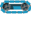

- Aktuální jméno v katalogu: (unnamed/unused)
- Katalogová poznámka (`02-tiles.md`): žádné jméno v `BlockTypes.hpp`, 0/78 souborů (nepoužito)
- Passable: no
- Vizuální signál (průměrná alpha): sparse/decorative (mostly transparent)

**Co to je?**
Odpověď: plošina, běžící pás (caterpillar/chenille tread — potvrzeno reálně použito přes MoveObject icon=, viz task "Fix 02-tiles.md")

**Render mód?**
Odpověď: Billboard

---

## Icon 312

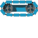

- Aktuální jméno v katalogu: (unnamed/unused)
- Katalogová poznámka (`02-tiles.md`): žádné jméno v `BlockTypes.hpp`, 0/78 souborů (nepoužito)
- Passable: no
- Vizuální signál (průměrná alpha): sparse/decorative (mostly transparent)

**Co to je?**
Odpověď: plošina, běžící pás (caterpillar/chenille tread — potvrzeno reálně použito přes MoveObject icon=, viz task "Fix 02-tiles.md")

**Render mód?**
Odpověď: Billboard

---

## Icon 313

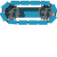

- Aktuální jméno v katalogu: (unnamed/unused)
- Katalogová poznámka (`02-tiles.md`): žádné jméno v `BlockTypes.hpp`, 0/78 souborů (nepoužito)
- Passable: no
- Vizuální signál (průměrná alpha): sparse/decorative (mostly transparent)

**Co to je?**
Odpověď: plošina, běžící pás (caterpillar/chenille tread — potvrzeno reálně použito přes MoveObject icon=, viz task "Fix 02-tiles.md")

**Render mód?**
Odpověď: Billboard

---

## Icon 314

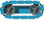

- Aktuální jméno v katalogu: (unnamed/unused)
- Katalogová poznámka (`02-tiles.md`): žádné jméno v `BlockTypes.hpp`, 0/78 souborů (nepoužito)
- Passable: no
- Vizuální signál (průměrná alpha): sparse/decorative (mostly transparent)

**Co to je?**
Odpověď: plošina, běžící pás (caterpillar/chenille tread — potvrzeno reálně použito přes MoveObject icon=, viz task "Fix 02-tiles.md")

**Render mód?**
Odpověď: Billboard

---

## Icon 315

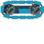

- Aktuální jméno v katalogu: (unnamed/unused)
- Katalogová poznámka (`02-tiles.md`): žádné jméno v `BlockTypes.hpp`, 0/78 souborů (nepoužito)
- Passable: no
- Vizuální signál (průměrná alpha): sparse/decorative (mostly transparent)

**Co to je?**
Odpověď: plošina, běžící pás (caterpillar/chenille tread — potvrzeno reálně použito přes MoveObject icon=, viz task "Fix 02-tiles.md")

**Render mód?**
Odpověď: Billboard

---

## Icon 316

- Aktuální jméno v katalogu: (unnamed/unused)
- Katalogová poznámka (`02-tiles.md`): žádné jméno v `BlockTypes.hpp`, 0/78 souborů (nepoužito)
- Passable: no
- Vizuální signál (průměrná alpha): sparse/decorative (mostly transparent)

**Co to je?**
Odpověď: plošina, běžící pás (caterpillar/chenille tread — potvrzeno reálně použito přes MoveObject icon=, viz task "Fix 02-tiles.md")

**Render mód?**
Odpověď: Billboard

---

## Icon 338

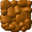

- Aktuální jméno v katalogu: (unnamed/unused)
- Katalogová poznámka (`02-tiles.md`): žádné jméno v `BlockTypes.hpp`, 0/78 souborů (nepoužito)
- Passable: no
- Vizuální signál (průměrná alpha): solid/textured tile, uncategorized

**Co to je?**
Odpověď: hroudka hlínky

**Render mód?**
Odpověď: UniformCube — krychle, textura na všech 6 stranách

---

## Icon 340

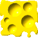

- Aktuální jméno v katalogu: (unnamed/unused)
- Katalogová poznámka (`02-tiles.md`): žádné jméno v `BlockTypes.hpp`, 0/78 souborů (nepoužito)
- Passable: no
- Vizuální signál (průměrná alpha): solid/textured tile, uncategorized

**Co to je?**
Odpověď: hrouda sýra

**Render mód?**
Odpověď: UniformCube — krychle, textura na všech 6 stranách

---

## Icon 365

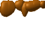

- Aktuální jméno v katalogu: (unnamed/unused)
- Katalogová poznámka (`02-tiles.md`): žádné jméno v `BlockTypes.hpp`, 0/78 souborů (nepoužito)
- Passable: no
- Vizuální signál (průměrná alpha): sparse/decorative (mostly transparent)

**Co to je?**
Odpověď: Bridge — jiný animační snímek stejného objektu jako ikona 364 (už vyřešeno v předchozím dotazníku)

**Render mód?**
Odpověď: DirectionalCube — krychle, textura na 4 bočních stranách, shora plná barva (hnědý odstín), zdola průhledné (stejně jako ikona 364)

---

## Icon 366

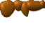

- Aktuální jméno v katalogu: (unnamed/unused)
- Katalogová poznámka (`02-tiles.md`): žádné jméno v `BlockTypes.hpp`, 0/78 souborů (nepoužito)
- Passable: no
- Vizuální signál (průměrná alpha): sparse/decorative (mostly transparent)

**Co to je?**
Odpověď: Bridge — jiný animační snímek stejného objektu jako ikona 364 (už vyřešeno v předchozím dotazníku)

**Render mód?**
Odpověď: DirectionalCube — krychle, textura na 4 bočních stranách, shora plná barva (hnědý odstín), zdola průhledné (stejně jako ikona 364)

---

## Icon 367

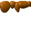

- Aktuální jméno v katalogu: (unnamed/unused)
- Katalogová poznámka (`02-tiles.md`): žádné jméno v `BlockTypes.hpp`, 0/78 souborů (nepoužito)
- Passable: yes
- Vizuální signál (průměrná alpha): sparse/decorative (mostly transparent)

**Co to je?**
Odpověď: okraj hroudy hlíny

**Render mód?**
Odpověď: `InnerFlatPlate` — deska uprostřed krychle, textura na desce (stejný vzor jako ostatní "okraj hroudy" ikony v tomto kole)

---

## Icon 368

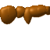

- Aktuální jméno v katalogu: (unnamed/unused)
- Katalogová poznámka (`02-tiles.md`): žádné jméno v `BlockTypes.hpp`, 0/78 souborů (nepoužito)
- Passable: yes
- Vizuální signál (průměrná alpha): sparse/decorative (mostly transparent)

**Co to je?**
Odpověď: okraj hroudy hlíny

**Render mód?**
Odpověď: `InnerFlatPlate` — deska uprostřed krychle, textura na desce (stejný vzor jako ostatní "okraj hroudy" ikony v tomto kole)

---

## Icon 369

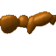

- Aktuální jméno v katalogu: (unnamed/unused)
- Katalogová poznámka (`02-tiles.md`): žádné jméno v `BlockTypes.hpp`, 0/78 souborů (nepoužito)
- Passable: yes
- Vizuální signál (průměrná alpha): sparse/decorative (mostly transparent)

**Co to je?**
Odpověď: okraj hroudy hlíny

**Render mód?**
Odpověď: `InnerFlatPlate` — deska uprostřed krychle, textura na desce (stejný vzor jako ostatní "okraj hroudy" ikony v tomto kole)

---

## Icon 370

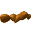

- Aktuální jméno v katalogu: (unnamed/unused)
- Katalogová poznámka (`02-tiles.md`): žádné jméno v `BlockTypes.hpp`, 0/78 souborů (nepoužito)
- Passable: yes
- Vizuální signál (průměrná alpha): sparse/decorative (mostly transparent)

**Co to je?**
Odpověď: okraj hroudy hlíny

**Render mód?**
Odpověď: `InnerFlatPlate` — deska uprostřed krychle, textura na desce (stejný vzor jako ostatní "okraj hroudy" ikony v tomto kole)

---

## Icon 371

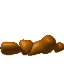

- Aktuální jméno v katalogu: (unnamed/unused)
- Katalogová poznámka (`02-tiles.md`): žádné jméno v `BlockTypes.hpp`, 0/78 souborů (nepoužito)
- Passable: yes
- Vizuální signál (průměrná alpha): sparse/decorative (mostly transparent)

**Co to je?**
Odpověď: okraj hroudy hlíny

**Render mód?**
Odpověď: `InnerFlatPlate` — deska uprostřed krychle, textura na desce (stejný vzor jako ostatní "okraj hroudy" ikony v tomto kole)

---

## Icon 372

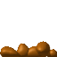

- Aktuální jméno v katalogu: (unnamed/unused)
- Katalogová poznámka (`02-tiles.md`): žádné jméno v `BlockTypes.hpp`, 0/78 souborů (nepoužito)
- Passable: yes
- Vizuální signál (průměrná alpha): sparse/decorative (mostly transparent)

**Co to je?**
Odpověď: okraj hroudy hlíny

**Render mód?**
Odpověď: `InnerFlatPlate` — deska uprostřed krychle, textura na desce (stejný vzor jako ostatní "okraj hroudy" ikony v tomto kole)

---

## Icon 374

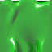

- Aktuální jméno v katalogu: (unnamed/unused)
- Katalogová poznámka (`02-tiles.md`): žádné jméno v `BlockTypes.hpp`, 0/78 souborů (nepoužito)
- Passable: no
- Vizuální signál (průměrná alpha): solid/textured tile, uncategorized

**Co to je?**
Odpověď: kus zeleného slizu

**Render mód?**
Odpověď: UniformCube — krychle, textura na všech 6 stranách

---

## Icon 405

- Aktuální jméno v katalogu: (unnamed/unused)
- Katalogová poznámka (`02-tiles.md`): žádné jméno v `BlockTypes.hpp`, 0/78 souborů (nepoužito)
- Passable: yes
- Vizuální signál (průměrná alpha): sparse/decorative (mostly transparent)

**Co to je?**
Odpověď: kapka zeleného slizu

**Render mód?**
Odpověď: Billboard

---

## Icon 406

- Aktuální jméno v katalogu: (unnamed/unused)
- Katalogová poznámka (`02-tiles.md`): žádné jméno v `BlockTypes.hpp`, 0/78 souborů (nepoužito)
- Passable: yes
- Vizuální signál (průměrná alpha): sparse/decorative (mostly transparent)

**Co to je?**
Odpověď: kapka zeleného slizu

**Render mód?**
Odpověď: Billboard

---

## Icon 407

- Aktuální jméno v katalogu: (unnamed/unused)
- Katalogová poznámka (`02-tiles.md`): žádné jméno v `BlockTypes.hpp`, 0/78 souborů (nepoužito)
- Passable: yes
- Vizuální signál (průměrná alpha): sparse/decorative (mostly transparent)

**Co to je?**
Odpověď: kapka zeleného slizu

**Render mód?**
Odpověď: Billboard

---

## Icon 408

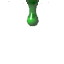

- Aktuální jméno v katalogu: (unnamed/unused)
- Katalogová poznámka (`02-tiles.md`): žádné jméno v `BlockTypes.hpp`, 0/78 souborů (nepoužito)
- Passable: yes
- Vizuální signál (průměrná alpha): sparse/decorative (mostly transparent)

**Co to je?**
Odpověď: kapka zeleného slizu

**Render mód?**
Odpověď: Billboard

---

## Icon 409

- Aktuální jméno v katalogu: (unnamed/unused)
- Katalogová poznámka (`02-tiles.md`): žádné jméno v `BlockTypes.hpp`, 0/78 souborů (nepoužito)
- Passable: yes
- Vizuální signál (průměrná alpha): sparse/decorative (mostly transparent)

**Co to je?**
Odpověď: kapka zeleného slizu

**Render mód?**
Odpověď: Billboard

---

## Icon 414

- Aktuální jméno v katalogu: (unnamed/unused)
- Katalogová poznámka (`02-tiles.md`): žádné jméno v `BlockTypes.hpp`, 0/78 souborů (nepoužito)
- Passable: yes
- Vizuální signál (průměrná alpha): solid/textured tile, uncategorized

**Co to je?**
Odpověď: budka pro přesun do jiného světa

**Render mód?**
Odpověď: Billboard

---

## Icon 415

- Aktuální jméno v katalogu: (unnamed/unused)
- Katalogová poznámka (`02-tiles.md`): žádné jméno v `BlockTypes.hpp`, 0/78 souborů (nepoužito)
- Passable: yes
- Vizuální signál (průměrná alpha): solid/textured tile, uncategorized

**Co to je?**
Odpověď: budka pro přesun do jiného světa

**Render mód?**
Odpověď: Billboard

---

## Icon 416

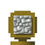

- Aktuální jméno v katalogu: (unnamed/unused)
- Katalogová poznámka (`02-tiles.md`): žádné jméno v `BlockTypes.hpp`, 0/78 souborů (nepoužito)
- Passable: yes
- Vizuální signál (průměrná alpha): solid/textured tile, uncategorized

**Co to je?**
Odpověď: budka pro přesun do jiného světa

**Render mód?**
Odpověď: Billboard

---

## Icon 417

- Aktuální jméno v katalogu: (unnamed/unused)
- Katalogová poznámka (`02-tiles.md`): žádné jméno v `BlockTypes.hpp`, 0/78 souborů (nepoužito)
- Passable: yes
- Vizuální signál (průměrná alpha): solid/textured tile, uncategorized

**Co to je?**
Odpověď: budka pro přesun do jiného světa

**Render mód?**
Odpověď: Billboard

---

## Icon 418

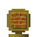

- Aktuální jméno v katalogu: (unnamed/unused)
- Katalogová poznámka (`02-tiles.md`): žádné jméno v `BlockTypes.hpp`, 0/78 souborů (nepoužito)
- Passable: yes
- Vizuální signál (průměrná alpha): solid/textured tile, uncategorized

**Co to je?**
Odpověď: budka pro přesun do jiného světa

**Render mód?**
Odpověď: Billboard

---

## Icon 419

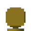

- Aktuální jméno v katalogu: (unnamed/unused)
- Katalogová poznámka (`02-tiles.md`): žádné jméno v `BlockTypes.hpp`, 0/78 souborů (nepoužito)
- Passable: yes
- Vizuální signál (průměrná alpha): solid/textured tile, uncategorized

**Co to je?**
Odpověď: budka pro přesun do jiného světa

**Render mód?**
Odpověď: Billboard

---

## Icon 420

- Aktuální jméno v katalogu: (unnamed/unused)
- Katalogová poznámka (`02-tiles.md`): žádné jméno v `BlockTypes.hpp`, 0/78 souborů (nepoužito)
- Passable: yes
- Vizuální signál (průměrná alpha): solid/textured tile, uncategorized

**Co to je?**
Odpověď: budka pro přesun do jiného světa

**Render mód?**
Odpověď: Billboard

---

## Icon 436

- Aktuální jméno v katalogu: (unnamed/unused)
- Katalogová poznámka (`02-tiles.md`): žádné jméno v `BlockTypes.hpp`, 0/78 souborů (nepoužito)
- Passable: no
- Vizuální signál (průměrná alpha): sparse/decorative (mostly transparent)

**Co to je?**
Odpověď: sloup

**Render mód?**
Odpověď: Billboard

---

## Icon 438

- Aktuální jméno v katalogu: (unnamed/unused)
- Katalogová poznámka (`02-tiles.md`): žádné jméno v `BlockTypes.hpp`, 0/78 souborů (nepoužito)
- Passable: no
- Vizuální signál (průměrná alpha): sparse/decorative (mostly transparent)

**Co to je?**
Odpověď: sloup

**Render mód?**
Odpověď: Billboard

---

## Icon 439

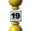

- Aktuální jméno v katalogu: (unnamed/unused)
- Katalogová poznámka (`02-tiles.md`): žádné jméno v `BlockTypes.hpp`, 0/78 souborů (nepoužito)
- Passable: no
- Vizuální signál (průměrná alpha): sparse/decorative (mostly transparent)

**Co to je?**
Odpověď: sloup

**Render mód?**
Odpověď: Billboard

---
